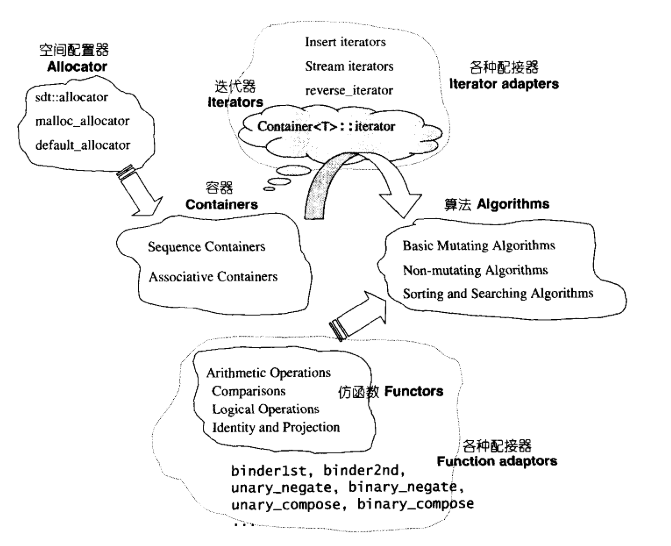

# 前言与STL概论

## 前言与主义事项

### 术语转换

|英语术语|大陆|本书|
|---|---|---|
|adapter|适配器|配接器|
|arfument|实参|引数|
|by reference|传参考，传地址|传址|
|by value|传值|传值|
|dereference|反引用,解参考|提领|
|evaluate|评估，估算|评估，核定|
|instance|案例，实例|实体|
|instantiated|实例化|实体化，具现化|
|library|库，库函数|程序库|
|range|范围|区间(STL)|
|resolve|解析|决议|
|parameter|形参|参数|
|type|类型|型别|

### 阅读顺序

控件配置器(allocaror)是会显示所有容器(container)的定义式

全局函数调用

<stl_construct.h>对象构造与析构的基本函数

<stl_uninirialized.h>用于内存管理的基本函数

<stl_algobase.h>包含各种基本算法

### 章节概览

| 第一章 | STL 概论与实现版本简介                      |
| ------ | ------------------------------------------- |
| 第二章 | 控件配置器(allocator)                       |
| 第三章 | 迭代器(iterators)概念与traits编程技法       |
| 第四章 | 序列是容器(sequenece containers)            |
| 第五章 | 关联式容器(assiciated containers)           |
| 第六章 | 算法(algorithms)                            |
| 第七章 | 仿函数、函数对象(functors,function objects) |
| 第八章 | 配接器(adapter)                             |

## STL 六大组件

| 容器(containers)   | 各种数据结构，是一种class template                           | vector、list、deque、set、map |
| ------------------ | ------------------------------------------------------------ | ----------------------------- |
| 算法(algorithms)   | 常用算法，是一种 function tremplate                          | sort search copy erase        |
| 迭代器(iterators)  | 容器与算法之间的胶合剂，泛型指针，相当于用来重载运算符(* -> ++ --)的class template |                               |
| 仿函数(functors)   | 行为类似函数、算法的策略、是重载了operator()的class活class template，一般函数指针可以视为狭义的仿函数 |                               |
| 配接器(adapters)   | 修饰容器、仿函数、迭代器接口的东西。相当于一个二层封装       | queue、stack                  |
| 配置器(allocators) | 负责控件的配置与管实现动态控件配置、管理、释放的class template |                               |
|                    |                                                              |                               |

### 六大组件之间的关系

* Container通过Allocator数据储存空间
* Algorithm通过Iterator存取Container内容
* Functor协助Alogorithm完成策略变化
* Adapter修饰/套接Functor

### 总体文件的分布

* C++标准规范下的C头文件(无扩展名)
    * cstdio,cstdlib,cstring..
* C++标准库不属于STL范畴者
    * stream,string..相关文件

* STL标准头文件[无拓展名]
    * vector,deque,list,map,algorithm,functional..
* C++ Standrad定案前HP所规范的STL文件
    * vector.h,deque.h,list.h,map.h,algo.h,function.h...
* SGI STL内部文件(STL 真正实现)
    * stl_vector.h,stl_deque.h,stl_list.h,stl_map.h,stl_algo.h,stl_function,h..
* 各个文件的具体内容见书P49

## STL中的组态

位于<stl_config.h>

|组态|常量声明|作用|
|---|---|---|
|组态3|__STL_STATIC_TEMPLATE_MEMBER_BUG| 测试class template拥有的static data members|
|组态5|__STL_CLASS_PARTIAL_SPECIALIZATION| 测试class template 的一般化设计之外 特别针对默写template 参数做特殊设计|
| 组态6 |__STL_FUNCTION_TMPL_PARTIAL_ORDER|partial specialization of function templates|
|组态7|__STL_EXPLICIT_FUNCTION_TMPL_ARGS|未使用|
|组态8|__STL_MEMBER_TEMPLATES|测试class template之内是否再有template(members)|
|组态10|__STL_LIMIRED_DEFAULT_TEMPLATES|测试template参数可否根据前一个template参数而设定默认值|
|组态11|__STL_NON_TYPE_TMPL_PARA_BUG|测试class template可否拥有non-type  template 参数|
|组态|__STL_NULL_TMPL_ARGS|(bound frinend template friend) class的某个具现体与其firend function template 的某个具现体有一一对应的关系|
|组态|__STL_TEMPLATE_NULL|(class template explicit specialization) 适用于GCC VC6 允许使用者不指定template<>就完成 explicit specialization，C++ Bulider严格要救遵照C++标准规格|

### 静态成员

静态常量整数成员在class内部直接初始化。

class 内含有 const static integral data member。C++标准允许直接赋予初值,其中integral泛指所有整数型别。

### increment/decrement/dereference 操作符

所有迭代器必须实现前进(increment,operator++)和取值(dereferenece, operator*)功能

其中前进(increment)还分为前置式 (prefix)和后置式(posifix)

若迭代器具备双向功能 必须提供decrement操作

### STL:区间表示-前闭后开

### function call 操作符  operator()

C++中的左右小括号可以被重载 

C语言函数传递只能通过函数指针传递，但是无法持有自己的局部状态，也无法打到组件计数的可适配性，即无法再将某些修饰条件加上而改变其状态

STL 接收所谓状态 / 策略 即以仿函数形式呈现 。所谓仿函数就是对（）重载使其称为体格仿函数。