# AES

> https://zhuanlan.zhihu.com/p/78913397
>
> https://blog.csdn.net/qq_28205153/article/details/55798628

## 背景

AES的全称是(Advanced Encryption Standard)，意思是高级加密标准, 出现主要是为了取代DES加密算法的。因为计算机性能提升，而DES 密钥长度为56bit，理论安全强度是2的56次方。强度足以应对。

3DES的加密方法，但由于它的加密时间是DES算法的3倍多，64Bit的分组大小相对较小，所以还是不能满足人们对安全性的要求。 

为了取代DES，美国征集高级加密标准，选出5个加密算法 Rijndael，Serpent，Twofish，RC6和MARS。最终经过安全性分析、软硬件性能评估等严格的步骤，Rijndael算法获胜。

AES 为最常见的对称加密算法，AES候选提交方案都必须满足以下标准：

- **分组大小为128位的分组密码。**
- **必须支持三种密码标准：128位、192位和256位。**
- **比提交的其他算法更安全。**
- **在软件和硬件实现上都很高效。**

AES密码与分组密码Rijndael基本上完全一致，Rijndael分组大小和密钥大小都可以为128位、192位和256位。然而AES只要求分组大小为128位，因此只有分组长度为128Bit的Rijndael才称为AES算法。本文只对分组大小128位，密钥长度也为128位的Rijndael算法进行分析。密钥长度为192位和256位的处理方式和128位的处理方式类似，只不过密钥长度每增加64位，算法的循环次数就增加2轮，128位循环10轮、192位循环12轮、256位循环14轮。

## AES 基本结构

在AES标准规范中，分组长度只能是128位，也就是说，每个分组为16个字节（每个字节8位）。密钥的长度可以使用128位、192位或256位。

|   AES   | 密钥长度/32bits | 分组长度/32bits | 加密轮数 |
| :-----: | :-------------: | :-------------: | :------: |
| AES-128 |        4        |        4        |    10    |
| AES-192 |        6        |        4        |    12    |
| AES-256 |        8        |        4        |    14    |

下述以 AES-128 为例， 密钥长度为128位 加密轮数为10轮

AES 加密共识为 C = E(K, P) ，执行10轮函数 只有最后一轮不同

AES 处理单位为字节，128位的输入明文分组P恶化输入密钥K被氛围16个字节，标记为 P = P0-15 和 K = K0-15

eg P=abcdefghijklmnop 则 a => P0, p => P15

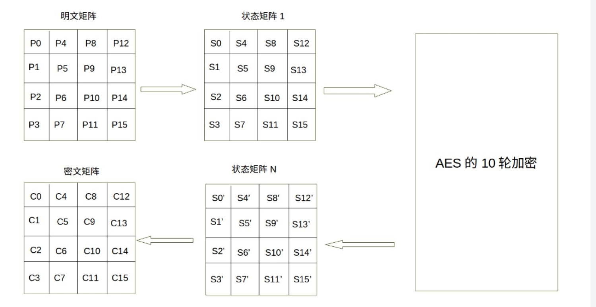

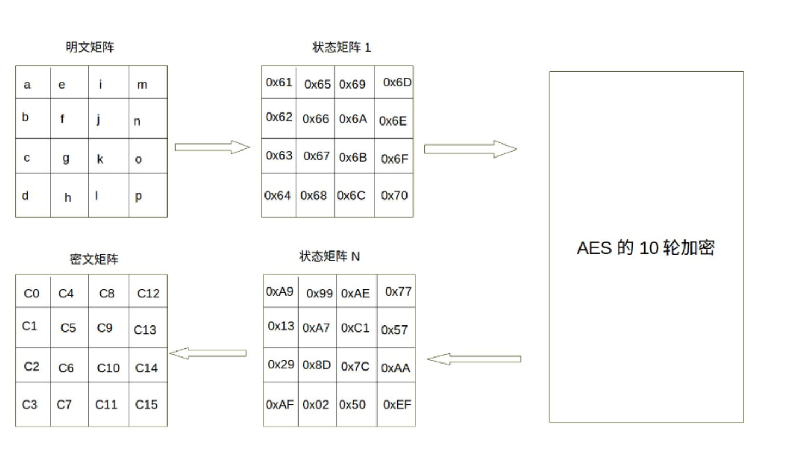

同理 128位密钥也是用字节为单位的矩阵表示，举证的每一列被称为 1个32位比数字，通过密钥编排函数 拓展成为44个字组成的序列，前四个元素为原始密钥，用于运算原始密钥加， 后续40个 分为10组 每组4个128bit ，用于10轮密钥加

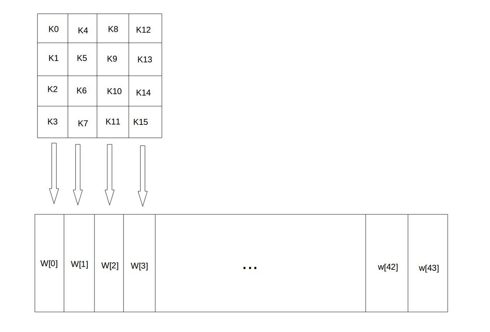

设K = “abcdefghijklmnop" 则 K0 = a K15 = p,W[0] = K0 K1 K2 K3 = abcd

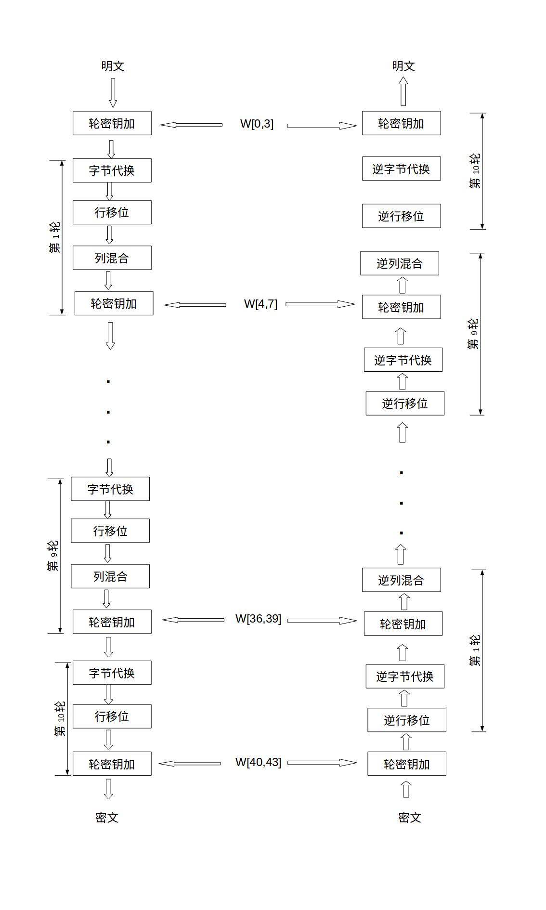

## 字节代换

字节代换执行一个简单的查表操作，AES 定义一个S盒和一个逆S盒

| 行/列 | 0    | 1    | 2    | 3    | 4    | 5    | 6    | 7    | 8    | 9    | A    | B    | C    | D    | E    | F    |
| ----- | ---- | ---- | ---- | ---- | ---- | ---- | ---- | ---- | ---- | ---- | ---- | ---- | ---- | ---- | ---- | ---- |
| 0     | 0x63 | 0x7c | 0x77 | 0x7b | 0xf2 | 0x6b | 0x6f | 0xc5 | 0x30 | 0x01 | 0x67 | 0x2b | 0xfe | 0xd7 | 0xab | 0x76 |
| 1     | 0xca | 0x82 | 0xc9 | 0x7d | 0xfa | 0x59 | 0x47 | 0xf0 | 0xad | 0xd4 | 0xa2 | 0xaf | 0x9c | 0xa4 | 0x72 | 0xc0 |
| 2     | 0xb7 | 0xfd | 0x93 | 0x26 | 0x36 | 0x3f | 0xf7 | 0xcc | 0x34 | 0xa5 | 0xe5 | 0xf1 | 0x71 | 0xd8 | 0x31 | 0x15 |
| 3     | 0x04 | 0xc7 | 0x23 | 0xc3 | 0x18 | 0x96 | 0x05 | 0x9a | 0x07 | 0x12 | 0x80 | 0xe2 | 0xeb | 0x27 | 0xb2 | 0x75 |
| 4     | 0x09 | 0x83 | 0x2c | 0x1a | 0x1b | 0x6e | 0x5a | 0xa0 | 0x52 | 0x3b | 0xd6 | 0xb3 | 0x29 | 0xe3 | 0x2f | 0x84 |
| 5     | 0x53 | 0xd1 | 0x00 | 0xed | 0x20 | 0xfc | 0xb1 | 0x5b | 0x6a | 0xcb | 0xbe | 0x39 | 0x4a | 0x4c | 0x58 | 0xcf |
| 6     | 0xd0 | 0xef | 0xaa | 0xfb | 0x43 | 0x4d | 0x33 | 0x85 | 0x45 | 0xf9 | 0x02 | 0x7f | 0x50 | 0x3c | 0x9f | 0xa8 |
| 7     | 0x51 | 0xa3 | 0x40 | 0x8f | 0x92 | 0x9d | 0x38 | 0xf5 | 0xbc | 0xb6 | 0xda | 0x21 | 0x10 | 0xff | 0xf3 | 0xd2 |
| 8     | 0xcd | 0x0c | 0x13 | 0xec | 0x5f | 0x97 | 0x44 | 0x17 | 0xc4 | 0xa7 | 0x7e | 0x3d | 0x64 | 0x5d | 0x19 | 0x73 |
| 9     | 0x60 | 0x81 | 0x4f | 0xdc | 0x22 | 0x2a | 0x90 | 0x88 | 0x46 | 0xee | 0xb8 | 0x14 | 0xde | 0x5e | 0x0b | 0xdb |
| A     | 0xe0 | 0x32 | 0x3a | 0x0a | 0x49 | 0x06 | 0x24 | 0x5c | 0xc2 | 0xd3 | 0xac | 0x62 | 0x91 | 0x95 | 0xe4 | 0x79 |
| B     | 0xe7 | 0xc8 | 0x37 | 0x6d | 0x8d | 0xd5 | 0x4e | 0xa9 | 0x6c | 0x56 | 0xf4 | 0xea | 0x65 | 0x7a | 0xae | 0x08 |
| C     | 0xba | 0x78 | 0x25 | 0x2e | 0x1c | 0xa6 | 0xb4 | 0xc6 | 0xe8 | 0xdd | 0x74 | 0x1f | 0x4b | 0xbd | 0x8b | 0x8a |
| D     | 0x70 | 0x3e | 0xb5 | 0x66 | 0x48 | 0x03 | 0xf6 | 0x0e | 0x61 | 0x35 | 0x57 | 0xb9 | 0x86 | 0xc1 | 0x1d | 0x9e |
| E     | 0xe1 | 0xf8 | 0x98 | 0x11 | 0x69 | 0xd9 | 0x8e | 0x94 | 0x9b | 0x1e | 0x87 | 0xe9 | 0xce | 0x55 | 0x28 | 0xdf |
| F     | 0x8c | 0xa1 | 0x89 | 0x0d | 0xbf | 0xe6 | 0x42 | 0x68 | 0x41 | 0x99 | 0x2d | 0x0f | 0xb0 | 0x54 | 0xbb | 0x16 |

将该字节的高四位作为行值，第四位作为列值，取出S或者逆S盒对应元素作为映射

## 字节代换逆操作

对查逆S盒操作

| 行/列 | 0    | 1    | 2    | 3    | 4    | 5    | 6    | 7    | 8    | 9    | A    | B    | C    | D    | E    | F    |
| ----- | ---- | ---- | ---- | ---- | ---- | ---- | ---- | ---- | ---- | ---- | ---- | ---- | ---- | ---- | ---- | ---- |
| 0     | 0x52 | 0x09 | 0x6a | 0xd5 | 0x30 | 0x36 | 0xa5 | 0x38 | 0xbf | 0x40 | 0xa3 | 0x9e | 0x81 | 0xf3 | 0xd7 | 0xfb |
| 1     | 0x7c | 0xe3 | 0x39 | 0x82 | 0x9b | 0x2f | 0xff | 0x87 | 0x34 | 0x8e | 0x43 | 0x44 | 0xc4 | 0xde | 0xe9 | 0xcb |
| 2     | 0x54 | 0x7b | 0x94 | 0x32 | 0xa6 | 0xc2 | 0x23 | 0x3d | 0xee | 0x4c | 0x95 | 0x0b | 0x42 | 0xfa | 0xc3 | 0x4e |
| 3     | 0x08 | 0x2e | 0xa1 | 0x66 | 0x28 | 0xd9 | 0x24 | 0xb2 | 0x76 | 0x5b | 0xa2 | 0x49 | 0x6d | 0x8b | 0xd1 | 0x25 |
| 4     | 0x72 | 0xf8 | 0xf6 | 0x64 | 0x86 | 0x68 | 0x98 | 0x16 | 0xd4 | 0xa4 | 0x5c | 0xcc | 0x5d | 0x65 | 0xb6 | 0x92 |
| 5     | 0x6c | 0x70 | 0x48 | 0x50 | 0xfd | 0xed | 0xb9 | 0xda | 0x5e | 0x15 | 0x46 | 0x57 | 0xa7 | 0x8d | 0x9d | 0x84 |
| 6     | 0x90 | 0xd8 | 0xab | 0x00 | 0x8c | 0xbc | 0xd3 | 0x0a | 0xf7 | 0xe4 | 0x58 | 0x05 | 0xb8 | 0xb3 | 0x45 | 0x06 |
| 7     | 0xd0 | 0x2c | 0x1e | 0x8f | 0xca | 0x3f | 0x0f | 0x02 | 0xc1 | 0xaf | 0xbd | 0x03 | 0x01 | 0x13 | 0x8a | 0x6b |
| 8     | 0x3a | 0x91 | 0x11 | 0x41 | 0x4f | 0x67 | 0xdc | 0xea | 0x97 | 0xf2 | 0xcf | 0xce | 0xf0 | 0xb4 | 0xe6 | 0x73 |
| 9     | 0x96 | 0xac | 0x74 | 0x22 | 0xe7 | 0xad | 0x35 | 0x85 | 0xe2 | 0xf9 | 0x37 | 0xe8 | 0x1c | 0x75 | 0xdf | 0x6e |
| A     | 0x47 | 0xf1 | 0x1a | 0x71 | 0x1d | 0x29 | 0xc5 | 0x89 | 0x6f | 0xb7 | 0x62 | 0x0e | 0xaa | 0x18 | 0xbe | 0x1b |
| B     | 0xfc | 0x56 | 0x3e | 0x4b | 0xc6 | 0xd2 | 0x79 | 0x20 | 0x9a | 0xdb | 0xc0 | 0xfe | 0x78 | 0xcd | 0x5a | 0xf4 |
| C     | 0x1f | 0xdd | 0xa8 | 0x33 | 0x88 | 0x07 | 0xc7 | 0x31 | 0xb1 | 0x12 | 0x10 | 0x59 | 0x27 | 0x80 | 0xec | 0x5f |
| D     | 0x60 | 0x51 | 0x7f | 0xa9 | 0x19 | 0xb5 | 0x4a | 0x0d | 0x2d | 0xe5 | 0x7a | 0x9f | 0x93 | 0xc9 | 0x9c | 0xef |
| E     | 0xa0 | 0xe0 | 0x3b | 0x4d | 0xae | 0x2a | 0xf5 | 0xb0 | 0xc8 | 0xeb | 0xbb | 0x3c | 0x83 | 0x53 | 0x99 | 0x61 |
| F     | 0x17 | 0x2b | 0x04 | 0x7e | 0xba | 0x77 | 0xd6 | 0x26 | 0xe1 | 0x69 | 0x14 | 0x63 | 0x55 | 0x21 | 0x0c | 0x7d |

## 行位移

简单的左循环操作，密钥长度为128时

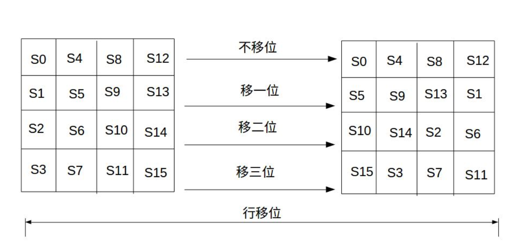

逆位移则是反过来操作。

## 列混合

类混合通过矩阵相乘 获得混淆后的矩阵

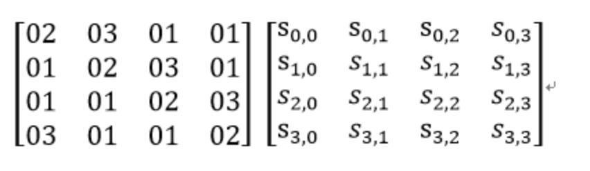

第j列 混合可以表示为

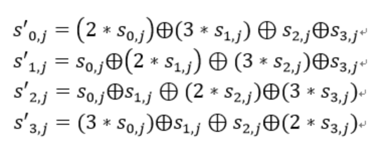

其中乘法与假发都是基于GF(2^8)的二元运算 不是常规意义的加乘

对于加法 等价于二字节异或(相同为假 不同为真)

对于乘法 使用域 乘以 00000010 等驾驭左移1位 (低位补0)后 在更具情况情况 同 (00011011)进行异或运算。

若S1 = (a7 a6 a5 a4 a3 a2 a1 a0)0x02 * S1 如图

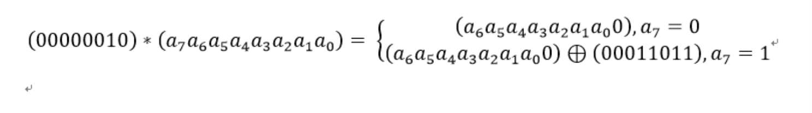

乘以0000010 可以拆分为两次 00000010运算

乘以0000011 可以拆分为 乘以(0000 0001)和(0000 0010) 再将乘积异或

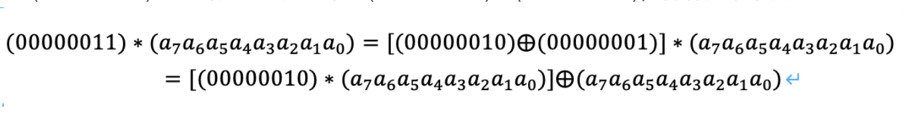

## 列混合逆运算

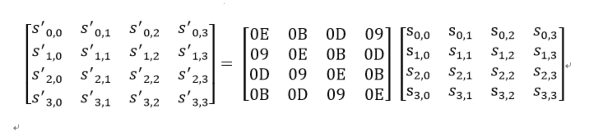

## 轮密钥加

密钥ki中每个字W[4i],W[4i+1],W[4i+2],W[4i+3] 为32bit字包换四字节 ，

轮密钥过程可以堪称字逐位异或的结果 可以看成 S0 S1 S2 S3 组成的32位字与W[4i]的异或

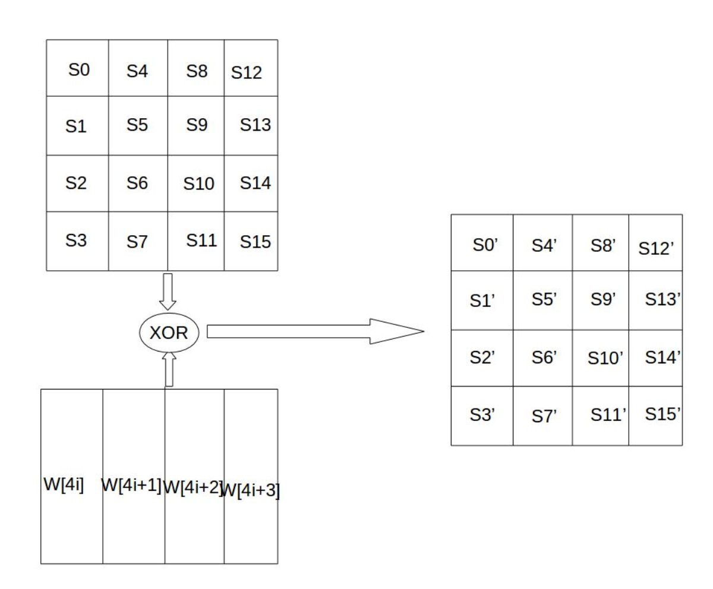

## 密钥扩展

初始密钥作为 4x4矩阵输入。

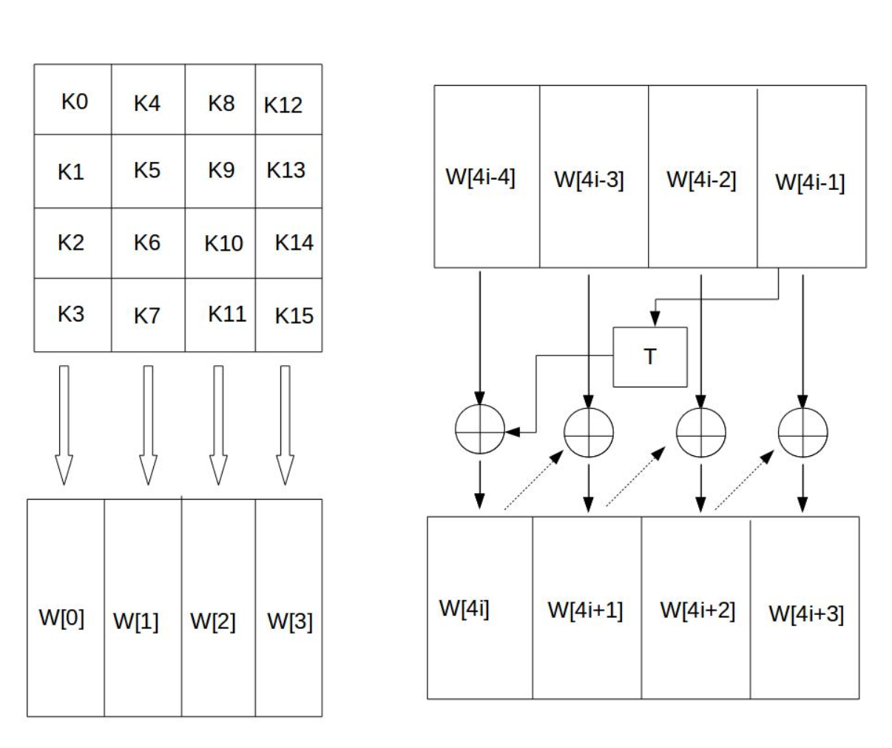

4x4 矩阵 4个字节组成字 如

"abcdefghijklmnop",则K0 = ‘a’,K1 = ‘b’, K2 = ‘c’,K3 = ‘d’,W[0] = “abcd”

W数组扩充40个新列，构成总共44列的扩展密钥数组。新列以如下的递归方式产生

1.如果i不是4的倍数，那么第i列由如下等式确定：
 W[i]=W[i-4]⨁W[i-1]
 2.如果i是4的倍数，那么第i列由如下等式确定：
 W[i]=W[i-4]⨁T(W[i-1])

T是一个有点复杂的函数。

字循环、字节代换和轮常量异或，这3部分的作用分别如下。
a.字循环：将1个字中的4个字节循环左移1个字节。即将输入字[b0, b1, b2, b3]变换成[b1,b2,b3,b0]。
b.字节代换：对字循环的结果使用S盒进行字节代换。
c.轮常量异或：将前两步的结果同轮常量Rcon[j]进行异或，其中j表示轮数。

| j       | 1           | 2           | 3           | 4           | 5           |
| ------- | ----------- | ----------- | ----------- | ----------- | ----------- |
| Rcon[j] | 01 00 00 00 | 02 00 00 00 | 04 00 00 00 | 08 00 00 00 | 10 00 00 00 |
| j       | 6           | 7           | 8           | 9           | 10          |
| Rcon[j] | 20 00 00 00 | 40 00 00 00 | 80 00 00 00 | 1B 00 00 00 | 36 00 00 00 |
