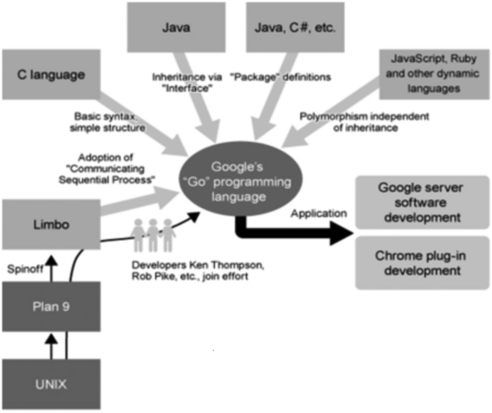

# 概论与简介

## 思想

以 C 语言为目标结果的编译器来拓展 Go 语言的设计思想。

在声明和包的设计方面，Go 语言受到 Pascal、Modula 和 Oberon 系语言的影响

在并发原理的设计上，Go 语言从同样受到 Tony Hoare 的 CSP（通信序列进程 *Communicating Sequential Processes*）理论影响的 Limbo 和 Newsqueak 的实践中借鉴了一些经验，并使用了和 Erlang 类似的机制。

## 目标与优势

* C/C++ 无法上计算机发展的脚步

* 软件发展跟不上硬件，程序体积膨胀。需要高层次概念的低级语言。

* 需要达到 快速编译，高效执行，易于开发 三者之间的平衡

* Go 语言是一门`类型安全`和`内存安全`的编程语言。虽然 Go 语言中仍有指针的存在，但并不允许进行指针运算。

* 网络通信，并发和并行编程提供支持，更好地利用分布式和多核计算机。

  > 设计者通过 goroutine 这种轻量级线程的概念来实现这个目标，然后通过 channel 来实现各个 goroutine 之间的通信。他们实现了分段栈增长和 goroutine 在线程基础上多路复用技术的自动化。

* 构建速度速度提升

* 依赖管理 采用包模型

* 执行速度与C/C++ 相提并论

* 解决内存问题与垃圾回收机制， Go 语言像其它静态语言一样执行本地代码，但它依旧运行在某种意义上的虚拟机，以此来实现高效快速的垃圾回收（使用了一个简单的标记-清除算法）

* 反射操作

* go install 对包管理与部署

* 支持C语言文件调用，快速迁移。

## 设计原则

* 减少关键字(25个)，减少混乱与复杂程度
* 提高代码可读，仅提供一到二种方法解决问题
* 概念相互独立
* 完整的编码规范， [Go 语言编码规范](http://golang.org/doc/go_spec.html)
* [LALR](http://en.wikipedia.org/wiki/LALR_parser) 是 Go 语言的语法标准，你也可以在 [`src/cmd/internal/gc/go.y`](https://github.com/golang/go/blob/master/src%2Fcmd%2Finternal%2Fgc%2Fgo.y) 中查看到，这种语法标准在编译时不需要符号表来协助解析。

## 特性

* 没有类和继承，通过 `接口(interface)` 概念实现多态
* 类型没有层级，混合型语言
* 静态类型 不 允许隐式转换，所有东西都是显式的
* 拥有 动态语言特性 `var` 
* 支持交叉编译，完全支持utf8

## 用途

Go 语言被设计成一门应用于搭载 Web 服务器，存储集群或类似用途的巨型中央服务器的系统编程语言。用于服务器端开发

Go 语言一个非常好的目标就是实现所谓的复杂事件处理（[CEP](http://en.wikipedia.org/wiki/Complex_event_processing)），这项技术要求海量并行支持，高度的抽象化和高性能。当我们进入到物联网时代，CEP 必然会成为人们关注的焦点。

值得注意的是，因为垃圾回收和自动内存分配的原因，Go 语言**不**适合用来开发对实时性要求很高的软件。

Go 语言可以在 `Intel` 或 `ARM` 处理器上运行，因此它也可以在安卓系统下运行，例如 Nexus 系列的产品。

## 1.2.7 关于特性缺失

许多能够在大多数面向对象语言中使用的特性 Go 语言都没有支持。可能在未来被支持

- 为了简化设计，不支持 **函数重载**和**操作符重载**
- 为了避免在 C/C++ 开发中的一些 Bug 和混乱，不支持 **隐式转换**
- Go 语言通过另一种途径实现面向对象设计（第 10-11 章）来放弃**类和类型的继承**
- 尽管在接口的使用方面（第 11 章）可以实现类似变体类型的功能，但本身不支持变体类型
- 不支持动态加载代码
- 不支持动态链接库
- 不支持泛型
- 通过 `recover` 和 `panic` 来替代异常机制（第 13.2-3 节）
- 不支持静态变量

## 链接

这里还有一个在 Linked-in 的小组：[www.linkedin.com/groups?gid=2524765&trk=myg_ugrp_ovr](http://www.linkedin.com/groups?gid=2524765&trk=myg_ugrp_ovr)。

知识图谱

https://www.processon.com/view/link/5a9ba4c8e4b0a9d22eb3bdf0#map

Go 编程语言的维基百科：[en.wikipedia.org/wiki/Go_(programming_language)](http://en.wikipedia.org/wiki/Go_\(programming_language\))

Go 语言相关资源的搜索引擎页面：[gowalker.org](https://gowalker.org)

Go 语言还有一个运行在 Google App Engine 上的 [Go Tour](http://tour.golang.org/)

你也可以通过执行命令 `go install go-tour.googlecode.com/hg/gotour` 安装到你的本地机器上

对于中文读者，可以访问该指南的 [中文版本](http://go-tour-zh.appspot.com/ [500 服务器炸了 = =]

通过命令 `go install https://bitbucket.org/mikespook/go-tour-zh/gotour` 进行安装。