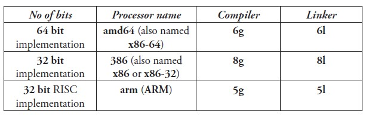

# 环境配置

## 简介

Go 语言开发团队开发了适用于以下操作系统的编译器：

- Linux
- FreeBSD
- Mac OS X（也称为 Darwin）

Go 原生编译器 `gc` 和非原生编译器 `gccgo`，这两款编译器都是在类 Unix 系统下工作。

## 原生编译器 gc

编译器和连接器 使用 c 语言编写并生成本地代码。[1.5 实现`自举` 即编译器与链接器都是go实现]

目前支持intel和amd 架构创建

> g 编译器 l 链接器

### 编译器参数

可用的编译器标记如下：

	flags:
	-I 针对包的目录搜索
	-d 打印声明信息
	-e 不限制错误打印的个数
	-f 打印栈结构
	-h 发生错误时进入恐慌（panic）状态
	-o 指定输出文件名 // 详见第3.4节
	-S 打印产生的汇编代码
	-V 打印编译器版本 // 详见第2.3节
	-u 禁止使用 unsafe 包中的代码
	-w 打印归类后的语法解析树
	-x 打印 lex tokens

使用统一的 `go build` 和 `go install` 等命令进行程序的构建与管理，而这些指令会自动调用相关的编译器或链接器。

> 如果你想获得更深层次的信息，你可以在目录 [`$GOROOT/src/cmd`](https://github.com/golang/go/tree/master/src/cmd) 下找到编译器和链接器的源代码。Go 语言本身是由 C 语言开发的，而不是 Go 语言（Go 1.5 开始自举）。
>
> 词法分析程序是 GNU bison，语法分析程序是名为 [`$GOROOT/src/cmd/gc/go.y`](https://github.com/golang/go/blob/master/src%2Fcmd%2Finternal%2Fgc%2Fgo.y) 的 yacc 文件，它会在同一目录输出 `y.tab.{c,h}` 文件。
>
> 如果你想知道更多有关构建过程的信息，你可以在 [`$GOROOT/src/make.bash`](https://github.com/golang/go/blob/master/src/make.bash) 中找到。
>
> 大部分的目录都包含了名为 `doc.go` 的文件，这个文件提供了更多详细的信息。

## gccgo

编译速度相较于gc 编译速度较慢

## 环境变量

- `$GOROOT` 表示 Go 在你的电脑上的安装位置，它的值一般都是 `$HOME/go`，当然，你也可以安装在别的地方。
- `GOARCH` 表示目标机器的处理器架构，它的值可以是 386、amd64 或 arm。
- `$GOOS` 表示目标机器的操作系统，它的值可以是 darwin、freebsd、linux 或 windows。
- `$GOBIN` 表示编译器和链接器的安装位置，默认是 `$GOROOT/bin`，如果你使用的是 Go 1.0.3 及以后的版本，一般情况下你可以将它的值设置为空，Go 将会使用前面提到的默认值。

* `$GOHOSTOS` 和 `$GOHOSTARCH` 设置本地机器的操作系统名称和编译体系结构，这两个变量只有在进行交叉编译的时候才会用到，如果你不进行显示设置，他们的值会和本地机器（`$GOOS` 和 `$GOARCH`）一样。
* **$GOPATH** 默认采用和 `$GOROOT` 一样的值，但从 Go 1.1 版本开始，你必须修改为其它路径。它可以包含多个 Go 语言源码文件、包文件和可执行文件的路径，而这些路径下又必须分别包含三个规定的目录：`src`、`pkg` 和 `bin`，这三个目录分别用于存放源码文件、包文件和可执行文件。
* **$GOARM** 专门针对基于 arm 架构的处理器，它的值可以是 5 或 6，默认为 6。
* **$GOMAXPROCS** 用于设置应用程序可使用的处理器个数与核数

## GO 安装

Linux https://github.com/unknwon/the-way-to-go_ZH_CN/blob/master/eBook/02.3.md

Windows https://github.com/unknwon/the-way-to-go_ZH_CN/blob/master/eBook/02.5.md

MacOS https://github.com/unknwon/the-way-to-go_ZH_CN/blob/master/eBook/02.4.md

### 安装目录清单

你的 Go 安装目录（`$GOROOT`）的文件夹结构应该如下所示：

README.md, AUTHORS, CONTRIBUTORS, LICENSE

- `/bin`：包含可执行文件，如：编译器，Go 工具
- `/doc`：包含示例程序，代码工具，本地文档等
- `/lib`：包含文档模版
- `/misc`：包含与支持 Go 编辑器有关的配置文件以及 cgo 的示例
- `/os_arch`：包含标准库的包的对象文件（`.a`）
- `/src`：包含源代码构建脚本和标准库的包的完整源代码（Go 是一门开源语言）
- `/src/cmd`：包含 Go 和 C 的编译器和命令行脚本
