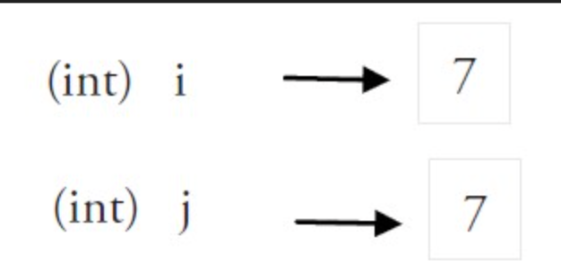
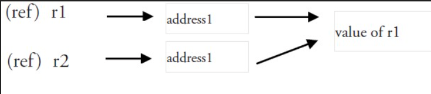

# 语言基础

## 文件名

以`.go` 为后缀，均以小写字母组成，以下划线为分割。如 `scanner_test.go`不包含空格和特殊字符。

## 标识符

区分大小写，以 可以使用任何 UTF-8 编码的字符或 `_` 开头，然后紧跟着 0 个或多个字符或 Unicode 数字，如：X56、group1、_x23、i、өԑ12。

以下是无效的标识符： 

- 1ab（以数字开头）
- case（Go 语言的关键字）
- a+b（运算符是不允许的）

### 25个保留关键字

| break    | default     | func   | map       | select |
| -------- | ----------- | ------ | --------- | ------ |
| case     | defer       | go     | interface | struct |
| chan     | else        | goto   | package   | switch |
| const    | fallthrough | if     | range     | type   |
| continue | for         | import | return    | var    |

### 36个预定义标识符

| append     | copy    | int    | print   |
| ---------- | ------- | ------ | ------- |
| bool       | false   | int64  | println |
| byte       | float32 | iota   | real    |
| cap        | float64 | len    | recover |
| close      | imag    | make   | string  |
| complex    | int     | new    | true    |
| complex64  | int8    | nil    | uint    |
| complex128 | int16   | panic  | uint8   |
| uint       | uint32  | uint64 | uintptr |

程序中可能会使用到这些分隔符：括号 `()`，中括号 `[]` 和大括号 `{}`。

每个语句**不**需要像 C 家族中的其它语言一样以分号 `;`

如果你打算将多个语句写在同一行，它们则必须使用 `;` 人为区分

## hello,world

```go
package main

import "fmt"

func main() {
	fmt.Println("hello, world")
}
```

## 包

每个 Go 文件都属于且仅属于一个包。一个包可以由许多以 `.go` 为扩展名的源文件组成。

你必须在源文件中非注释的第一行指明这个文件属于哪个包。`package main`表示一个可独立执行的程序，每个 Go 应用程序都包含一个名为 `main` 的包。

如果你打算编译包名不是为 main 的源文件，如 `pack1`，编译后产生的对象文件将会是 `pack1.a` 而不是可执行程序。另外要注意的是，所有的包名都应该使用小写字母。

属于同一个包的源文件必须全部被一起编译，一个包即是编译时的一个单元，因此根据惯例，每个目录都只包含一个包。

如果对一个包进行更改或重新编译，所有引用了这个包的客户端程序都必须全部重新编译。

Go 中的包模型采用了显式依赖关系的机制来达到快速编译的目的，编译器会从后缀名为 `.o` 的对象文件（需要且只需要这个文件）中提取传递依赖类型的信息。

**eg：**

如果 `A.go` 依赖 `B.go`，而 `B.go` 又依赖 `C.go`：

- 编译 `C.go`, `B.go`, 然后是 `A.go`.
- 为了编译 `A.go`, 编译器读取的是 `B.o` 而不是 `C.o`.

**每一段代码只会被编译一次**

### 标准库

**标准库**一般情况下，标准包会存放在 `$GOROOT/pkg/$GOOS_$GOARCH/` 目录下。

### 导入包

一个 Go 程序是通过 `import` 关键字将一组包链接在一起。

多个包导入

```go
import "fmt"
import "os"
```

or

```go
import(
	"fmt"
  "os"
)
```

> 最好按照字母排列 更加清晰易读

如果包名不是以 如果包名不是以 `.` 或 `/`开头，则 Go 会在全局文件进行查找。

如果包名以 `./` 开头，则 Go 会在相对目录中查找；

如果包名以 `/` 开头（在 Windows 下也可以这样使用），则会在系统的绝对路径中查找。

## 常量

定义：`const identifier [type] = value`

```go
const Pi = 3.1415
```

在 Go 语言中，你可以省略类型说明符 `[type]`，因为编译器可以根据变量的值来推断其类型。

- 显式类型定义： `const b string = "abc"`
- 隐式类型定义： `const b = "abc"`

未定义类型的常量会在必要时刻根据上下文来获得相关类型

```go
var n int f(n+5)
// 无类型的数字型常量 “5” 它的类型在这里变成了 int
```

常量的值必须是能够在编译时就能够确定的。所有用于计算的值必须在编译期间就能获得。

编译期间自定义函数均属于未知，内置函数可以使用，如：`len()`

数字型的常量是没有大小和符号的，并且可以使用任何精度而不会导致溢出.

> 不过需要注意的是，当常量赋值给一个精度过小的数字型变量时，可能会因为无法正确表达常量所代表的数值而导致溢出，这会在编译期间就引发错误。

常量也允许使用并行赋值的形式

```go
const beef, two, c = "eat", 2, "veg"
const Monday, Tuesday, Wednesday, Thursday, Friday, Saturday = 1, 2, 3, 4, 5, 6
const (
	Monday, Tuesday, Wednesday = 1, 2, 3
	Thursday, Friday, Saturday = 4, 5, 6
)
```

### 枚举与iota

常量可以用于枚举

```go
const (
	Unknown = 0
	Female = 1
	Male = 2
)
//也可以用iota 作为枚举值
const (
	a = iota
	b = iota
	c = iota
)
```

第一个 `iota` 等于 0，每当 `iota` 在新的一行被使用时，它的值都会自动加 1，并且没有赋值的常量默认会应用上一行的赋值表达式。

在每遇到一个新的常量块或单个常量声明时， `iota` 都会重置为 0。

```go
// 赋值一个常量时，之后没赋值的常量都会应用上一行的赋值表达式
const (
	a = iota  // a = 0
	b         // b = 1
	c         // c = 2
	d = 5     // d = 5   
	e         // e = 5
)

// 赋值两个常量，iota 只会增长一次，而不会因为使用了两次就增长两次
const (
	Apple, Banana = iota + 1, iota + 2 // Apple=1 Banana=2
	Cherimoya, Durian                  // Cherimoya=2 Durian=3
	Elderberry, Fig                    // Elderberry=3, Fig=4

)

// 使用 iota 结合 位运算 表示资源状态的使用案例
const (
	Open = 1 << iota  // 0001
	Close             // 0010
	Pending           // 0100
)

const (
	_           = iota// 使用 _ 忽略不需要的 iota
	KB = 1 << (10 * iota)// 1 << (10*1)
	MB			// 1 << (10*2)
	GB			// 1 << (10*3)
	TB			// 1 << (10*4)
  PB      // 1 << (10*5)
	EB      // 1 << (10*6)
	ZB      // 1 << (10*7)
	YB      // 1 << (10*8)
)
```

## 变量

### 声明

声明变量的一般形式是使用 `var` 关键字：`var identifier type`‘

```go
var a, b *int
```

> 为避免像 C 语言中那样含糊不清的声明形式

> 例如：`int* a, b;`。在这个例子中，只有 a 是指针而 b 不是。
>
> 将变量类型声明放在后面
>
> `var a, b *int` 
>
> a和b 都是指针类型

多个变量声明

```go
var a int
var b bool
var srt string
```

可以改写成

```go
var(
	a int
	b bool
	str string
)
```

> 这种方式一般用于声明全局变量

变量声明后 统自动赋予它该类型的零值：

int 为 0，float 为 0.0，bool 为 false，string 为空字符串，指针为 nil。

记住，所有的内存在 Go 中都是经过初始化的。

### 命名

变量的命名规则遵循骆驼命名法，即首个单词小写，每个新单词的首字母大写，

例如：`numShips` 和 `startDate`。

但如果你的全局变量希望能够被**外部**包所使用，则需要将首个单词的首字母也大写。

### 作用域

标识符是唯一的。

但你可以在某个代码块的内层代码块中使用相同名称的变量，则此时外部的同名变量将会暂时隐藏。

一般情况下，局部变量的作用域可以通过代码块（用大括号括起来的部分）判断。

### 赋值

使用 `=`复制，可以在初始化时候赋值。

go 编译器会根据变量的值自动判断类型。所以在变量声明时，自动推断类型。

```go
var a = 15
var b = false
var str = "Go says hello to the world!"
```

变量也可以在运行时自动推断类型。这种写法主要用于声明包级别的全局变量。

你可以使用 `a := uint64(0)` 来同时完成类型转换和赋值操作，这样 a 的类型就是 uint64

### 简短语法

使用操作符 `:=` 可以高效地创建一个新的变量，称之为初始化声明

```go
a := 1
```

在定义变量 a 之前使用它，则会得到编译错误 `undefined: a`

声明了一个局部变量却没有在相同的代码块中使用它，会得到编译错误， `a declared and not used`。

单纯地给 a 赋值也是不够的，这个值必须被使用。

多变量赋值

```go
a, b, c := 5, 7, "abc"
```

这被称为 **并行** 或 **同时** 赋值。也可以用于

`_` 被用于抛弃值

```go
_,b = 5,7
```

> 此时 5 被抛弃

#### init 函数

变量可以在 init 函数中初始化，`init` 函数不能被人为调用，在每个包完成初始化后自动执行，并且执行的优先级比`main`函数高。

init 函数也经常被用在当一个程序开始之前调用后台执行的 goroutine

如下面这个例子当中的 `backend()`

```go
func init() {
   // setup preparations
   go backend()
}
```

### 值与引用

#### 值

不同处理器和操作系统的字有32位(4 字节)和64位(8 字节)，内存地址用十六进制数表示。

`int`、`float`、`bool` 和 `string` 些基本类型都属于值类型，像 `数组` 和 `结构` 这些复合类型也是值类型，使用这些类型的变量直接指向存在内存中的值。

使用`&` 获取变量地址。值类型的变量的值存储在栈中。

```go
&i //0xf840000040
```

拷贝时，实际上是内存上进行拷贝

```go
j = i
```



#### 引用

更复杂的数据通常会需要使用多个字，这些数据一般使用引用类型保存。



当使用赋值语句 `r2 = r1` 时，只有引用（地址）被复制。

如果 r1 的值被改变了，那么这个值的所有引用都会指向被修改后的内容。

在 Go 语言中，`指针` 属于引用类型，其它的引用类型还包括 `slices`，`maps`和 `channel`。

被引用的变量会存储在堆中，以便进行垃圾回收，且比栈拥有更大的内存空间。

## 打印与输出

函数 `Printf` 可以在 fmt 包外部使用，这是因为它以大写字母 P 开头，该函数主要用于打印输出到控制台。

```go
func Printf(format string, list of variables to be printed)
```

> 通常使用的格式化字符串作为第一个参数

使用 C 风格的字符串格式化方法 即 使用`%`

 `%s` 代表字符串标识符

`%v` 代表使用类型的默认输出格式的标识符

 `%t` 来表示输出的值为布尔型

 `%p`指针的格式化标识符

函数 `fmt.Sprintf` 相当于`format`函数，与`Printf`函数格式化方法相同，返回字符串。

函数 `fmt.Print`  会自动使用格式化标识符 `%v` 对字符串进行格式化，两者都会在每个参数之间自动增加空格。

`fmt.Println`会在 `fmt.Println`末尾加上换行符。

可以使用`fmt.Errorf` 来打印错误。

```go
fmt.Errorf("%d is out of the uint8 range", n)
```

## 变量类型与运算符

### bool 布尔类型

布尔型的值只可以是常量 `true` 或者 `false`。

两个类型相同的值可以使用相等 `==` 或者不等 `!=` 运算符来进行比较并获得一个布尔型的值。

Go 对于值之间的比较有非常严格的限制

* 只有两个类型相同的值才可以进行比较
* 如果值的类型是接口，它们也必须都实现了相同的接口
* 如果其中一个值是常量，那么另外一个值的类型必须和该常量类型相兼容的。

bool 的运算与 C/C++ 的 保持一致

布尔型的常量和变量也可以通过和逻辑运算符（非 `!`、和 `&&`、或 `||`）结合来产生另外一个布尔值
和 `&&`、或 `||` 与相等 `==` 或不等 `!=` 属于二元运算符，而非 `!` 属于一元运算符。

`&& `和 `||` 是具有快捷性质的运算符，当运算符左边表达式的值已经能够决定整个表达式的值的时候，运算符右边的表达式将不会被执行。

> && 左边的值为 false，|| 左边的值为 true

以 `is` 或者 `Is` 开头的函数命名，对于布尔值的好的命名能够很好地提升代码的可读性

### int 整型

整型的零值为 0

int 型是计算最快的一种类型。


- `int` 和 `uint` 在 32 位操作系统上，它们均使用 32 位（4 个字节），在 64 位操作系统上，它们均使用 64 位（8 个字节）。
- `uintptr` 的长度被设定为足够存放一个指针即可。

整数范围：

- int8（-128 -> 127）
- int16（-32768 -> 32767）
- int32（-2,147,483,648 -> 2,147,483,647）
- int64（-9,223,372,036,854,775,808 -> 9,223,372,036,854,775,807）

无符号整数范围：

- uint8（0 -> 255）
- uint16（0 -> 65,535）
- uint32（0 -> 4,294,967,295）
- uint64（0 -> 18,446,744,073,709,551,615）

增加前缀 0 来表示 8 进制数（如：077）

增加前缀 0x 来表示 16 进制数（如：0xFF）

使用 e 来表示 10 的连乘（如： 1e3 = 1000，或者 6.022e23 = 6.022 x 1e23）

### float 浮点型

浮点型的零值为 0.0。

浮点型范围（IEEE-754 标准）：

- float32（+- 1e-45 -> +- 3.4 * 1e38）
- float64（+- 5 * 1e-324 -> 107 * 1e308）

loat32 精确到小数点后 7 位，float64 精确到小数点后 15 位。

由于精确度的缘故，你在使用 `==` 或者 `!=` 来比较浮点数时应当非常小心。

你应该 **尽可能** 地使用 `float64`，因为 `math` 包中所有有关数学运算的函数都会要求接收这个类型。

### 复数

Go的复数类型如下

```go
complex64 (32 位实数和虚数)
complex128 (64 位实数和虚数)
```

复数使用 `re+imI` 来表示，其中 `re` 代表实数部分，`im` 代表虚数部分，I 代表sqrt(-1)。

```go
// 构建复数 re 和 im 均为 float32 类型
c = complex(re, im)
// 获得函数虚部
real(c)
// 获得函数虚部
imag(c)
```

内存的要求不是特别高，最好使用 `complex128 `作为计算类型，因为相关函数都使用这个类型的参数

### 字符类型

字符严格来说不是Go的类型，是整型的特殊用例。`byte` 是 `uint8`的别名。以下方法是等效的

```go
var ch byte = 65
var ch byte = '\x41'
var ch byte = 'A'
```

> `\x` 总是紧跟着长度为 2 的 16 进制数，`\`后面跟着长度为3的8进制数。

Go 支持 Unicode(UTF-8)使用int比阿婆睡觉哦，一般用`U+hhhh`表示h代表使用16进制数。其实 `rune` 也是 Go 当中的一个类型，并且是 `int32` 的别名。

在书写 Unicode 字符时，需要在 16 进制数之前加上前缀 `\u` 或者 `\U`。

Unicode 至少占用 2 个字节,用 `int16` 或者 `int` 类型来表示。

如需使用 4 字节，则 `\U` 前缀

前缀 `\u` 则总是紧跟着长度为 4 的 16 进制数

前缀 `\U` 紧跟着长度为 8 的 16 进制数。

```go
var ch int = '\u0041'
var ch2 int = '\u03B2'
var ch3 int = '\U00101234'
fmt.Printf("%d - %d - %d\n", ch, ch2, ch3) // integer
fmt.Printf("%c - %c - %c\n", ch, ch2, ch3) // character
fmt.Printf("%X - %X - %X\n", ch, ch2, ch3) // UTF-8 bytes
fmt.Printf("%U - %U - %U", ch, ch2, ch3) // UTF-8 code point
```

输出：

	65 - 946 - 1053236
	A - β - r
	41 - 3B2 - 101234
	U+0041 - U+03B2 - U+101234

格式化说明符 `%c` 用于表示字符；当和字符配合使用时，`%v` 或 `%d` 会输出用于表示该字符的整数；`%U` 输出格式为 U+hhhh 的字符串. 

包 `unicode` 包含了一些针对测试字符的非常有用的函数（其中 `ch` 代表字符）：

- 判断是否为字母：`unicode.IsLetter(ch)`
- 判断是否为数字：`unicode.IsDigit(ch)`
- 判断是否为空白符号：`unicode.IsSpace(ch)`

这些函数返回一个布尔值。

包 `utf8` 拥有更多与 rune 类型相关的函数。

### strings 和 strconv

`HasPrefix` 判断字符串 `s` 是否以 `prefix` 开头：

```go
strings.HasPrefix(s, prefix string) bool
```

`HasSuffix` 判断字符串 `s` 是否以 `suffix` 结尾：

```go
strings.HasSuffix(s, suffix string) bool
```

`Contains` 判断字符串 `s` 是否包含 `substr`：

```go
strings.Contains(s, substr string) bool
```

`Index` 返回字符串 `str` 在字符串 `s` 中的索引（`str` 的第一个字符的索引），-1 表示字符串 `s` 不包含字符串 `str`：

```go
strings.Index(s, str string) int
```

`LastIndex` 返回字符串 `str` 在字符串 `s` 中最后出现位置的索引（`str` 的第一个字符的索引），-1 表示字符串 `s` 不包含字符串 `str`：

```go
strings.LastIndex(s, str string) int
```

如果需要查询非 ASCII 编码的字符在父字符串中的位置，建议使用以下函数来对字符进行定位：

```go
strings.IndexRune(s string, r rune) int
```

`Replace` 用于将字符串 `str` 中的前 `n` 个字符串 `old` 替换为字符串 `new`，并返回一个新的字符串，如果 `n = -1` 则替换所有字符串 `old` 为字符串 `new`：

```go
strings.Replace(str, old, new, n) string
```

`Count` 用于计算字符串 `str` 在字符串 `s` 中出现的非重叠次数：

```go
strings.Count(s, str string) int
```

`Repeat` 用于重复 `count` 次字符串 `s` 并返回一个新的字符串：

```go
strings.Repeat(s, count int) string
```

`ToLower` 将字符串中的 Unicode 字符全部转换为相应的小写字符：

```go
strings.ToLower(s) string
```

`ToUpper` 将字符串中的 Unicode 字符全部转换为相应的大写字符：

```go
strings.ToUpper(s) string
```

你可以使用 `strings.TrimSpace(s)` 来剔除字符串开头和结尾的空白符号；如果你想要剔除指定字符，则可以使用 `strings.Trim(s, "cut")` 来将开头和结尾的 `cut` 去除掉。该函数的第二个参数可以包含任何字符，如果你只想剔除开头或者结尾的字符串，则可以使用 `TrimLeft` 或者 `TrimRight` 来实现。

strings.Fields(s)` 将会利用 1 个或多个空白符号来作为动态长度的分隔符将字符串分割成若干小块，并返回一个 slice，如果字符串只包含空白符号，则返回一个长度为 0 的 slice。

`strings.Split(s, sep)` 用于自定义分割符号来对指定字符串进行分割，同样返回 slice。

因为这 2 个函数都会返回 slice，所以习惯使用 for-range 循环来对其进行处理（第 7.3 节）。

`Join` 用于将元素类型为 string 的 slice 使用分割符号来拼接组成一个字符串：

```go
strings.Join(sl []string, sep string) string
```

函数 `strings.NewReader(str)` 用于生成一个 `Reader` 并读取字符串中的内容，然后返回指向该 `Reader` 的指针，从其它类型读取内容的函数还有：

- `Read()` 从 []byte 中读取内容。
- `ReadByte()` 和 `ReadRune()` 从字符串中读取下一个 byte 或者 rune。

与字符串相关的类型转换都是通过 `strconv` 包实现的。

任何类型 **T** 转换为字符串总是成功的。

- `strconv.Itoa(i int) string` 返回数字 i 所表示的字符串类型的十进制数。
- `strconv.FormatFloat(f float64, fmt byte, prec int, bitSize int) string` 将 64 位浮点型的数字转换为字符串，其中 `fmt` 表示格式（其值可以是 `'b'`、`'e'`、`'f'` 或 `'g'`），`prec` 表示精度，`bitSize` 则使用 32 表示 float32，用 64 表示 float64。

字符串转换为其它类型 **tp** 并不总是可能的，可能会在运行时抛出错误 `parsing "…": invalid argument`。

针对从字符串类型转换为数字类型，Go 提供了以下函数：

- `strconv.Atoi(s string) (i int, err error)` 将字符串转换为 int 型。
- `strconv.ParseFloat(s string, bitSize int) (f float64, err error)` 将字符串转换为 float64 型。

利用多返回值的特性，这些函数会返回 2 个值，第 1 个是转换后的结果（如果转换成功），第 2 个是可能出现的错误，因此，我们一般使用以下形式来进行从字符串到其它类型的转换：

	val, err = strconv.Atoi(s)

### 时间和日期

`time` 包为我们提供了一个数据类型 `time.Time`（作为值使用）以及显示和测量时间和日期的功能函数

当前时间可以使用 `time.Now()` 获取，或者使用 `t.Day()`、`t.Minute()` 

包中的一个预定义函数 `func (t Time) Format(layout string) string` 可以根据一个格式化字符串来将一个时间 t 转换为相应格式的字符串，你可以使用一些预定义的格式，如：`time.ANSIC` 或 `time.RFC822`。

```go
fmt.Println(t.Format("02 Jan 2006 15:04")) 
```

输出：

	21 Jul 2011 10:31

### 指针

程序在内存中存储它的值，每个内存块（或字）有一个地址，通常用十六进制数表示，如：`0x6b0820` 或 `0xf84001d7f0`。

Go 语言的取地址符是 `&`，放到一个变量前使用就会返回相应变量的内存地址

`*`号（前缀）来获取指针所指向的内容，一个指针引用一个值被称为间接引用。

```go
var intP *int
intP = &i1
```

当一个指针被定义后没有分配到任何变量时，它的值为 `nil`。

Go 语言中的指针保证了内存安全，移动执政是不被允许的。

### 类型转换

```go
valueOfTypeB = typeB(valueOfTypeA)
```

一个取值范围较小的类型转换到一个取值范围较大的类型（例如将 int16 转换为 int32）。

当从一个取值范围较大的转换到取值范围较小的类型时（例如将 int32 转换为 int16 或将 float32 转换为 int），会发生精度丢失（截断）的情况。

具有相同底层类型的变量之间可以相互转换：

```go
var a IZ = 5
c := int(a)
d := IZ(c)
```


## 运算符

### 位运算

* 与 `&` 一假即假
* 或 `|`一真即真
* 非 `!`取反

* 异或`^` 相同为假，不同为真

* 位清除 `&^`指定位置的值设置为0

* 按位补足 `^` ，相当于 `m^x`

  * 对于无符号，全部位设置为1

  * 对于有符号，则`m = -1`

    ```go
    ^10 = -01 ^ 10 = -11
    
     10: 0001 0010
     -1: 1111 1111
    -11: 1110 1101
    
    ```

* 左移`<<`

  向左移动，右侧空白以0填充

*  右移`>>`

  向右移动，左侧空白以0填充

### 逻辑运算

`==`、`!=`、`<`、`<=`、`>`、`>=`。

### 算数运算

 `+`、`-`、`*` 和 `/`

> 相对于一般规则而言，Go 在进行字符串拼接时允许使用对运算符 `+` 的重载，但 Go 本身不允许开发者进行自定义的运算符重载

整数除以 0 可能导致程序崩溃，将会导致运行时的恐慌状态

> 如果除以 0 的行为在编译时就能被捕捉到，则会引发编译错误

浮点数除以 0.0 会返回一个无穷尽的结果，使用 `+Inf` 表示

你可以将语句 `b = b + a` 简写为 `b+=a`，同样的写法也可用于 `-=`、`*=`、`/=`、`%=`。

对于整数和浮点数，你可以使用一元运算符 `++`（递增）和 `--`（递减），但只能用于后缀

带有 `++` 和 `--` 的只能作为语句，而非表达式，因此 `n = i++` 这种写法是无效的

在运算时 **溢出** 不会产生错误，Go 会简单地将超出位数抛弃。

如果你需要范围无限大的整数或者有理数（意味着只被限制于计算机内存），你可以使用标准库中的 `big` 包，该包提供了类似 `big.Int` 和 `big.Rat` 这样的类型

### 优先级

优先级 	运算符
 7 		^ !
 6 		* / % << >> & &^
 5 		+ - | ^
 4 		== != < <= >= >
 3 		<-
 2 		&&
 1 		||

### 随机数

```go
package main
import(
	"math/rand"
)

func main(){
  rand.Seed(value)		// 随机数种子，一般使用伪随机数
  a := rand.Int()			// 整数范围的随机数
  r := rand.Int(8)		// 0-8
  f := rand.Float32() // [0.0 - 1.0)
}
```

## 别名

```go
type newName orgName
```

类型别名得到的新类型并非和原类型完全相同，新类型不会拥有原类型所附带的方法，TZ 可以自定义一个方法用来输出

```go
type (
   IZ int
   FZ float64
   STR string
)
```

## Go 程序的一般结构

- 在完成包的 import 之后，开始对常量、变量和类型的定义或声明。
- 如果存在 init 函数的话，则对该函数进行定义（这是一个特殊的函数，每个含有该函数的包都会首先执行这个函数）。
- 如果当前包是 main 包，则定义 main 函数。
- 然后定义其余的函数，首先是类型的方法，接着是按照 main 函数中先后调用的顺序来定义相关函数，如果有很多函数，则可以按照字母顺序来进行排序。

Go 程序的执行（程序启动）顺序如下：

1. 按顺序导入所有被 main 包引用的其它包，然后在每个包中执行如下流程：
2. 如果该包又导入了其它的包，则从第一步开始递归执行，但是每个包只会被导入一次。
3. 然后以相反的顺序在每个包中初始化常量和变量，如果该包含有 init 函数的话，则调用该函数。
4. 在完成这一切之后，main 也执行同样的过程，最后调用 main 函数开始执行程序。

## 命名规范

返回某个对象的函数或方法的名称一般都是使用名词，没有 `Get...` 之类的字符，如果是用于修改某个对象，则使用 `SetName`。

有必须要的话可以使用大小写混合的方式，如 MixedCaps 或 mixedCaps，而不是使用下划线来分割多个名称。
