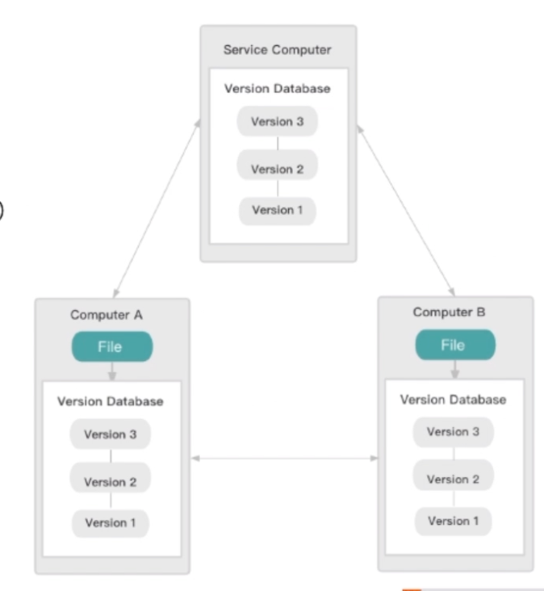
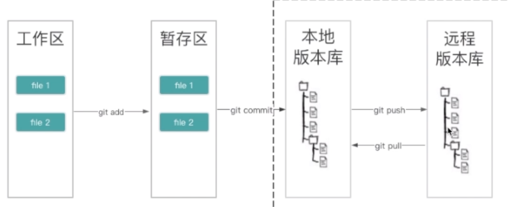
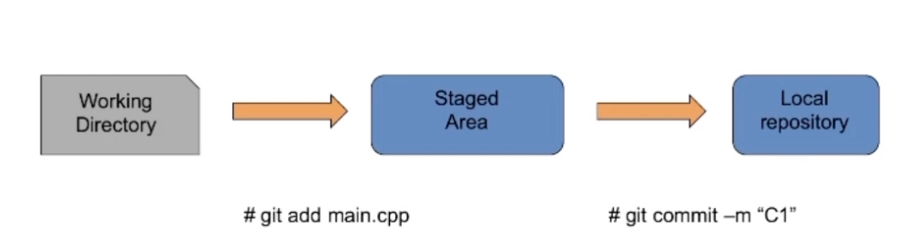
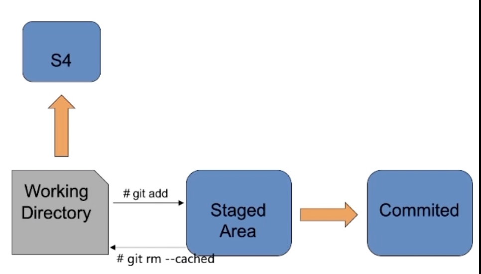

# git

> 文档：https://git-scm.com/docs

## 基础

### 概述

版本控制
是指对软件开发过程中各种程序代码、配置文件及说明文档等
文件变更的管理,是软件配置管理的核心思想之

### 种类

版本控制系统

* 集中式版本控制系统( Centralized Version Control Systems）

  举例:SVN

  * 有一个单的集中管理的服务器,保存所有文件的修订版本
  * 而协同工作的人们都通过客户端连到这台服务器,取出最新的文件或者提交更新

* 分布式版本控制系统( Distributed Version Control System,简称DVC）
  举例:Git
  * 客户端并不只提取最新版本的文件快照而是把代码仓库完整地镜像下来
  * 没有“中央服务器”,每个人的电脑上都是一个完整的版本库



### 配置

```sh
# 配置Git

# 配置提交代码的提交人信息,全局生效

git config --global user name"Your Name"
gitconfig--globaluseremail,"email@example.com"

# 创建本地版本库

mkdir learngit
cd learnt

# /Users/myuser/learngit

git init

# Initialized empty Git repository in /Users/myuser/learngit/git/
```


## 工作区与工作流

* 版本库( repository):
  一个目录,目录里面的文件都可以被Git管理起来,每个文件的增加、修改、删除,Git都能追踪,通常可分为本地版本库和远程版本库
* 工作目录( working copy或 directory):
  也叫工作区,在本地能看到的目录
* 暫存目录( stage!或者 index)
  也叫做索引,需要提交的文件修改通通放到暂存区,然后一次性提交暂存区的所有修改;


- 在工作区编辑文件,添加文件到暂存区,保存文件到版本库
- 本地版本库推送到远程版本库
- 本地版本库从远程版本库拉取版本更新



## 操作

### 本地修改和提交

* 创建空的仓库及配置(见前章)
* 编辑源文件main.cpp
* 添加到缓存区
* 提交C1



```sh
git add main cpp
git status
# On branch master
# No commits yet
# Changes to be committed
# (use" git rm --cached <file>."to unstage)
# new file: main cpp
git commit-m "C1
# [master (root-commit)689fe4b] Cl
# 1 file changed, 0 insertions(+), 0 deletions(
# create mode 100644 main cpp
```

### 提交的撤销恢复回滚
本地暂时不想提交的修改
可以放入暂存区S4

```sh
git stash
```

撤销本地修改,本地修改全部丟弃

```sh
git checkout -f
```



```sh
git add main cpp
git status
# On branch master
# Changes to be committed
# (use"git reset HEAD <file>. "to unstage)
# modified: main cpp
git rm --cached main cpp
# main cpp
# git status
# On branch master
# Changes to be committed:
# (use "git reset HEAD <file>."to unstage)
# 		deleted main. cpp
# Untracked files
# (use "git add <file>. "to include in what will be committed)
# 		main.cpp
```


### 提交的撇销恢复回滚

- 回滚到C2
- 最新提交的 commit变成了C2
- C3的修改放入暂存区
- C3没有被删除,无法追溯

### 为提交贴标签
给提交贴标签

```sh 
git tag
```


用来记录一次特定意义的提交记录

```sh
git tag C3
git log
# commit 889256e75232cd164f09f6d5b94b30e8bd0bll5b (HEAD -> master, tag: C3)
# Author:admin<admin@baidu.com>
# Date: Tue May2523:25:382621+6800
```

* 查看当前状态
* 显示当前分支名称
* 显示各个工作区的状态

更多友好的输出格式显示
git status-sb-uno--show-stash

### 查看提交记录
从当前提交记录开始向前追溯
详细的作者,日期,日志记录

### git log

```sh
git log --pretty=format: %h %green%ar %Cred%an %Reset %s %c(auto)%d
```

* 本地修改和提交

  ```sh
  git add
  git commit
  ```

* 提交的撒销恢复回滚

  ```sh
  git rm -cached
  git checkout-f
  git reset
  ```

* 为提交贴标签

  ```sh
  git tag ...
  ```

* 查看提交记录和状态

  ```sh 
  git status
  git log
  ```

## git 分支管理

### 分支的定义
分支其实就是一个可移动的指针,用来记录当前所在节点的所有修改记录。当然每个分支都不受其他分支的影响

> 就像科幻电影里面的平行宇宙一样。

gjt会使用 master作为分支的默认名称。多次提交后,已经存在了指向最后一次commit的 master分支,即每次提交后都会自动向前移动。
分支的好处

* 同时并行推进多个 feature开发,提高开发效率
* 各分支在开发过程中,如果有一个分支失败或者中断,不会对其他分支有任何影
