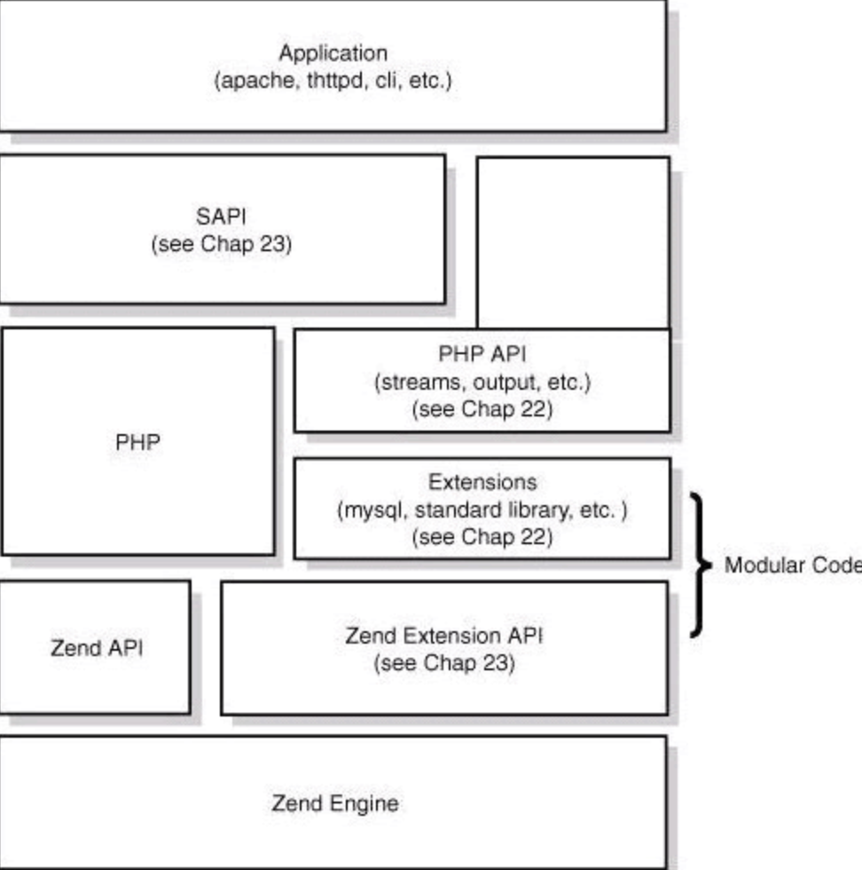
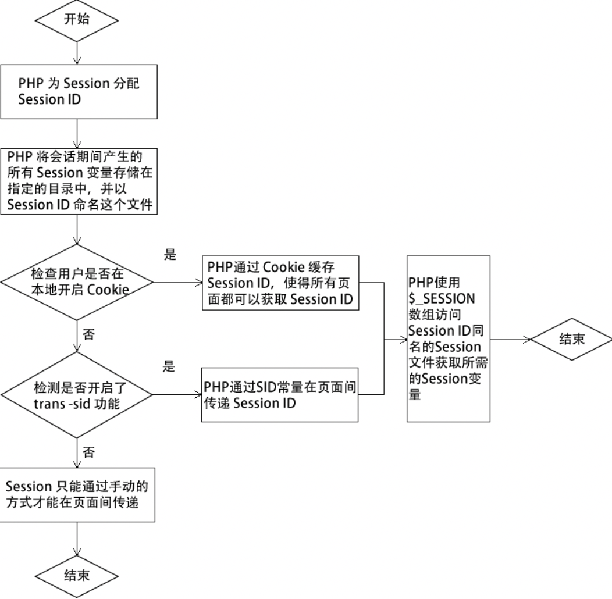
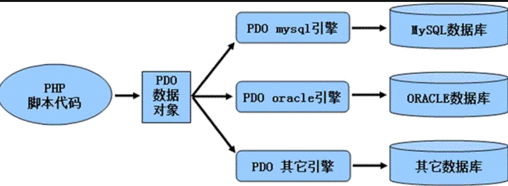

# PHP 快速入门

> 参考文档：
>
> 教程：http://c.biancheng.net/php/
>
> 官方文档：https://www.php.net/manual/zh/index.php

> [php 是世界上最好的语言](https://pic1.zhimg.com/80/v2-0dd98d19611671aaec270355fbff7057_1440w.jpg?source=1940ef5c)(官方说的)

## 简介

`PHP` 是`开源`的 `Web 后端`编程语言

### 应用

1. WEB 服务端
2. 命令行脚本
3. 桌面应用程序(并不)

### 优势

* 学习成本低
  * 入门快，语法简单

* 使用快捷
  * PHP 结合 Linux、Nginx 或 Apache、MySQL 可以很方便快捷地搭建出一套系统
  * PHP 还支持直接调用系统命令
* 良好的数据库支持
* 面向对象
* 开发频率高
  * `解释`执行的`脚本`语言，写完程序以后可以立即执行
* 跨平台
* 生态圈丰富
* 开源框架

### 设计理念

- 解释型
  - 程序一行一行的边解释边运行；
- 弱类型
  - 它的类型根据赋值的数据自动调整
  - 在运行过程中可以给变量赋值不同类型的数据，从而修改变量的类型
- 多 **进程** 模型
  - 由于 PHP 是多进程模型，不同请求间互不干涉，这样保证了一个请求挂掉不会对全盘服务造成影响
  - PHP 也已经支持了多线程模型
- 使用引擎（Zend） + 组件（ext）的模式降低内部耦合；
- 中间层（sapi）隔绝 web server 和 PHP。

### 四层体系



#### Zend 引擎（核心）

Zend 引擎整体用`C语言`实现，是 PHP 的 `内核`部分
它负责将 PHP 代码翻译（词法、语法解析等一系列编译过程）为可执行的 opcode 操作码，并实现相应的处理方法、基本的（如 hashtable、oo）、内存分配及管理、提供相应的 API 方法供外部调用。

 Zend 是一切的核心，所有的外围功能均围绕 Zend 实现。

####  Extensions（扩展）

围绕着 Zend 引擎，Extensions 通过组件化的方式提供各种基础服务我们常见的各种内置函数（例如变量操作函数、字符串操作函数等）以及标准库等都是通过 Extensions 来实现。

 用户也可以根据需要实现自己的 Extension 组件以达到功能扩展、性能优化等目的，这就是高手常说的“编写 PHP 扩展”。

#### SAPI（服务器应用程序编程接口）

SAPI 全称是 Server Application Programming Interface，译为“服务器应用程序编程接口”。

 SAPI 通过一系列钩子函数，使得 PHP 可以和外围交互数据，这是 PHP 非常优雅和成功的一个设计，通过 SAPI 成功的将 PHP  本身和上层应用解耦隔离，PHP 可以不再考虑如何针对不同应用进行兼容，而应用本身也可以针对自己的特点实现不同的处理方式。

#### Application（上层应用）

这就是我们平时编写的 PHP 程序，通过不同的 SAPI 方式得到各种各样的应用模式，例如通过 Web 服务器实现网站后台、在命令行下以脚本方式运行等。

## 安装

windows

https://www.apachefriends.org/download.html

mac 

目前自带php

## HelloWorld

```php
# index.php
<?php
 		echo "Hello World! ";
?>
```

放置于apache 的目标文件夹中

## 标记

四种标记风格

* xml风格

```php
<?php
  echo "C语言中文网";
?>
```

默认推荐风格

* 简短风格

```php
<?
		echo "xxxx";
?>
```

其他的两个PHP7 不再支持

## 数据类型

| 类型              | 功能                                                         |
| ----------------- | ------------------------------------------------------------ |
| boolean（布尔型） | 最简单的数据类型，只有两个值：true(真) / false(假)           |
| string（字符串）  | 字符串是连续的字符序列                                       |
| integer（整型）   | 整型包含所有的整数，可以是正数也可以是负数                   |
| float（浮点型）   | 浮点型也是用来表示数字的，与整型不同除了可以表示整数外它还可以用来表示小数和指数 |

### string 字符串

定义字符串有三种方式，单引号方式、双引号方式、Heredoc 方式

```php
<?php
    //双引号方式声明字符串
    $str1 = "C语言中文网";  
    //单引号方式声明字符串
    $str2 = 'PHP 教程';      
    //Heredoc 方式声明字符串
    $str3 = <<<EOF
    url：
    http://c.biancheng.net/php/
EOF;
    echo $str1."<br>".$str2."<br>".$str3;
?>
```

### 整型

在 PHP 中，整型变量称为 integer 或 int 类型，用来表示一个整数，整型的规则如下所示：

- 整型必须至少有一个数字（0～9）；
- 整型不能包含逗号或空格；
- 整型不能包含小数点；
- 整型可以是正数或负数。

可以用三种格式来表示，即十进制、十六进制（以 0x 为前缀）和八进制（以 0 为前缀）

```php
<?php    
  $x = 5985;      // 定义一个整型数据类型的变量   
	var_dump($x);   // 输出此变量    
	echo "<br>";    
	$x = -345;    
	var_dump($x);       
	echo "<br>";    
	$x = 0x8C;      //十六进制数字    
	var_dump($x);     	
	echo "<br>";    
	$x = 047;       //八进制数字    
	var_dump($x);
?>
```

### 浮点型

浮点型在 PHP 中被称为 float 类型，也可称为实数，可以用来存储整数和小数，有效的取值范围是 1.8E-308 到 1.8E+308 之间。浮点数的精确度比整型数据类型要高。

### 布尔型

布尔型只有两种值，分别是 `TRUE` 和 `FALSE`（**不区分大小写**），意为逻辑真和逻辑假。

### 数组

使用 `array()`函数创建

```php
<? php
  $arr = array('key' => val, ...)
```

### 对象/类

使用 `class` 声明， 用 `new` 来实例化对象

```php
<?php
  class Car  //使用 class 声明一个类对象
  {
    var $color;
    function car($color="black") {
      $this->color = $color;
    }
    function getColor() {
      return $this->color;
    }
	}
  $car = new Car();
  $car->car('red');
  echo $car->getColor();
?>
```

类中使用`var`声明对象，`function`声明方法

### 特殊变量

`NULL` 表示空值

当满足下列条件时，变量的值为 NULL：

- 变量被指定为 NULL 值；
- 变量在没有被赋值前，默认值为 NULL；
- 使用 unset() 函数删除一个变量后，这个变量值也为 NULL。

### 资源

资源（Resource）在 PHP 中同样是一种特殊的数据类型。它主要描述一个 PHP  的扩展资源，例如一个数据库查询（Query）、一个打开的文件句柄（fopen）或一个数据库连接（Database  Connection）以及字符流（stream）等扩展类型。

 但是我们并不能直接操作这个变量类型，只能通过专门的函数来使用。

```php
<?php
	header("content-type:text/html;charset=utf-8");//设置编码，解决中文乱码
	$file = fopen("test.txt", "rw");//打开test.txt文件
	var_dump($file);
?>
```

## 变量

### 声明

- 变量必须以 $ 符号开头，其后是变量的名称，$ 并不是变量名的一部分；
- 变量名必须以字母或下划线开头；
- 变量名不能以数字开头；
- 变量名只能包含字母（A~z）、数字（0~9）和下划线（_）；
- 与其它语言不通的是，PHP 中的一些关键字也可以作为变量名（例如 $true、$for）。

```php
$var_name = val;
```

### 输出

```php
var_dump($var_name)
```

### 赋值

```php
<?php
  	$a = 100; // 直接赋值
		$b = $a;  // 拷贝
		$b = &$a; // 引用
```

### 可变变量

可变变量就是一个变量以另外一个变量的值作为变量名

```php
<?php
  $demo = 'string';
  $$demo = 'C语言中文网';
  echo $string.'<br>';
  $name = 'PHP入门教程';
  $str = 'name';
  echo $$str.'<br>';
  $url = 'http://c.biancheng.net/php/';
  $website = 'url';
  $link = 'website';
  echo $$$link;
?>
```

运行结果如下：

```sh
C语言中文网
PHP入门教程
http://c.biancheng.net/php/
```

#### 数组相关

$$a[1] 时歧义,用“{ }”将变量包裹

$a[1] 作为一个变量 =>${$a[1]}

$$a 作为一个变量并取出该变量中索引为 [1] 的值 ${$a}[1]

### 静态变量 static

- 当函数执行完毕后，静态变量不会消失；
- 静态变量只能在函数内部使用；
- 静态变量只会被初始化一次； 
- 静态变量初始化的值可以省略，默认值为 null；
- 静态变量的初始值只能是具体的字符串、数值等，而不能是一个表达式。

#### 声明

```php
static var_name = value;
static var1,var2,...
```

### 全局变量 global

```php
global var1,var2,....
```

- global 关键字，只能在函数内部使用，不能在函数外部使用；
- global 关键字只能用来引用函数外部的全局变量，在引用时不能直接赋值，赋值和声明语句需要分开写；
- 在函数内部销毁一个使用 global 关键字修饰的变量时，函数外部的变量不受影响。

与 global 关键字功能类似的还有 `$GLOBALS`, `$GLOBALS` 是一个预定义的超全局数组，其中包含了全局作用域中的所有可用变量，变量的名字就是数组的键。

```php
echo $GLOBALS['var_name'];
```

### 预定义变量

- $GLOBALS：全局作用域中的全部可用变量；

- $_SERVER：服务器和执行环境的信息；

  | 变量的名称                   | 说明                                                         |
  | ---------------------------- | ------------------------------------------------------------ |
  | $_SERVER['SERVER_ADDR']      | 当前程序所在的服务器的 IP 地址                               |
  | $_SERVER['SERVER_NAME']      | 当前程序所在的服务器的主机名。如果程序运行在虚拟主机上，则该名称由虚拟主机所设置的值决定 |
  | $_SERVER['REQUERT_METHOD']   | 访问页面使用的请求方法。如 GET、HEAD、POST、PUT 等           |
  | $_SERVER['REMOTE_ADDR']      | 浏览当前页面的用户的 IP 地址                                 |
  | $_SERVER['REMOTE_HOST']      | 浏览当前页面的用户的主机名，反向域名解析基于该用户的 REMOTE_ADDR |
  | $_SERVER['REMOTE_PORT']      | 用户机器上连接到 Web 服务器所使用的端口号                    |
  | $_SERVER['SCRIPT_FILENAME']  | 当前程序的绝对路径                                           |
  | $_SERVER['SERVER_PORT']      | 当前运行脚本所在的服务器的端口号，默认是 80，如果使用 SSL 安全连接，则这个值是用户设置的 HTTP 端口 |
  | $_SERVER['SERVER_SIGNATURE'] | 包含了服务器版本和虚拟主机名的字符串                         |
  | $_SERVER['DOCUMENT_ROOT']    | 当前运行脚本所在的文档根目录                                 |

- $_REQUEST：包含了 $_GET，$_POST 和 $_COOKIE 的所有信息；

- $_POST：通过 POST 方法提交的数据；

- $_GET：通过 GET 方法提交的数据；

- $_FILES：通过 POST 方式上传到服务器的文件数据；

- $_ENV：通过环境方式传递给当前脚本的变量组成的数组；

- $_COOKIE：通过 HTTP Cookies 方式传递给当前脚本的变量所组成的数组；

- $_SESSION：当前脚本可用 SESSION 变量组成的数组。

## 常量

- 常量前面没有美元符号（$）；
- 常量只能用 define() 和 const 定义；
- 常量的作用域是全局的；
- 常量一旦被定义就不能被重新定义或者取消定义。

### 定义

* define

```php
define(string $name, mixed $value [, bool $case_insensitive = false])
```

| 参数              | 说明                                                         |
| ----------------- | ------------------------------------------------------------ |
| $name             | 必选参数，常量名称（需要使用双引号或单引号包裹）             |
| $value            | 必选参数，常量的值                                           |
| $case_insensitive | 可选参数，指定是否大小写敏感，默认是大小写敏感的，设定为 true 则表示大小写不敏感 |

* const

```php
const 常量名 = 常量值;
```

### 获取常量的值

```php
constant(string $name)
```

### 判断常量是否存在

```php
defined(string $name)
```

### 预定义常量

- PHP_VERSION：当前 PHP 的版本号；
- PHP_OS：当前的操作系统名称；
- PHP_EOL：系统换行符，Windows 是（\r\n），Linux 是（\n），MAC 是（\r）；
- PHP_INT_MAX：当前 PHP 支持的最大整数；
- PHP_INT_MIN：当前 PHP 支持的最小整数；
- PHP_EXTENSION_DIR：PHP 的扩展目录；
- TRUE：布尔类型的 true；
- FALSE：布尔类型的 false；
- NULL：Null 值。
- 
-  \__LINE__ ：文件中的当前行号；
- \__FILE__：当前文件的绝对路径（包含文件名）；
- \__DIR\__：当前文件的绝对路径（不包含文件名），等价于 dirname(\__FILE__)；
- \__FUNCTION__：当前函数（或方法）的名称；
- \__CLASS__：当前的类名（包括该类的作用区域或命名空间）；
- \__TRAIT__：当前的 trait 名称（包括该 trait 的作用区域或命名空间）；
- \__METHOD__：当前的方法名（包括类名）；
- \__NAMESPACE__：当前文件的命名空间的名称。

## 注释

单行 `#`或 `//`

多行`/*`...`*/`

## 定界符

```php
<<<sign
    一段文本
sign;
```

使用定界符定义的字符串中虽然能解析变量，但是不能进行运算。

- 定界符标识必须前后一致；
- 可以任意定义定界符标识，比如 echo、html、div，尽量选用有意义的标识符，并遵循命名规范；
- 起始标识符后不能跟任何字符，空格也不可以，另起一行后再输入文本内容；
- 结束标识符后面要紧跟一个分号，并且前后都不能有任何字符，即结束标识要顶头写，且独占一行，其后除紧跟分号外，不能有任何字符（空格也不可以）；
- 最后要注意的是，结束标识所在行不能成为脚本的最后一行，其下必须有空行或者其他代码行，否则报错。

## 运算符

| 名称       | 操作符 | 举例        |
| ---------- | ------ | ----------- |
| 加法运算   | +      | $a + $b     |
| 减法运算   | -      | $a - $b     |
| 乘法运算   | *      | $a * $b     |
| 除法运算   | /      | $a / $b     |
| 取余数运算 | %      | $a % $b     |
| 字符串链接 | .      | "123"."456" |

| 操作     | 符号 | 举例      | 展开形式      | 意义                                                         |
| -------- | ---- | --------- | ------------- | ------------------------------------------------------------ |
| 赋值     | =    | $a = 2    | $a = 2        | 将右边表达式的值赋给左边的变量                               |
| 加       | +=   | $a += 2   | $a = $a + 2   | 将运算符左边的变量加上右边表达式的值赋给左边的变量           |
| 减       | -=   | $a -= 2   | $a = $a - 2   | 将运算符左边的变量减去右边表达式的值赋给左边的交量           |
| 乘       | *=   | $a *= 2   | $a = $a * 2   | 将运算符左边的变量乘以右边表达式的值赋给左边的变量           |
| 除       | /=   | $a /= 2   | $a = $a / 2   | 将运算符左边的变量除以右边表达式的值赋给左边的变量           |
| 拼接字符 | .=   | $a .= '2' | $a = $a . '2' | 将右边的字符追加到左边                                       |
| 取余数   | %=   | $a %= 2   | $a = $a % 2   | 将运算符左边的变量用右边表达式的值求模，并将结果赋给左边的变量 |

| 操作     | 符号 | 举例      | 展开形式      | 意义                                                         |
| -------- | ---- | --------- | ------------- | ------------------------------------------------------------ |
| 赋值     | =    | $a = 2    | $a = 2        | 将右边表达式的值赋给左边的变量                               |
| 加       | +=   | $a += 2   | $a = $a + 2   | 将运算符左边的变量加上右边表达式的值赋给左边的变量           |
| 减       | -=   | $a -= 2   | $a = $a - 2   | 将运算符左边的变量减去右边表达式的值赋给左边的交量           |
| 乘       | *=   | $a *= 2   | $a = $a * 2   | 将运算符左边的变量乘以右边表达式的值赋给左边的变量           |
| 除       | /=   | $a /= 2   | $a = $a / 2   | 将运算符左边的变量除以右边表达式的值赋给左边的变量           |
| 拼接字符 | .=   | $a .= '2' | $a = $a . '2' | 将右边的字符追加到左边                                       |
| 取余数   | %=   | $a %= 2   | $a = $a % 2   | 将运算符左边的变量用右边表达式的值求模，并将结果赋给左边的变量 |

| 操作     | 符号 | 举例      | 展开形式      | 意义                                                         |
| -------- | ---- | --------- | ------------- | ------------------------------------------------------------ |
| 赋值     | =    | $a = 2    | $a = 2        | 将右边表达式的值赋给左边的变量                               |
| 加       | +=   | $a += 2   | $a = $a + 2   | 将运算符左边的变量加上右边表达式的值赋给左边的变量           |
| 减       | -=   | $a -= 2   | $a = $a - 2   | 将运算符左边的变量减去右边表达式的值赋给左边的交量           |
| 乘       | *=   | $a *= 2   | $a = $a * 2   | 将运算符左边的变量乘以右边表达式的值赋给左边的变量           |
| 除       | /=   | $a /= 2   | $a = $a / 2   | 将运算符左边的变量除以右边表达式的值赋给左边的变量           |
| 拼接字符 | .=   | $a .= '2' | $a = $a . '2' | 将右边的字符追加到左边                                       |
| 取余数   | %=   | $a %= 2   | $a = $a % 2   | 将运算符左边的变量用右边表达式的值求模，并将结果赋给左边的变量 |

### 位运算符

| 符号 | 作用     | 举例     |
| ---- | -------- | -------- |
| &    | 按位与   | $m & $n  |
| \|   | 按位或   | $m \| $n |
| ^    | 按位异或 | $m ^ $n  |
| ~    | 按位取反 | ~$m      |
| <<   | 向左移位 | $m << $n |
| >>   | 向右移位 | $m >> $n |

### 递增和递减运算符

```php
++$a
$b++
--$c
```

> 注意：递增和递减操作符与变量之间不能有空格。

### 逻辑运算符

| 逻辑运算符           | 示例                   | 何时结果为真                                                 |
| -------------------- | ---------------------- | ------------------------------------------------------------ |
| && 或 and（逻辑与）  | $m && $n 或 $m and $n  | 当 $m 和 $n 都为真时结果为真，$m 和 $n 有任意一个为假时结果为假 |
| \|\| 或 or（逻辑或） | $m \|\| $n 或 $m or $n | 只要 $m 和 $n 中有任意一个为真，则结果为真                   |
| xor（逻辑异或）      | $m xor $n              | 当 $m 和 $n 一真一假时，结果为真                             |
| !（逻辑非）          | !$m                    | 当 $m 为假时，结果为真                                       |

### 比较运算符

| 例子           | 名称                       | 描述                                                         |
| -------------- | -------------------------- | ------------------------------------------------------------ |
| $a == $b       | 等于                       | 如果类型转换后 $a 和 $b 的值相等，则返回 TRUE，否则返回 FALSE |
| $a === $b      | 全等                       | 如果 $a 和 $b 不仅值相等，而且它们值的类型也相等，则返回 TRUE，否则返回 FALSE |
| $a != $b       | 不等于                     | 如果类型转换后 $a 的值不等于 $b 的值，则返回TRUE，否则返回 FALSE |
| $a <> $b       | 不等于                     | 与 != 相同，如果类型转换后 $a 的值不等于 $b 的值，则返回 TRUE，否则返回 FALSE |
| $a !== $b      | 不全等                     | 如果 $a 的值不等于 $b的值，或者它们值的类型不同，则返回 TRUE，否则返回 FALSE |
| $a < $b        | 小与                       | 如果 $a 的值小于 $b 的值，则返回 TRUE，否则返回 FALSE        |
| $a > $b        | 大于                       | 如果 $a 的值大于 $b 的值，则返回 TRUE，否则返回 FALSE        |
| $a <= $b       | 小于等于                   | 如果 $a 的值小于或者等于 $b 的值，则返回 TRUE，否则返回 FALSE |
| $a >= $b       | 大于等于                   | 如果 $a 的值大于或者等于 $b 的值，则返回 TRUE，否则返回 FALSE |
| $a <=> $b      | 太空船运算符（组合比较符） | 当 $a小于、等于、大于 $b时 分别返回一个小于、等于、大于0的整型值。 PHP7开始提供. |
| $a ?? $b ?? $c | NULL合并操作符             | 从左往右第一个存在且不为 NULL 的操作数。如果都没有定义且不为 NULL，则返回 NULL。PHP7开始提供。 |

### 三元运算

```php
(expr1)?(expr2):(expr3); //表达式1?表达式2:表达式3
```

## 流程控制

### if-else

```php
 if (判断条件 1) {
    语句块 1;
} else if (判断条件 2) {
    语句块 2;
}
else{
    语句块 n+1;
}
```

### while /do-while

```php
while (表达式) {
    语句块;
}
```

```php
do {
    语句块;
} while (表达式);
```

### switch case

```php
switch(表达式){
    case 值 1:
        语句块 1;
        break;
    ... ...
    case 值 n:
        语句块 n;
        break;
    default:
        语句块 n+1;
}
```

### for/foreach

```php
for (初始化表达式; 条件判断; 变量更新) {
    循环体;
}
```

```php
//格式1
foreach (array_expression as $value){
    statement
}

//格式2
foreach (array_expression as $key => $value){
    statement
}
```

在 PHP 5 版本中，当 foreach 开始循环执行时，每次数组内部指针都会自动向后移动一个单元，但是在 PHP 7 中却不是这样。

```php
$array = [0, 1, 2];
foreach ($array as $val)
{    
  var_dump(current($array));
}
```

在 PHP 5 中的输出结果为：

```
int(0) int(1) int(2)
```

但在 PHP 7 中的输出结果却为：

```
int(0) int(0) int(0)
```

### break/continue

打断循环 / 继续下一轮循环

### goto

跳转到标记处 

不要用

### die/exit 输出一个消息并退出当前脚本

```php
exit(message);
die(message);
```

message 为一个可选参数（可以为空）,可以是字符串类型也可以是 int 类型。

如果 message  为字符串类型，则函数会打印该字符串并退出当前脚本

如果 message 为 int 类型，那么该值会作为退出状态码，并且不会被打印输出。  

退出状态码的取值范围在 0 至 254 之间

> 注意：不要使用被 PHP 保留的退出状态码 255。 状态码 0 用于成功中止程序。

## include/require

### include

包含外部文件

```php
include('filename')
include 'filename'
```

### requore

require 语句的使用方法与 include 语句类似，都是实现对外部文件的引用。

在 PHP 文件执行之前，PHP  解析器会用被引用文件的全部内容替换 require 语句，然后与 require 语句之外的其他语句组成新的 PHP 文件，最后再按新 PHP  文件执行程序代码。

### 区别

require 语句和 include 语句几乎完全一样，不同的是当被包含文件不存或存在错误时，require 语句会发出一个 Fatal error 错误并终止程序执行，而 include 则会发出一个 Warining 警告但程序会接着向下执行。

### include_once/require_once

检查文件是否已经被包含，确保文件只被引用一次。

## 函数

### 定义

```php
# 值传递
function 函数名 (参数1, 参数2, ..., 参数n){
    函数体;
    return 返回值; # 返回值唯一
}

# 引用传递
function name (&参数1, &参数2, ..., &参数3) {
    ...    
}

# 默认参数
function name (&参数1, &参数2, ..., &参数3=“xxx”) {
    ...    
}

# 可变长 作为数组
function name (...$arr) {
    ...    
}
```

### 参数类型声明

在 PHP 7 中增加了参数可声明的类型种类，如表所示。

| 类型                             | 说明                         | PHP 版本  |
| -------------------------------- | ---------------------------- | --------- |
| class/interface name（类，接口） | 参数必须是指定类或接口的实例 | PHP 5.0.0 |
| Array                            | 参数为数组类型               | PHP 5.1.0 |
| Callable                         | 参数为有效的回调类型         | PHP 5.4.0 |
| Bool                             | 参数为布尔型                 | PHP 7.0.0 |
| Float                            | 参数为浮点型                 | PHP 7.0.0 |
| Int                              | 参数为整型                   | PHP 7.0.0 |
| String                           | 参数为字符串                 | PHP 7.0.0 |
| class/interface name（类，接口） | 参数必须是指定类或接口的实例 | PHP 5.0.0 |
| Array                            | 参数为数组类型               | PHP 5.1.0 |

### 类型转换

默认情况下，当传递的参数不是函数指定的参数类型时，PHP 会尝试将所传参数转换成指定参数类型。

在将浮点型转成整型时，只取其中的整数部分。

#### 严格模式

在 PHP 7 中，可以使用`declare(strict_types=1)`设置严格模式，这样只有在传递的参数与函数期望得到的参数类型一致时才能正确执行，否则会抛出错误

### 匿名函数

匿名函数创建

```php
function (参数列表) use(父作用域变量){
   ...
 }
```

### use 关键字

使用 use 关键字，闭包函数可以实现从父级作用域中继承变量，但是从 php7.1 开始，不支持继承预定义变量和 $this。

### 可变函数

PHP 中支持可变函数的概念（也叫变量函数），可以这样理解，如果一个变量名后有小括号`()`，那么 PHP 就会寻找与变量值同名的函数并执行它。

```php
<?php
    function website(){
        echo 'C语言中文网<br>';
    }
    function url($str = ''){
        echo $str.'<br>';
    }
    function title($string){
        echo $string;
    }

    $funcname = 'website';
    $funcname();
    $funcname = 'url';
    $funcname('http://c.biancheng.net/php/');
    $funcname = 'title';
    $string = 'PHP 教程';
    $funcname($string);
?>
```

### 回调函数

在 PHP 中调用回调函数，不像 C、Java 等语言那样直接使用函数名作为函数参数，而是使用函数名对应的字符串名称来调用。

```php
<?php
    function arithmetic($funcName, $m, $n) {
        return $funcName($m, $n);
    }
    function add($m,$n){
        return $m+$n;
    }

    $sum = arithmetic('add', 5, 9);
    echo '5 + 9 ='.$sum;
?>
```

PHP 还提供了两个内置函数 call_user_func() 和 call_user_func_array()  来对回调函数进行支持。

 call_user_func_array() 是以数组的形式接收回调函数的参数

call_user_func() 则是以具体的参数来接收回调函数参数的。

#### call_user_func()

call_user_func 函数会把第一个参数作为回调函数来调用，其语法格式如下：

`call_user_func ($callback [, $parameter, ... ])`

其中，第一个参数 $callback 是被调用的回调函数，其余参数是回调函数的参数，多个参数之间使用`,`分隔。

#### call_user_func_array()

call_user_func_array 函数可以调用回调函数，并使用一个数组来作为回调函数的参数，其语法格式如下：

`call_user_func_array ($callback ,$param_arr)`

## 字符串

### 单双引号

PHP 会解析双引号中的变量，而不会解析单引号中的变量

单引号和双引号中都可以使用转义字符`\`，但是，在单引号定义的字符串中只能转义单引号和转义符本身，而在双引号定义的字符串中，PHP 可以转义更多的特殊字符。

### 字符串拼接

PHP 中可以使用字符串连接符`.`来拼接字符串，

也可以使用 赋值运算符`.=`

### 字符串函数

#### 大小写转换

| 函数名称        | 功能                                           |
| --------------- | ---------------------------------------------- |
| strtoupper      | 将字符串转化为大写                             |
| strtolower      | 将字符串转化为小写                             |
| ucfirst         | 将字符串的首字母转化为大写                     |
| lcfirst         | 将字符串的首字母转化为小写                     |
| ucwords         | 将字符串中每个单词的首字符转化为大写           |
| mb_strtoupper   | 将字符串转化为大写（与 strtoupper 函数有区别） |
| mb_strtolower   | 将字符串转化为小写（与 strtolower 函数有区别） |
| mb_convert_case | 按照不同的模式对字符串进行转换                 |

```php
mb_convert_case($str, $mode [, $encoding = mb_internal_encoding()])
```

其中，

$str 是需要转换的字符串；

$mode 是转换模式，可以是 MB_CASE_UPPER、 MB_CASE_LOWER 和 MB_CASE_TITLE 的其中一个

$encoding 是参数的字符编码，可以省略。

#### 字符串查找

* `stripos()` 用来查找字符串（不区分大小写） 字符串某部分字符串首次出现的位置（不区分大小写）。

* `strpos()`字符串首次出现的位置 strpos() 用来查找字符串首次出现的位置。

* `strripos()`用来计算指定字符串在目标字符串中最后一次出现的位置（不区分大小写）。
* `strrpos()` 用来计算指定字符串在目标字符串中最后一次出现的位置.

#### 替换

`str_ireplace() `和` str_replace `使用新的字符串替换原来字符串中指定的特定字符串，`str_replace` 区分大小写，`str_ireplace()` 不区分大小写，两者语法相似。

#### 截取

`substr() `函数可以从字符串的指定位置截取一定长度的字符，这段被截取的字符可称为“子串”或者“子字符串”

`mb_substr()`函数可以从一个字符串中截取指定的一部分，与 substr() 函数不同的是，mb_substr() 函数不仅对英文字符有效，对中文字符同样有效，其语法格式如下：

#### 去除空格

- `trim() `函数：去除字符串左右两边的空白字符和特殊字符；
- `ltrim() `函数：去除字符串左边的空白字符和特殊字符；
- `rtrim() `函数：去除字符串右边的空白字符和特殊字符。

```php
trim($str [, $character_mask = " \t\n\r\0\x0B"])
```

- " "：普通空格符；
- "\t"：制表符；
- "\n"：换行符；
- "\r"：回车符；
- "\0"：空字节符；
- "\x0B"：垂直制表符。

#### 长度

`strlen() `函数可以返回给定字符串的长度

> 在 strlen() 函数中，数字、英文、小数点、下划线和空格占一个字符长度；而一个 GB2312 编码的汉字占两个字符长度，一个 UTF-8 编码的汉字占三个字符长度。

`mb_strlen() `函数的返回值为具有 $encoding 编码的字符串 $str 所包含的字符数，如果 $encoding 无效则返回 false。

#### 转义

`addslashes()` 函数的作用是给字符串加入`\`，对指定的字符串进行转义，语法格式如下：

`stripslashes() `函数的作用是还原一个被转义的字符串，也就是去除在字符串中加入的反斜线，语法格式如下：

#### 重复

` str_repeat() `函数可以重复一个字符串

#### 打乱

` str_shuffle()` 函数来随机打乱一个字符串中的所有字符

#### 分割

`explode()` 函数可以基于字符串分隔符拆分字符串，即它将一个字符串根据分隔符拆分为若干个子串，然后将这些子串组合成数组并返回

```php
explode($delimiter, $string [, $limit])
```

- $limit：可选参数，可以为空，规定要返回数组元素的数目；
  - 如果 $limit 不为空且为正数，则返回的数组最多包含 $limit 个元素，最后的那个元素包含了 $string 的剩余部分；
  - 如果 $limit 不为空且为负数，则返回除了最后的 $limit 个元素外的所有元素；
  - 如果 $limit 为 0，则会被当作 1；
  - 如果 $limit 为空，则表示返回所有数组元素。

## 数组

* 所有数组都是键值对

索引数组的下标（键名）由数字组成，默认从 0 开始，

* 关联数组

关联数组的下标（键名）由数值和字符串混合的形式组成，

### 定义

* 使用直接为数组元素赋值方法声明一维数组的语法格式如下所示：

```
$数组变量名[下标] = 值
```

> 其中下标（索引值）可以是一个字符串或一个整数，并且下标需要使用`[ ]`包裹。

* array() 函数来新建一个数组。它接受一定数量用逗号分隔的` key=>value `参数对

```php
 $array = array(0 => 'C语言中文网', 1 => 'PHP 教程', 2 => 'PHP 数组', 3 => 'http://c.biancheng.net/php/');
```

#### 多维数组

数组变量的值为一个数组。

### 添加

```
$arr = array();
array_push($arr, el1, el2 ... eln);
$arr[] = el1; # 效率高
```


### 函数

#### 数组长度

`count() `函数可以统计出数组里所有元素的数量，或对象中的属性个数

```php
count($array [, $mode = COUNT_NORMAL])
```

- $array：为待统计的数组或对象；
- $mode：为可选参数，可以省略。
  - 如果省略 $mode 参数，或者将其设置为 COUNT_NORMAL 或者 0，count() 函数将不检测多维数组；
  - 如果 $mode 设置为 COUNT_RECURSIVE 或者 1，count() 函数将递归计算数组中元素的个数，对于计算多维数组的元素个数尤为有用。

> 如果 $array 既不是数组，也不是对象，count() 函数将返回 1；如果 $array 等于 NULL，则 count() 函数返回 0

`sizeof()` 函数是 `count()` 函数的别名

#### 排序

| sort()   | 对数组元素进行升序排序（从小到大）。                         |
| -------- | ------------------------------------------------------------ |
| rsort()  | 对数组元素进行降序排序（从大到小）。                         |
| asort()  | 对数组元素进行升序排序（从小到大），并保持索引关系。         |
| arsort() | 对数组元素进行降序排序（从大到小），并保持索引关系。         |
| ksort()  | 按照数组的键值对数组进行升序排序（从小到大），并保持索引关系。 |
| krsort() | 按照数组的键值对数组进行降序排序（从大到小），并保持索引关系。 |

`sort()` 函数可以将数组进行升序排序（从小到大，由低到高），语法格式如下：

sort($array [, $sort_flags = SORT_REGULAR])

参数说明如下：

- $array：为要排序的数组。
- $sort_flags：为可选参数，默认为“SORT_REGULAR”，用来定义函数排序的模式。$sort_flags 可以设置为下面这些值：
  - 0 或 SORT_REGULAR：正常比较数组元素，不改变其类型（默认值）；
  - 1 或 SORT_NUMERIC：将数组元素当作数字来比较；
  - 2 或 SORT_STRING：将数组元素当作字符串来比较
  - 3 或 SORT_LOCALE_STRING：根据当前的区域（locale）设置来把数组元素当作字符串比较，可以用 setlocale() 来改变。
  - 4 或 SORT_NATURAL：和 natsort() 类似对每个数组元素以“自然的顺序”对字符串进行排序，是 PHP5.4.0 中新增的。
  - 5 或 SORT_FLAG_CASE：能够与 SORT_STRING 或 SORT_NATURAL 合并（OR 位运算），不区分大小写排序字符串。

#### 内部指针

每个数组都有一个内部的指针指向它“当前的”单元（元素），这个指针最初指向的是当前数组中的第一个单元。

 通过 current() 函数，就可以获取内部指针指向元素的值

`current($array)`参数 $array 表示被操作的数组。

如果内部指针指向超出了数组的末端，current() 函数会返回 FALSE。

> pos() 函数与 current() 函数的功能完全相同

- end()：将内部指针指向数组中的最后一个元素；
- next()：将内部指针指向数组中的下一个元素；
- prev()：将内部指针指向数组中的上一个元素；
- reset()：将内部指针指向数组中的第一个元素；
- each()：返回当前元素的键名和键值，并将内部指针指向数组中的下一个元素。

#### 当前元素的键值对

each() 函数返回数组中当前元素的键值对，并将数组内部的指针指向数组的下一个元素。

> 自 PHP7.2 起，each() 函数已经被弃用。

#### 键是否存在

`array_key_exists($key, $array)`

#### for each

foreach 语句有两种语法格式，第二种比较次要但却是第一种有用的扩展。

```php
//第一种格式
foreach (array_expression as $value){
    statement
}
//第二种格式
foreach (array_expression as $key => $value){
    statement
}
```

#### 是否存在某个值

`in_array()` 函数可以查找数组中是否包含某个值，如果存在则返回 TRUE，不存在则返回 FALSE

```php
in_array($needle, $array[, $strict = FALSE])
```

$strict：为可选参数，默认为 FALSE。

- 如果 $strict 为空或者 FALSE，则 in_array() 函数只会检查 $needle 的值是否和 $array 中的值相等；
- 如果 $strict 的值为 TRUE，in_array() 函数除了会检查 $needle 和 $array 中的值之外，还会比较它们的类型是否相等。

#### 数组拼接[join]

`implode($glue, $array) `或者 `implode($array)`

### list

 list() 可以把一个数组中的值分别赋给一组变量，像 array() 一样，它并不是真正的函数，而是语言结构。 list() 可以在单次操作内为一组（多个）变量赋值。

> list() 仅能用于索引数组，并且索引要从 0 开始。PHP5 里 list() 从最右边的参数开始赋值；而 PHP7 里 list() 从最左边的参数开始赋值。

```php
$array = array(1=>"C语言中文网",2=>"PHP 教程", 3=>"http://c.biancheng.net/php/");

list($a, $b, $c) = $array;
# 数组下标没有 0 所以a 没有被赋值
# $a =
# $b = C语言中文网
# $c = PHP 教程

$array = array("C语言中文网", "PHP 教程",  "http://c.biancheng.net/php/");
list($a, , $c) = $array;
echo '$a = '.$a.'<br>$b = '.$b.'<br>$c = '.$c;
?>
# $a = C语言中文网
# $b =
# $c = http://c.biancheng.net/php/
```

## 面向对象 OOP

### 定义类

```php
 [修饰类的关键字] class 类名{
    类的属性和方法;
}
```

- abstract：抽象类或方法，被修饰为抽象类之后，类将不能被实例化，但可以被继承。如果类中有至少一个方法被声明为抽象的，那么这个类也必须声明为抽象的。继承一个抽象类的时候，子类必须重新定义父类中的所有抽象方法，而且这些方法的访问控制必须和父类中一样。
- final：使用 final 修饰的类不能被继承，而使用 final 修饰的方法不能在子类中重新定义。

### 属性/成员变量

```php
访问权限修饰符 属性名称 = 属性值;
```

- public：公共的，在类的内部、子类中或者类的外部都可以使用，不受限制；
- protected：受保护的，在类的内部和子类中可以使用，但不能在类的外部使用；
- private：私有的，只能在类的内部使用，在类的外部或子类中都无法使用。

> 注意：一个类，即一对大括号之间的全部内容都要在一段代码中，也就是一个`<?php ... ?>`之间，不能分割成多块。

### 方法

在类中定义的函数被称为成员方法。函数和成员方法唯一的区别就是，函数实现的是某个独立的功能，而成员方法是实现类中的一个行为，是类的一部分。

在 PHP7 中，引入了类型声明

```php
[权限修饰符] function 方法名 (类型 参数1, 类型 参数2, ..., 类型 参数n) : 返回值类型 {
    ... ...
}
```

例如 public、private、protected 等

- public：公共的，在类的内部、子类中或者类的外部都可以使用，不受限制；
- protected：受保护的，在类的内部和子类中可以使用，但不能在类的外部使用；
- private：私有的，只能在类的内部使用，在类的外部或子类中都无法使用。

### 实例化

```php
变量名 = new 类名(参数数列表);
变量名 = new 类名;
```

### 成员访问

```php
变量名 -> 成员属性 = 值;   //为成员属性赋值
变量名 -> 成员属性;           //直接获取成员属性的值
变量名 -> 成员方法();        //访问对象中的成员方法
```

### 构造函数

在 PHP7.0 的用法，构造函数必须使用` __construct `来定义。

> 在 PHP3.0 和 PHP4.0 中，构造函数是一个与其所在类同名的函数

```php
public function __construct(参数列表){
    ... ...
}
```

### 析构函数

```php
public function __destruct(){
    ... ...
}
```

### 继承

类的继承需要通过 extends 关键字来实现。语法格式如下所示：

```php
class 子类名 extends 父类名{
    ... ...
}
```

|                | public（默认） | private | protected |
| -------------- | -------------- | ------- | --------- |
| 同一个类中访问 | √              | √       | √         |
| 在子类中访问   | √              |         | √         |
| 在类的外部访问 | √              |         |           |

### $this

在对象中的每个成员方法里面都会存在一个特殊的对象引用“$this”。成员方法属于哪个对象，“$this”就代表哪个对象，与连接符`->`联合使用，专门用来完成对象内部成员之间的访问。

```php
$this -> 成员属性;
$this -> 成员方法(参数列表);
```

### 命名空间

PHP 命名空间可以解决以下两类问题：

- 用户编写的代码与 PHP 内部的类/函数/常量或第三方类/函数/常量之间的命名冲突；
- 为很长的标识符名称（通常是为了缓解第一类问题而定义的）创建一个别名（或简短）的名称，以提高源代码的可读性。

#### 定义

```php
namespace 命名空间名;
```

> 在声明命名空间之前除了用于定义源文件编码方式的 declare 语句外，所有非 PHP 代码（包括空白符）都不能出现在命名空间声明之前。

#### 定义子命名空间

与目录和文件的关系很象

```php
namespace App\Model;
namespace App\Controller\Home;
```

#### 同一文件多个命名空间

```php
<?php
	namespace MyProject;
		...
	namespace AnotherProject{
  	...
  }
}
?>
```

> 将全局的非命名空间中的代码与命名空间中的代码组合在一起，只能使用大括号形式的语法，同时全局代码必须用一个不带名称的 namespace 语句加上大括号括起来

#### 命名空间使用

- 非限定名称

  或不包含前缀的类名称，例如 $a=new foo(); 或  foo::staticmethod(); 。如果当前命名空间是 currentnamespace，那么 foo 将被解析为 currentnamespace\foo。如果使用 foo 的代码是全局的，不包含在任何命名空间中的代码，则 foo 会被解析为 foo。

- 限定名称，或包含前缀的名称

  例如 $a=new subnamespace\foo();  或  subnamespace\foo::staticmethod(); 。如果当前的命名空间是 currentnamespace，则 foo 会被解析为 currentnamespace\subnamespace\foo。如果使用 foo 的代码是全局的，不包含在任何命名空间中的代码，foo 会被解析为 subnamespace\foo。

- 完全限定名称

  或包含了全局前缀操作符的名称，例如 $a = new \currentnamespace\foo(); 或 \currentnamespace\foo::staticmethod();。在这种情况下，foo 总是被解析为代码中的文字名 currentnamespace\foo。

#### 别名/导入

```php
use namespace;
use namespace as xxx;
```

#### namespace 关键字和 __NAMESPACE__ 常量

__NAMESPACE__ 常量的值是包含当前命名空间名称的字符串

namespace 关键字可用来显式访问当前命名空间或子命名空间中的元素，它等价于类中的 self 操作符

### 特殊方法


| __construct()  | 实例化类时自动调用                                   |
| -------------- | ---------------------------------------------------- |
| __destruct()   | 类对象使用结束时自动调用                             |
| __set()        | 在给未定义的属性赋值时自动调用                       |
| __get()        | 调用未定义的属性时自动调用                           |
| __isset()      | 使用 isset() 或 empty() 函数时自动调用               |
| __unset()      | 使用 unset() 时自动调用                              |
| __sleep()      | 使用 serialize 序列化时自动调用                      |
| __wakeup()     | 使用 unserialize 反序列化时自动调用                  |
| __call()       | 调用一个不存在的方法时自动调用                       |
| __callStatic() | 调用一个不存在的静态方法时自动调用                   |
| __toString()   | 把对象转换成字符串时自动调用                         |
| __invoke()     | 当尝试把对象当方法调用时自动调用                     |
| __set_state()  | 当使用 var_export() 函数时自动调用，接受一个数组参数 |
| __clone()      | 当使用 clone 复制一个对象时自动调用                  |
| __debugInfo()  | 使用 var_dump() 打印对象信息时自动调用               |

### 抽象

#### 抽象方法

抽象方法是没有方法体的方法

```
abstract 访问权限修饰符 function 方法名1(参数列表);
```

#### 抽象类

只要一个类里面有一个方法是抽象方法，那么这个类就必须定义为抽象类

```php
abstract class 类名{
    public $name;
    abstract 访问权限修饰符 function 方法名1();
    abstract 访问权限修饰符 function 方法名2();
    访问权限修饰符 function 方法名3(){
        ... ... ;
    }
}
```

### 接口

但 PHP 只支持单继承，也就是说每个类只能继承一个父类。

接口是一种特殊的抽象类，而抽象类又是一种特殊的类，所以可以将接口看作是一种特殊的类。

#### 声明

```php
interface 接口名称{
    // 常量成员
    // 抽象方法
}
```

#### 使用

```php
class 类名 extends 父类名 implements 接口一, 接口二, ..., 接口 n {
    // 实现所有接口中的抽象方法
}
```

### final 最终类和最终方法

```php
inal class 类名{                   // 最终类
    ... ... ;
}
final function 方法名(){       // 最终方法
    ... ... ;
}
```

final 关键字的作用如下：

- 使用 final 修饰的类，不能被继承；
- 类中使用 final 修饰的成员方法，在子类中不能覆盖（重写）该方法。

### clone

在 PHP 中可以使用 clone 关键字克隆对象，语法格式如下：

`克隆对象名称 = clone 原对象名称;`

因为 clone 的方式实际上是对整个对象的内存区域进行了一次复制并用新的对象变量指向新的内存，因此赋值后的对象和原对象之间是相互独立的。

### instanceof 判断类别

使用 PHP 中的 instanceof 运算符，可以判断一个对象是否属于某一个类，语法格式如下：

对象名 instanceof 类名;

### __autoload() 函数

当我们 new 一个类时，如果当前源文件中找不到这个类，PHP 则会自动调用 __autoload() 函数，并将类名传递给 __autoload() 函数

```php
function __autoload($class){
    // 方法体
}
```

使用 __autoload() 函数自动加载类文件。

```
<?php    
	function __autoload($class){        
		$file = './'.$class.'.php';        				
		include_once($file);    
	}    
	$obj = new Demo();
?>
```

### spl_autoload_register() 函数

spl_autoload_register() 函数可以指定一个函数来替代 __autoload() 函数的功能

```php
spl_autoload_register([$autoload_function [, $throw = true [, $prepend = false ]]])
```

- $autoload_function：要替代 __autoload() 函数的函数名称，也可以是一个匿名函数。如果没有提供任何参数，则自动注册 autoload 的默认实现函数 spl_autoload()；
- $throw：用来设置 $autoload_function 无法成功注册时，spl_autoload_register() 函数是否抛出异常；
- $prepend：如果是 true，则 spl_autoload_register() 函数会添加 $autoload_function 函数到队列之首，否则添加到队列尾部。

```php
<?php
    spl_autoload_register('loadClass');
    function loadClass($class){
        $file = './'.$class.'.php';
        include_once($file);
    }

    $obj = new Demo();
?>
```

## 正则表达式

### 搜索匹配

```php
preg_match($pattern,$subject [, &$matches [, $flags = 0 [, $offset = 0 ]]])
  
preg_match_all($pattern, $subject [, &$matches [, $flags = PREG_PATTERN_ORDER [, $offset = 0 ]]])
```

- $pattern：要搜索的模式，也就是编辑好的正则表达式；
- $subject：要搜索的字符串；
- $matches：可选参数（数组类型），如果提供了 $matches，它将被填充为搜索结果。 $matches[0] 包含完整模式匹配到的文本， $matches[1] 包含第一个捕获子组匹配到的文本，以此类推；
- $flags：可选参数，$flags 可以被设置为 
  - match：
    - PREG_OFFSET_CAPTURE，如果传递了这个标记，对于每一个出现的匹配，返回时都会附加上字符串偏移量（相对于目标字符串的）；
  - match_all:
    - PREG_PATTERN_ORDER：结果排序为 $matches[0] 保存完整模式的所有匹配，$matches[1] 保存第一个子组的所有匹配，以此类推。
    - PREG_SET_ORDER：结果排序为 $matches[0] 包含第一次匹配得到的所有匹配（包含子组）， $matches[1] 是包含第二次匹配到的所有匹配(包含子组)的数组，以此类推。
    - PREG_OFFSET_CAPTURE：如果这个标记被传递，每个发现的匹配返回时会增加它相对目标字符串的偏移量。注意这会改变 $matches  中的每一个匹配结果字符串元素，使其成为一个第 0 个元素为匹配结果字符串，第 1 个元素为匹配结果字符串在 subject 中的偏移量。
- $offset：可选参数，用于指定从目标字符串的哪个位置开始搜索（单位是字节）。

preg_match() 函数可以返回 $pattern 的 是否有匹配，preg_match_all() 返回匹配的次数

### 匹配数组

```php
preg_grep($pattern, $input [, $flags = 0 ])
```

参数说明如下：

- $pattern：要搜索的模式，也就是定义好的正则表达式；
- $input：要搜索的数组；
- $flags：可选参数，可以设置为 PREG_GREP_INVERT，这时函数会返回数组中与给定模式 $pattern 不匹配的元素组成的数组。

perg_grep() 函数将遍历 $input 数组中的每一个元素，让该元素与模式 $pattern 进行匹配，然后将匹配成功或者匹配失败的元素返回。

### 替换匹配

 preg_replace() 函数可以执行正则表达式的搜索和替换，是一个强大的字符串替换处理函数，preg_replace() 返回所有结果，不管是否匹配成功。

```php
preg_replace($pattern, $replacement, $subject [, $limit = -1 [, &$count]])
```

- $pattern：要搜索的模式，可以使一个字符串或字符串数组；
- $replacement：用于替换的字符串或字符串数组。如果这个参数是一个字符串，并且 $pattern  是一个数组，那么所有的模式都使用这个字符串进行替换。如果 $pattern 和 $replacement 都是数组，每个 $pattern 使用 $replacement 中对应的元素进行替换。如果 $replacement 中的元素比 $pattern 中的少，多出来的  $pattern 使用空字符串进行替换。
- $subject：要进行搜索和替换的字符串或字符串数组，如果 $subject 是一个数组，搜索和替换回在 $subject 的每一个元素上进行, 并且返回值也会是一个数组。
- $limit：可选参数，每个模式在每个 $subject 上进行替换的最大次数。默认是 -1（无限）。
- $count：可选参数，如果指定，将会被填充为完成的替换次数。

preg_filter() 函数也用于执行一个正则表达式的搜索和替换，等价于preg_replace() 函数，不同的是 preg_filter() 函数只返回匹配成功的结果

### 分割字符串

preg_split() 函数通过一个正则表达式来分割字符串

```php
array preg_split ( string $pattern , string $subject [, int $limit = -1 [, int $flags = 0 ]] )
```

pattern：用于匹配的模式，也即正则表达式。

subject　要分隔的字符串。

limit：可选参数，如果指定，就将限制分隔得到的子串最多只有 limit 个，并且最后一个子串将包含所有剩余部分。limit 值为 -1、0 或 NULL 时都代表“不限制”，建议使用 NULL。

flags：可选参数，它有 3 个取值。

- 若设置为 PREG_SPLIT_NO_EMPTY，则 preg_split() 将返回分隔后的非空部分。
- 若设置为 PREG_SPLIT_DELIM_CAPTURE，则分隔的模式中的括号表达式将被捕获并返回。
- 若设置为 PREG_SPLIT_OFFSET_CAPTURE，则对于每一个出现的匹配返回时会附加字符串偏移量。

### 转义正则表达式

preg_quote()：对正则表达式进行转义

reg_quote() 函数用来对正则表达式字符串进行转义，也就是在特殊字符前边增加一个反斜杠`\`

## 会话控制

由于 HTTP 是无状态的协议，所以不能维护两个事务之间的状态。PHP 系统为了防止这种情况的发生，提供了如下三种网页之间传递数据的方法。

- 使用超链接或者 header() 函数，并在 URL 的 GET 请求中附加参数的形式，将数据从一个页面转向另一个 PHP 脚本中。也可以通过网页中的各种隐藏表单来储存使用者的资料，并将这些信息在提交表单时传递给服务器中的 PHP 脚本；
- 使用 Cookie 将用户的状态信息存放在浏览器中，并通过浏览器来存取 Cookie 中的信息；
- 相对于 Cookie 还可以使用 Session，将访问者的状态信息存放于服务器之中，让其他程序能透过服务器中的文件或数据库，来存取使用者的信息。

>  使用 URL 或表单的方式主要是用来处理参数的传递或是多条信息的输入，适合于两个脚本之间的简单数据传递。例如，通过表单修改或删除数据时，可以将数据对应的 ID 传递给其他脚本。

### Cookie

Cookie 是在 HTTP 协议下，服务器或脚本用来维护客户端上信息的一种方式。Cookie 是由 Web 服务器保存在用户浏览器（客户端）上的小文本文件，它可以包含有关用户的信息。无论何时用户链接到服务器，Web 站点都可以访问 Cookie 信息。

有些 Cookie 是临时的，有些则是持续的。临时的 Cookie 只在浏览器上保存一段规定的时间，一旦超过规定的时间，该 Cookie 就会被系统清除。

#### 用途

服务器可以利用 Cookie 包含信息的任意性来筛选并维护这些信息，以判断 HTTP 传输中的状态。Cookie 最典型的应用是判定注册用户是否已经登录网站。

#### 生命周期

Cookie 在生成时就会被指定一个 Expire 值，这就是 Cookie 的生存周期，在这个周期内 Cookie 有效，超出这个周期  Cookie 就会被清除。有些页面将 Cookie 的生存周期设置为“0”或负值，这样在关闭浏览器时，就会马上清除  Cookie，不会记录用户信息，更加安全。

#### 识别功能

如果在一台计算机中安装多个浏览器，每个浏览器都会在各自独立的空间存放 Cookie。

#### cookie 存储方式

* IE：%APPDATA%\Microsoft\Windows\Cookies\ 目录中的 xxx.txt 文件
* Firefox 和 Chrome 
  *  SQLite 数据库格式的文件。
  * FireFox Firefox 的 Cookie 数据位于 %APPDATA%\Mozilla\Firefox\Profiles\ 目录中的 xxx.default 目录下，名为 Cookies.sqlite 的文件中，
  * Chrome 的 Cookie 数据位于 %LOCALAPPDATA%\Google\Chrome\User Data\Default\ 目录中名为 Cookies 的文件中

### PHP - Cookie

#### 设置cockie

```php
setcookie(string $name [, string $value = "" [, int $expire = 0 [,  string $path = "" [, string $domain = "" [, bool $secure = false [, bool $httponly = false ]]]]]])
```

- $name：设置 Cookie 的名称；
- $value：可选参数，用来设置 Cookie 的值。可以通过 $_COOKIE['$name'] 的形式来获取 $value 的值；
- $expire：可选参数，用来设置 Cookie 的过期时间，这个时间是 Unix 时间戳的形式。如果设置成零或者忽略该参数，Cookie 会在会话结束时过期（也就是关掉浏览器时）；
- $path：可选参数，用来设置 Cookie 有效的服务器路径。 设置成 '/' 时，Cookie 对整个域名 $domain 有效。  如果设置成'/foo/'，则 Cookie 仅仅对 $domain 中 /foo/ 目录及其子目录有效（比如 /foo/bar/）。默认值为设置 Cookie 时的目录；
- $domain：可选参数，用来设置 Cookie 的有效域名/子域名。设置成子域名（例如 'c.biancheng.net'），会使  Cookie 对这个子域名和它的三级域名有效（例如 php.c.biancheng.net）。 要让 Cookie  对整个域名有效（包括它的全部子域名），只要设置成域名就可以了（例如 'biancheng.net'）；
- $secure：可选参数，用来设置这个 Cookie 是否仅仅通过安全的 HTTPS 连接传给客户端。设置成 TRUE 时，只有安全连接存在时才会设置 Cookie；
- $httponly：可选参数，设置成 TRUE 时，Cookie 仅可通过 HTTP 协议访问，也就是说 Cookie 无法通过类似 JavaScript 这样的脚本语言访问。设置该参数可以有效的减少受到 XSS 攻击的风险。

#### 获取 cookie

超全局变量` $_COOKIE` 获取 Cookie 

#### 删除cookie

setcookie() 函数将 Cookie 的值设置为空的方式来清除 Cookie

### 优缺点

* 优点

  * Cookie 易于使用和实现
    * Cookie 的使用要比任何其他 Internet 协议容易得多，直接使用系统函数就可以操作。
  * 占用内存少
    * 不需要任何服务器资源，由于 Cookie 是存储在用户的计算机上的，所以不会给服务器带来额外的负担。
  * 持久性
    * Cookie 最强大的一个方面就是持久性。当在客户端的浏览器上设置 Cookie  时，它可以持续数天，数月甚至数年。这样可以轻松保存用户首选项和访问信息，并在用户每次返回站点时保持此信息可用。此外，由于 Cookie  存储在客户端的硬盘上，因此如果服务器崩溃，它们仍然可用。
  * 易于管理
    * 大多数浏览器都可以让用户轻松的清除保持的 Cookie 信息。

* 缺点

  * 隐私问题

    大多数用户主要关心的是隐私。启用 Cookie 的 Web 浏览器会跟踪您访问过的所有网站。这意味着，经过许可第三方也可以访问这些 Cookie 信息。在某些情况下，这些第三方可以是广告商或者其他用户等。

  * 不安全

    Cookie 安全性是一个大问题，因为它们是以明文形式存储的，可能会造成安全风险，因为任何人都可以打开并篡改这些 Cookie 信息，这就意味着很容易被黑客入侵和修改。

  * 大小有限制，只能储存简单字符串信息

    Cookie 文本的大小一般为 4kb，Cookie 的数量也存在一些限制，每个站点只能容纳 20 个 Cookie 信息。另外，Cookie 仅限于简单的字符串信息，他们无法存储复杂的信息。

  * 可以被禁用

    用户可以选择在浏览器的设置中禁用 Cookie。这意味着用户可以决定不在他的浏览器上使用 Cookie，这可能会在我们浏览网站时产生一些问题。

## Session

用来储存使用者相关资料的，比如用户名、访问权限、登陆时间等

与 Cookie 最大不同之处在于 Cookie 是将资料存放于客户端电脑之中，而 Session 则是将数据存放于服务器系统之下

当开启一个 Session 时，PHP 将会创建一个随机的 Session  ID

> 例如“t5is1r7ct740dn390kuv3mpcse”

每个用户的 Session ID 都是唯一的，而且 Session ID  与服务器上存储该用户 Session 数据的文本文件名称相同。


Session ID 会分别保存在客户端和服务器端两个位置。

- 客户端，使用临时的 Cookie 保存在浏览器指定目录中，Cookie 名称默认为“PHPSESSID”；
- 服务器端，以文本文件形式保存在指定的 Session 目录中。

### 优势

与 Cookie 相比，Session 拥有以下的优势：

- 通常情况下 Session 更加安全，因为 Session 中的数据不会在客户端和服务器端来回重复传递；
- Session 能够存储比 Cookie 更多的信息；
- 在用户禁用 Cookie 的情况下，使用一些方法任然能保持 Session 正常工作。



### 存储方式

Session 默认会以文本的形式存储在服务器的临时目录中，文件名以“sess_”作为前缀，后面加上“Session ID”，

> “sess_t5is1r7ct740dn390kuv3mpcse”。

php.ini 中找到 Session 的相关配置，下面是一些常用的配置信息：

```sh
#session 的存储方式，默认是文件，还可以是 redis 或者是 memcache
session.save_handler = files           
#session 文件的存储目录
session.save_path = "d:/wamp/tmp"
#是否使用 cookie 存储 session_id
session.use_cookies = 1
#客户端存储 session_id 的会话名
session.name = PHPSESSID 
#是否自动开启 session
session.auto_start = 0 
#设置客户端中存储的 session_id 的过期时间，以秒为单位
session.cookie_lifetime = 0       
#设置客户端中存储的 session_id 的过期时间，以秒为单位
session.use_only_cookies=0  
#进程比率
session.gc_divisor = 1000   
#垃圾回收的处理几率
session.gc_probability = 1  
#设置 session 文件的过期时间
session.gc_maxlifetime = 1440             
```

### 生命周期

Session 在以下情况会被删除，也就是失效：

- Session 超时，超时指的是连续一定时间服务器没有收到该 Session 所对应客户端的请求，并且这个时间超过了服务器设置的 Session 超时的最大时间；
- 程序调用方法主动销毁 Session；
- 服务器关闭或服务停止。

### 开启

Session 的使用不同于 Cookie，在使用 Session 之前必须先启动，以便让 PHP 核心程序，将和 Session 相关的内建环境变量预先载入到内存中。

在 PHP 中可以使用 session_start() 函数来开启一个新的 Session 会

```php
session_start ([array $options = array()])
```

其中，参数 $options（可选参数）为一个关联数组，如果提供该参数，那么会用其中的项目覆盖会话配置指示中的配置项。此数组中的键无需包含` session. `前缀。

 如果通过 GET 或者 POST 方式，或者使用 cookie 提交了会话 ID，则会重用现有会话。session_start() 函数执行成功会开始会话并返回 TRUE，反之返回 FALSE。

### 设置与获取

```
$_SESSION[名称] = 值;
```

修改变量后 ，变量还会被存储到 sess_”和 Session ID 所命名的文件中

结构如下

```
变量名|类型:长度:值;    // Session 中的每个变量都使用相同的结构保存
```

### 删除

删除单个

```php
unset(mixed $var [, mixed $...])
```

销毁所有Session 

将空的数组赋值给 $_SESSION 来实现

### 结束当前会话

函数销毁当前会话的全部数据，即彻底销毁 Session，

## 异常

try-catch

```php
try{
    // 可能出现异常或错误的代码，比如文件操作、数据库操作等
}catch(Exception $e){    // $e 为一个异常类的对象
    // 输出错误信息
}
```

- getMessage()：返回异常的消息内容；
- getCode()：以数字形式返回异常代码；
- getFile()：返回发生异常的文件名；
- getLine()：返回发生错误的代码行号；
- getTrace()：返回 backtrace() 数组；
- getTraceAsString()：返回已格式化成字符串的、由函数 getTrace() 函数所产生的信息；
- \__toString()：产生异常的字符串信息，它可以重载。注意，该函数最前部是两个下划线。

### 错误日志设置

在php.ini 中设置，指定目标文件

```
error_reporting  =  E_ALL                             // 将会向PHP报告发生的每个错误  
display_errors = Off                                     // 不显示满足上条 指令所定义规则的所有错误报告  
log_errors = On                                           // 决定日志语句记录的位置  
log_errors_max_len = 1024                         // 设置每个日志项的最大长度  
error_log = E:/php_log/php_error.log         // 指定产生的错误报告写入的日志文件位置 
```

主动输出

```
error_log ( string $message [, int $message_type = 0 [, string $destination [, string $extra_headers ]]] ) : bool
```

- $message：需要记录的错误信息；
- $message_type：设置错误应该发送到何处。可能的信息类型有以下几个：
  - 0：（默认值）将 $message 发送到 PHP 的系统日志，使用操作系统的日志机制或者一个文件，取决于配置文件中 error_log 设置了什么；
  - 1：将 $message 发送到参数 $destination 设置的邮件地址。 第四个参数 $extra_headers 只有在这个类型里才会被用到；
  - 2：（已废弃）不再是一个选项；
  - 3：$message 被发送到位置为 $destination 的文件里。字符 $message 不会默认被当做新的一行；
  - 4：将 $message 直接发送到 SAPI 的日志处理程序中。
- $destination：目标，也就是错误消息被发送到的目的地。它的含义描述于以上，由 $message_type 参数所决定；
- $extra_headers：额外的头。当 $message_type 设置为 1 的时候使用。 该信息类型使用了 mail() 的同一个内置函数。

输出到系统文件中

具体需要在 php.ini 中修改的配置指令如下所示：

```
error_reporting = E_ALL          // 报告所发生的每个错误 
display_errors = Off              // 不显示满足上条指令所定义规则的所有错误报告 
log_errors = On                 // 决定日志语句记录的位置 
log_errors_max_len = 1024        // 设置每个日志项的最大长度 
error_log = syslog               // 指定产生的错误报告写入操作系统的日志里 
```


PHP 还允许向系统 syslog 中发送定制的消息

#### openlog()

打开一个当前系统中日志器的连接，为向系统插入日志消息做好准备。并将提供的第一个字符串参数插入到每个日志消息中，该函数还需要指定两个将在日志上下文使用的参数，可以参考官方文档使用。

#### syslog()

该函数向系统日志中发送一个定制消息。需要两个必选参数，第一个参数通过指定一个常量定制消息的优先级。例如 LOG_WARNING  表示一般的警告；LOG_EMERG  表示严重地可以预示着系统崩溃的问题，一些其他的表示严重程度的常量可以参考官方文档使用。第二个参数则是向系统日志中发送的定制消息，需要提供一个消息字符串，也可以是 PHP 引擎在运行时提供的错误字符串。

#### closelog()

该函数在向系统日志中发送完成定制消息以后调用，用来关闭由 openlog() 函数打开的日志连接。

### 自定义错误处理函数

`set_error_handler()` 函数，使用该函数可以指定另一个函数作为错误处理函数

```
set_error_handler(callable $error_handler [, int $error_types = E_ALL | E_STRICT ])
```

* $error_handler 是用户自定义的函数名称，除了可以传入函数名，还可以传入 NULL 重置处理程序到默认状态，还可以传入引用对象和对象方法名的数组。

用户自定义函数的格式如下：

```
error_handler(int $errno , string $errstr [, string $errfile [, int $errline [, array $errcontext ]]])
```

### 忽略错误

PHP 支持使用错误控制运算符` @`。将其放置在一个 PHP 表达式之前，该表达式可能产生的任何错误信息都将被忽略掉

如果用 set_error_handler() 设定了自定义的错误处理函数，这个错误处理函数仍然会被调用，而如果在出错语句前使用了` @ `的话，错误处理函数将返回 0。


PHP 有诸多错误级别，使用` error_reporting()` 函数可以设置 PHP 会报告何种错误，函数的语法格式如下：

error_reporting([int $level])

通过 display_errors 参数屏蔽错误

 php.ini 配置文件，在其中搜索 display_errors = off, 可关闭所有的 PHP 错误报告

## MYSQL

### 使用

开启mysqli 扩展，在php.ini 开启 `extension=mysqli `(PHP7)或 `extension=php_mysqli.dll`(PHP5)

### 连接

```php
mysqli_connect(
    [string $host = ini_get("mysqli.default_host")
    [, string $username = ini_get("mysqli.default_user")
    [, string $password = ini_get("mysqli.default_pw")
    [, string $dbname = ""
    [, int $port = ini_get("mysqli.default_port")
    [, string $socket = ini_get("mysqli.default_socket")
]]]]]] )
```

- $host：可选参数，要连接的服务器。可以是主机名或者是 IP 地址；
- $username：可选参数，登录所使用的 MySQL 用户名；
- $password：可选参数，登录所用的密码；
- $dbname：可选参数，执行查询时使用的默认数据库；
- $port：可选参数，指定连接到 MySQL 服务器的端口号；
- $socket：可选参数，指定 socket 或要使用的已命名 pipe，这个参数在开发中很少用到。

```php
$link = @mysqli_connect($host, $username, $password, $dbname, $port);   // 连接到数据库

$mysql    = new Mysqli($host, $username, $password, $dbname);
```

### 执行

```php
// OPP
mysqli::query( string $query [, int $resultmode = MYSQLI_STORE_RESULT ] )

// 面向过程
mysqli_query( mysqli $link , string $query [, int $resultmode = MYSQLI_STORE_RESULT ] )
```

### 获得结果

- mysqli_fetch_row()：从结果集中取得一行，并以索引数组的形式返回；
- mysqli_fetch_assoc()：从结果集中取得一行，并以关联数组的形式返回；
- mysqli_fetch_array()：从结果集中取得一行，并以关联数组、索引数组或二者兼有的形式返回；
- mysqli_fetch_all()：从结果集中取得所有行，并以关联数组、索引数组或二者兼有的形式返回；
- mysqli_fetch_object()：从结果集中取得一行，并以对象的形式返回。

### 获取行数

$mysqli_result -> num_rows;

mysqli_num_rows(mysqli_result $result)

### 多条语句(事务)

#### 面向对象风格的写法

mysqli::multi_query(string $query)

其中 $query 为要查询的 SQL 语句。

#### 面向过程风格的写法

mysqli_multi_query(mysqli $link, string $query)

其中 $link 为使用 mysqli_connect() 函数返回的链接标识；$query 为要查询的 SQL 语句。

参数 $query 中可以包含多条 SQL 命令，每条 SQL 命令之间使用分号`;`分隔

## PDO

PDO 是 PHP Date Object（PHP 数据对象）的简称

它是 PHP  为访问数据库定义的一个轻量级的、一致性的接口，它提供了一个数据访问抽象层，这样无论你使用什么数据库，都可以通过同一函数执行查询和获取数据，大大简化了数据库的操作，并能够屏蔽不同数据库之间的差异。

> 类似于python 的 

### 配置

配置文件 php.ini 中有关 PDO 相关的配置信息如下所示：

;extension=pdo_firebird
 ;extension=php_pdo_mysql.dll
 ;extension=pdo_oci
 ;extension=pdo_odbc
 ;extension=pdo_pgsql
 ;extension=pdo_sqlite

### 连接

```
PDO::__construct(string $dsn[, string $username [, string $password [, array $driver_options]]])
```

- $dsn：数据源名称或叫做 DSN（Data Source Name 的缩写），包含了请求连接到数据库的信息。通常一个 DSN 是由 PDO  驱动程序的名称，紧随其后是一个冒号，再后面是可选的驱动程序的数据库连接信息，比如主机名、端口和数据库名。以 MySQL 数据库为例 $dsn  可以定义为：`mysql:host=localhost;port=3306;dbname=dbname;charset=utf8`，分别定义了数据库类型、端口号、数据库名和字符集；
- $username：可选参数，用来表示 DSN 字符串中的用户名；
- $password：可选参数，用来表示 DSN 字符串中的密码；
- $driver_options：可选参数，一个具体驱动的连接选项的键/值数组。




### exec() 方法

当执行 INSERT、UPDATE 和 DELETE 等不需要返回结果集的 SQL 语句时，可以使用 PDO 对象中的 exec() 方法。该方法成功执行后，将返回受影响的行数，语法格式如下：

### query() 方法

当执行需要返回结果集的 SELECT 查询语句时，可以使用 PDO 对象中的 query() 方法。如果该方法执行成功，则会返回一个 PDOStatement 对象。

### prepare() 和 execute() 方法

当同一个查询需要多次执行时（有时需要迭代传入不同的参数），使用预处理语句的方式来实现效率会更高。使用预处理语句就需要使用 PDO 对象中的  prepare() 方法去准备一个将要执行的查询，再使用 PDOStatement 对象中的 execute() 方法来执行。

### 获得结果

fetch() 方法可以从一个 PDOStatement 对象的结果集中获取当前行的内容

fetchAll() 方法与上面介绍的 fetch() 方法类似，但是该方法只需要调用一次就可以获取结果集中的所有行，并赋给返回的数组。

## 文件处理

### fopen()和fclose()：打开和关闭文件

```php
fopen(string $filename, string $mode[, bool $use_include_path = false[, resource $context]])
  
fclose(resource $handle)
```

```php
$handle = fopen("./error/400.html", "r");

var_dump($handle);echo '<br>';

fclose($handle);
```

### 读取文件内容

| 函数名              | 描述                                                         |
| ------------------- | ------------------------------------------------------------ |
| readfile()          | 读入一个文件并写入到输出缓冲，出错则返回 FALSE               |
| file()              | 将整个文件读入一个数组中，出错则返回 FALSE                   |
| file_get_contents() | 将整个文件读入一个字符串，出错则返回 FALSE                   |
| fgets()             | 从文件指针中读取一行，出错则返回 FALSE                       |
| fgetss()            | 从文件指针中读取一行并过滤掉 HTML 和 PHP 标记，出错则返回 FALSE |
| fgetc()             | 从文件指针中读取一个字符，出错则返回 FALSE                   |
| fread()             | 从文件读取指定字节数的数据，出错则返回 FALSE                 |

###  file()：把整个文件读入一个数组中

file(string $filename[, int $flags = 0[, resource $context]])

参数说明如下：

- $filename：要读取的文件名称或路径；
- $flags：可选参数，flags 可以是以下一个或多个常量：
  - FILE_USE_INCLUDE_PATH：在 include_path 中查找文件；
  - FILE_IGNORE_NEW_LINES：在数组每个元素的末尾不要添加换行符；
  - FILE_SKIP_EMPTY_LINES：跳过空行。
- $context：使用 stream_context_create() 函数创建的上下文资源。

file_get_contents()：将文件读入一个字符串

### 文件写入

```php
fwrite(resource $handle, string $string[, int $length])
```

file_put_contents() 函数与 fwrite() 函数功能相同，同样可以将一个字符串写入到文件中，

```php
file_put_contents(string $filename, mixed $data[, int $flags = 0[, resource $context]])
```

 fwrite() 函数相同 file_put_contents() 函数执行成功会返回写入到文件内数据的字节数，失败时返回布尔值 FALSE 或者等同于 FALSE 的非布尔值

### file_exists()：判断文件是否存在

### PHP获取文件属性

| 函数名          | 作用                     | 语法格式                        | 返回值                                          |
| --------------- | ------------------------ | ------------------------------- | ----------------------------------------------- |
| file_exists()   | 检查文件或目录是否存在   | file_exists(string $filename)   | 文件存在返回 TRUE，不存在则返回 FALSE           |
| filesize()      | 获取文件大小             | filesize(string $filename)      | 返回文件大小的字节数，出错时返回 FALSE          |
| is_readable()   | 判断给定文件名是否可读   | is_readable(string $filename)   | 如果文件存在且可读则返回 TRUE，否则返回 FALSE   |
| is_writable()   | 判断给定文件名是否可写   | is_writable(string $filename)   | 如果文件存在且可读写则返回 TRUE，否则返回 FALSE |
| is_executable() | 判断给定文件名是否可执行 | is_executable(string $filename) | 如果文件存在且可执行则返回 TRUE，否则返回 FALSE |
| filectime()     | 获取文件的创建时间       | filectime(string $filename)     | 返回 UNIX 时间戳                                |
| filemtime()     | 获取文件的修改时间       | filemtime(string $filename)     | 返回 UNIX 时间戳                                |
| fileatime()     | 获取文件的上次访问时间   | fileatime(string $filename)     | 返回 UNIX 时间戳                                |
| stat()          | 获取文件大部分属性值     | stat(string $filename)          | 返回包含文件信息的数组                          |

### 文件操作

#### 复制

coру() 函数可以将一个文件复制（拷贝）到指定目录中，执行成功时返回 TRUE，失败时返回 FALSE。函数的语法格式如下：

```php
copy(string $source, string $dest[, resource $context])
```

#### 删除

unlink() 函数可以删除指定的文件，函数执行成功时返回 TRUE，失败时返回 FALSE，其语法格式如下：

```
unlink(string $filename[, resource $context])
```

#### 重命名

rename() 函数可以重命名一个文件或者目录，成功时返回 TRUE，失败时则返回 FALSE。该函数的语法格式如下：

```php
rename(string $oldname, string $newname[, resource $context])
```

### 文件上传

1. php.ini 设置Uploads项

   * file_uploads：如果值是 on，则说明服务器开启了文件上传功能：如果为 off，则说明服务器关闭了文件上传功能；
   * upload_tmp_dir：上传文件的临时目录。在文件被成功上传之前，文件首先会存放到服务器端的临时目录中，不设置的为系统默认的目录；
   * upload_max_filesize：服务器允许上传文件的最大值，以MB为单位，系统默认为2MB，用可以自行设置。

2. 其他配置项

   - max_execution_time：PHP 中一个指令所能执行的最大时间，单位是秒；
   - memory_limit：PHP 中一个指令所分配的内存空间，单位是 MB。

   > 提示：php.ini 文件配置完成后，需要重新启动 Apache 服务器，配置才能生效。

3. 设置预定义变量

   | 数组元素                     | 保存的信息                           |
   | ---------------------------- | ------------------------------------ |
   | $_FILES\[filename][name]     | 保存上传文件的文件名                 |
   | $_FILES\[filename][size]     | 保存上传文件的大小                   |
   | $_FILES\[filename][tmp_name] | 保存上传文件的临时名称               |
   | $_FILES\[filename][type]     | 保存上传文件的类型                   |
   | $_FILES\[filename][error]    | 保存上传文件结果的代号，0 则表示成功 |

4. 上传处理

   ```php
   move_uploaded_file(string $filename, string $destination)
   ```

   ```php
   <!DOCTYPE html>
   <html lang="en">
   <head>
       <meta charset="UTF-8">
       <title>C语言中文网——PHP文件上传</title>
   </head>
   <body>
       <form action="" method="post" enctype="multipart/form-data">
           <input type="file" name="upfile">
           <input type="submit" value="上传">
       </form>
   </body>
   </html>
   <?php
       if(!empty($_FILES)){
           $tmpname   = $_FILES['upfile']['tmp_name'];     // 临时文件名称
           $name      = $_FILES['upfile']['name'];         // 文件的原名称
           $path      = './uploads';                       // 上传目录
           $file_name = date('YmdHis').rand(100,999).$name;// 避免文件重名，更改文件名称
           if(move_uploaded_file($tmpname, $path.'/'.$file_name)){
               echo $name." 上传成功！";
           }else{
               echo $name." 上传失败！";
           }
       }
   ?>
   ```

### 目录

#### 打开目录

```php
opendir(string $path[, resource $context])
```

#### 关闭目录

```php
closedir([resource $dir_handle])
```

#### 获得目录下的文件

使用 readdir() 函数可以获取目录中下 **一个** 文件或目录的名称，函数的语法格式如下

```php
readdir([resource $dir_handle])
```

 scandir() 函数也可以列出指定目录中的文件及文件夹名称，scandir() 函数的语法格式如下：

```php
scandir(string $directory[, int $sorting_order[, resource $context]])
```

#### mkdir() 创建目录

```php
mkdir(string $pathname[, int $mode = 0777[, bool $recursive = false[, resource $context]]])
```

参数说明如下：

- $pathname：要创建的目录路径（包含新目录的名称）；
- $mode：可选参数，用来设定目录的权限，由四个数组组成，默认是 0777（最大的访问权限），不过 $mode 在 Windows 下会被忽略；
- $recursive：可选参数，为 true 时允许递归创建由 $pathname 所指定的多级嵌套目录，默认为 false；
- $context：在 PHP 5.0.0 中增加了对上下文（Context）的支持。


 组成 $mode 参数的四个数字的含义如下所示：

- 第一个数字通常是 0；
- 第二个数字规定所有者的权限；
- 第三个数字规定所有者所属的用户组的权限；
- 第四个数字规定其他所有人的权限。


 $mode 参数中，除第一个数字外，其它三个数字的取值范围如下（如需设置多个权限，可以将对应权限的数字相加）：

- 1 => 执行权限；
- 2 => 写权限；
- 4 => 读权限。

####  rmdir()：删除目录

