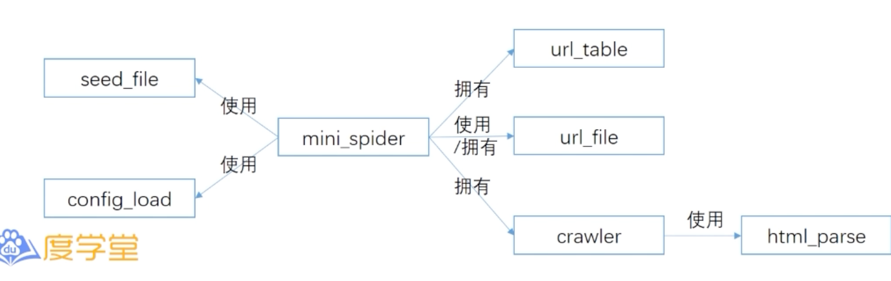
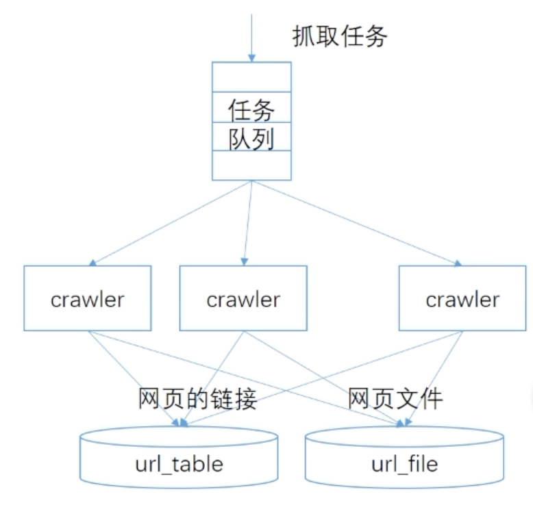
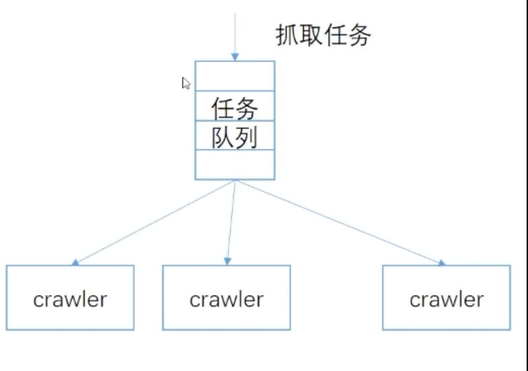
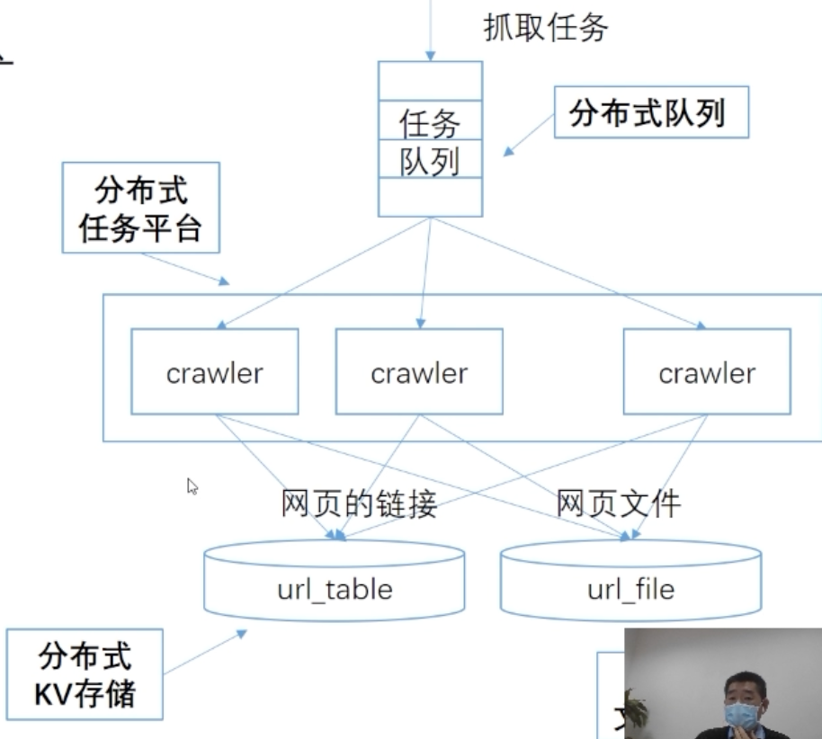

# Mini-spider

> http://learn.baidu.com/pages/index.html#/video/?courseId=28785&elementId=b417a051-04f1-4f54-ab76-4432fd2e7807&userId=6855123&groupId=null&curPlayIndex=0

## 概览
* 题目内容
* 程序的架构
* 多线程程序的编写
* 细节的处理

> 本次讲解以 Python为例,对于其它语言也适用

## 题目内容
* 使用 python,开发一个迷你定向抓取器
* 实现对种子链接、及抓取网页中所包含链接的抓取
* 如果链接符合特定的 pattern,则把抓取的网页保存到磁盘
* 输入
  * 种子文件:一些初始的网站URL地址
  * 配置文件:最大线程数,最大抓取深度
* 要求
  * 网页存储时,每个网页单独存为一个文件,以URL为文件名
  * 要求支持多线程并行抓取

## 题目的意义
* 起源10:/￥WClTY21c6P￥₽Y3TtGp1H1₭   
  * 2013年起,作为 Python Good Coder的考题
  * 2015年起,作为 Go Good Coderg的考题
* 是一个相对完整的后合程序
  * 配置加载,对外通信,内存数据表,磁盘O操作
* 重点考察内容
  * 编程规范
  * 软件架构的能力
  * 多线程编程
  * 细节处理

## 功能的分析
* 配置文件读取
  * 读取程序配置文件
  * 读取种子文件
* 网页的处理
  * 网页的抓取
  * 网页的解析
  * 网页的存储
* 其它考虑
  * 链接的去重
  * 多线程并发处理

## 模块的划分
* 模块划分的方法
  * 单一目的( single purpose)
  * 区分“数据类模块”和“过程类模块
  * 以数据为中心
  * 不以程序规模来决定
  > 可参考《代码的艺术》中的说明
* 模块划分是程序设计中最重要的问题
  * 模块≡>算法=>细节逻辑

### 建议的模块划分
* 数据类的模块
  * config_load.py:读取配置文件
  * seed file,py:读取种子文件
  * url_table.py:用于去重的内存表
  * url_file.py:用于保存网页文件
* 过程类的模块
  * html_parse.py:解析网页,获取链接
  * crawler.py:单个爬虫
  * mini_spider.py:主程序

## 模块间的关系
* 模块/类间的典型关系
  * 是:is-a,继承关系
  * 使用:use-a,调用关系
  * 包含:has-a,容器-成员变量关系
* 继承关系是最难设计和维护的
* 常见错误
  * 滥用继承关系,用继承关系替代包含关系

## 系统的架构
* 系统架构
  * 系统的组成、行为和更多细节
* 系统的组成
  * 组件:数据组件,执行/过程组件
  * 系统组件VS模块
    * seed file和 config_ load是模块,但不是系统组件
* 系统的行为
  * rawler从队列读取任务
  * crawler:抓取、解析、存储网页
  * crawler.将去重后的网址放入队列

### 像搭积木一样构建软件
* 将相关组件放在 Minispider p内
  * 不要在main()中随意创建
* 配置信息和种子信息通过参数传入

Crawler 和 Mini Spider间的数据共用
* 通过 Crawler的接口传递数据表的引用和配置
* 公用数据表仅在Mini-Spiders中定义

## 多线程
### 数据互斥访问
* 场景:url的重复判断
* 模块的定位
  * 是一个“ur表”(数据类模块)
  * 不是“去重模块”(过程类模块
* 访问互斥
  * 锁一定放在数据模块内
  * 常见错误:锁放在过程类模块中
* Test and Add
  * 常见错误:将"添加"和“判断"分为2个接口
  * 扩展:操作系统信号量的实现依赖于Test and Set 指令( Intel8086中称为XCHG指令)

### 临界区的注意事项
* 临界区:被锁保护的区域
* 尽量不要执行time-consuming的操作
  * 尽量放在临界区之外执行
* 不能出现无捕捉的 exception 会导致 lock.release()没有调用,进而死锁

## 数据封装
* 典型问题
  * 数据不独立定义封装
  * 把锁定义在类的模块中
* 数据封装没做好 => 程序难以维护
* 普遍现象
  * 用OO写面向过程程序
  * OO头头是道，骨子里是面向过程
* 仔细思考什么是封装(ENCAPSULATE)

## 种子信息的读取
* 典型错误:和其它逻辑耦合在一起
* 再次强调:划分模块和逻辑是否简单没有关系
* 典型错误:对OO的偏爱

## 任务
### 任务的分发
* 使用队列来分发
* 对于每个爬虫
  * 持续从队列中读取任务,并执行

### 任务怎么定义
* The Zen of Python
  * ...
  * Simple is better than complex
  * ...
* 用一个 tuple就搞定了!
  * (url, depth)
* 面向对象学多了,也是一种毒
  * 对OO需要批判性的学习

## 程序的优雅退出
* 常见问题
  * 实现机制非常复杂,不好维护
* 可利用 Queue的 task done(和ioin()

## Crawler的主逻辑
* Crawler'包含mini- Spider中最复杂的执行逻辑
* 函数规模
  * 6个主要步骤
  * 不到30行

## import的使用
* 规定
  * 禁止使用 from xxx import yyy
  * 严禁使用 from xx import
* 原因
  * 很难判断相关逻辑的出处

## Exception的处理
* 对所有IO操作,都要捕捉异常
* 尽量缩小捕捉异常的范围
* 如果要抛出异常,设计要求更高
  * 需要设计/协调好捕捉异常的时机

## 构造函数的使用
* 常见错误
  * 在构造函数中调用可能出错的操作
  * 根本没机会判断返回值
* 正确做法
  * 在其它函数中执行可能出错的操作

## 正则的使用
* 性能考虑
  * 若需要反复执行,不应使用
  * rematch(pattern, string)
* 推荐方式
  * 只执行一次
    prog = re compile(pattern)
  * 可能被调用多次
    result=prog match(string)
* 关于是否独立调用 compiler的争论
  * 论点:不需要,因为编译有缓存
* 观点:仍建议独立调用
  * 不要过于依赖底层隐含的机制
  **Explicit is better than implicit**
* 通过 compile,在配置加载或启动阶段发现
问题

## 配置的读取验证
* 仅仅说有错是不够的
  * 还要指出错误的位置
* 至少要把异常信息打印输出
* 最好是分字段做检查

## 函数
* 函数的切分
  * 在模块切分不好的情况下,函数也很难做好
* 函数内代码的分段
  * 很多人不分段,也没有段首注释
* 注释的使用
  * 无注释
  * 不区分 doc string和普通注释

## 扩展:如何实现对各网站的限速
* 需求
  * 在指定的速率內抓取指定网站
* 思路
  * 建立数据表,记录单位时间内的访问次数
  * 超过阈值后,重新排队或延迟入队

## 从单机扩展到分布式架
* 良好的软件架构,可以很容易的扩展为分布式架构
* 分布式的变化
  * 专用模块=>专用分布式系统
  * 函数调用=>消息通信/RPC

## 总结
* Good Coder考试,应不止于编程规范
  * 符合编程规范,只是基本要求 
  * 符合编程规范
* 更重要的是
  * 软件系统架构
  * 数据封装
  * 多线程机制
* 以小见大
  * 不写好 mini spider,何以写好大型代码?
  * 写好代码,从 mini spider?开始!

