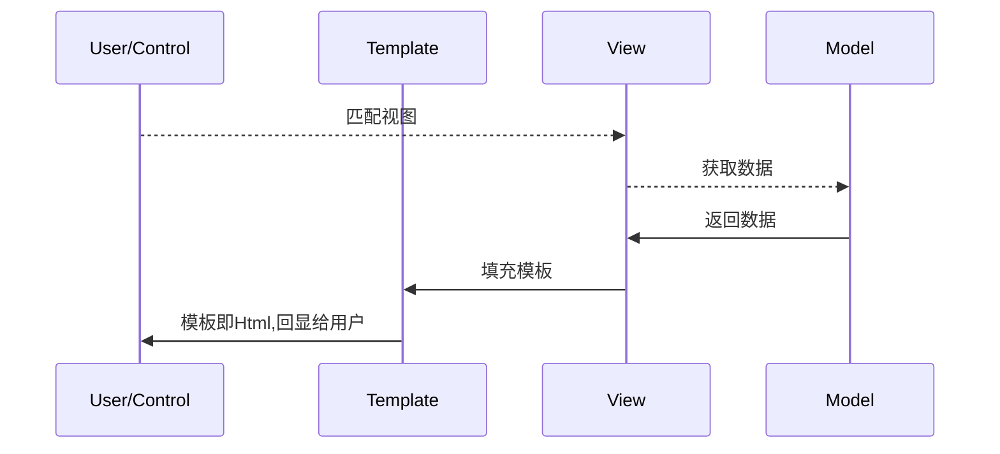
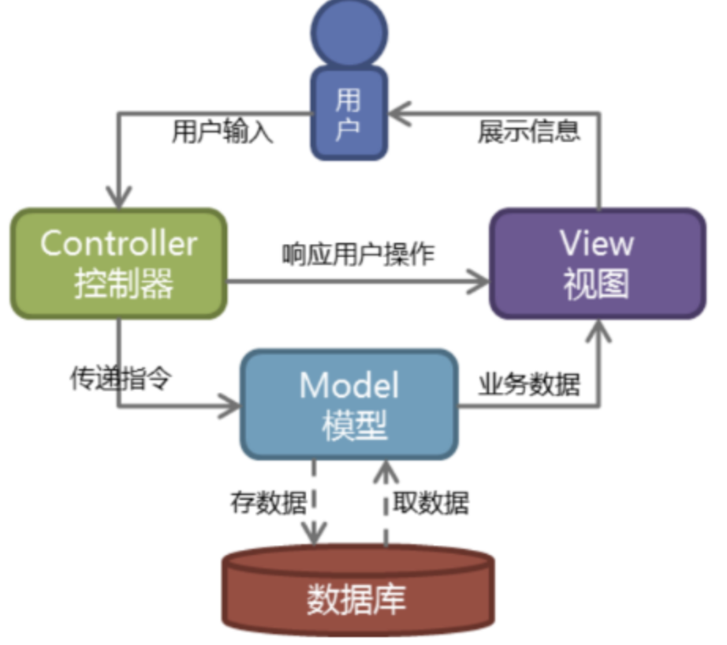
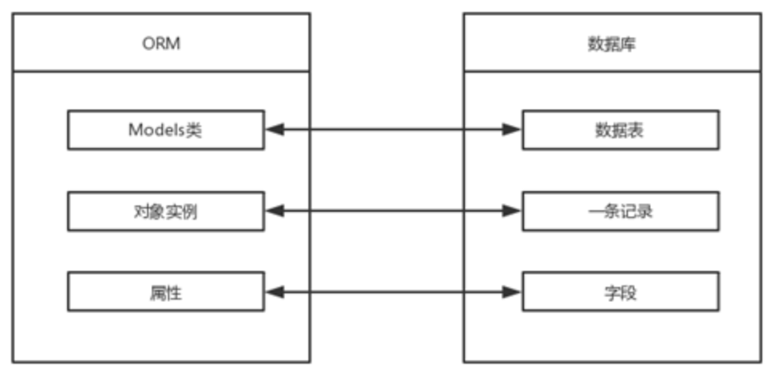
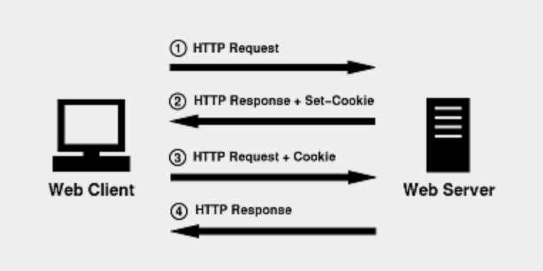
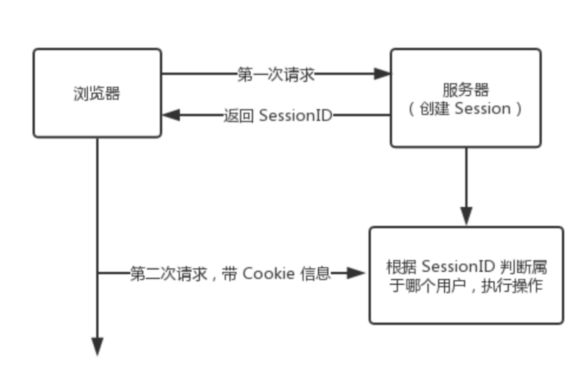
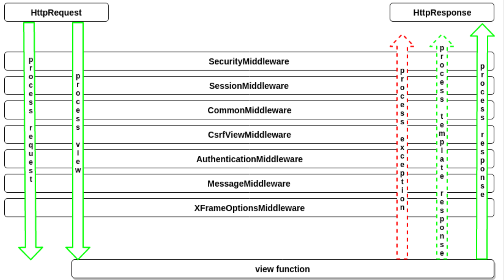
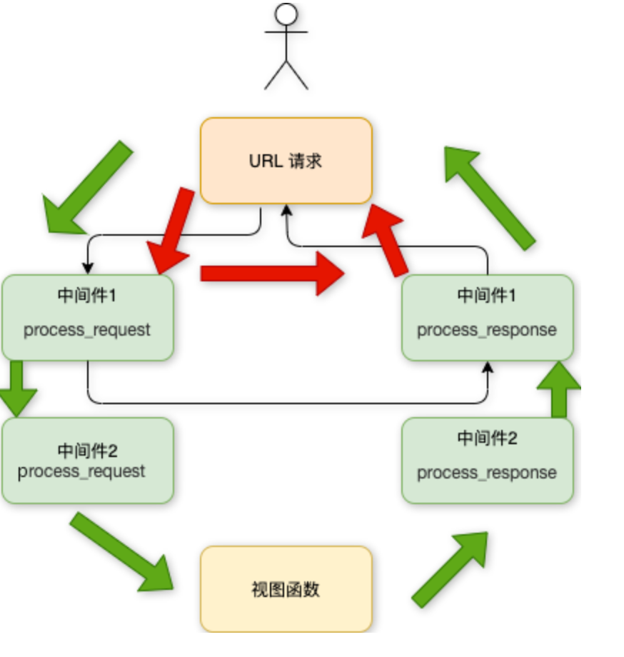
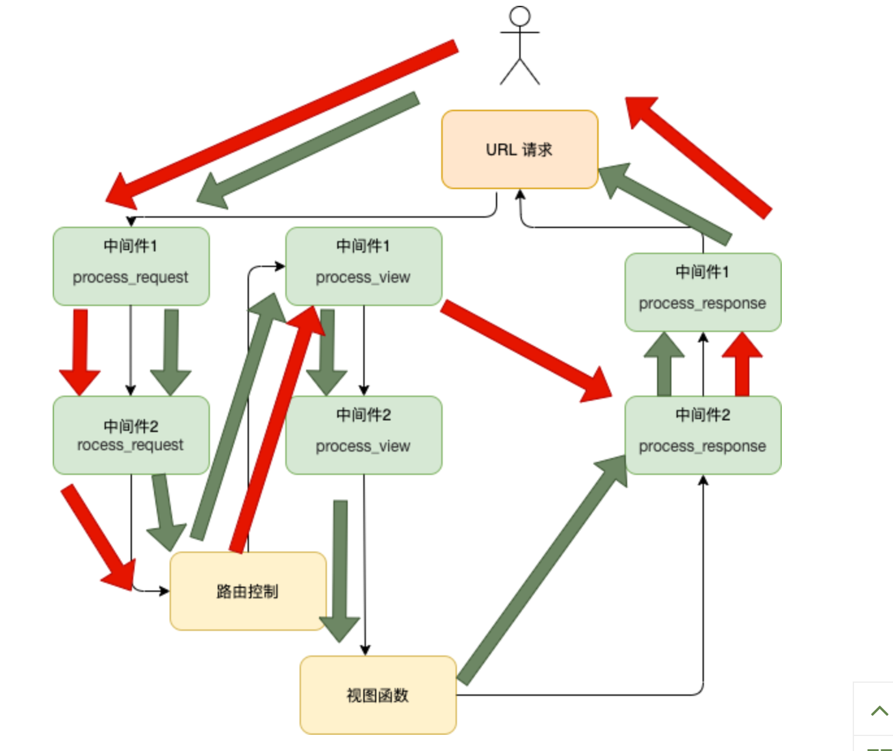

# Django

> 参考文档：
>
> 官方文档(en)：https://docs.djangoproject.com/en/4.1/
>
> 官方文档(zh)：https://docs.djangoproject.com/zh-hans/4.1/
>
> 菜鸟教程：https://www.runoob.com/django/django-tutorial.html


## 简介

Django 是一个开放源代码的 Web 应用框架，由 Python 写成。

Django 采用了 MVT 的软件设计模式，即模型（Model），视图（View）和模板（Template）。

* M 表示模型（Model）：编写程序应有的功能，负责业务对象与数据库的映射(ORM)。
* T 表示模板 (Template)：负责如何把页面(html)展示给用户。
* V 表示视图（View）：负责业务逻辑，并在适当时候调用 Model和 Template

MVT 模式优点：低耦合、开发快捷、部署方便、可重用性高、维护成本低。





## 版本

| Django 版本 | Python 版本              |
| ----------- | ------------------------ |
| 1.8         | 2.7, 3.2 , 3.3, 3.4, 3.5 |
| 1.9, 1.10   | 2.7, 3.4, 3.5            |
| **1.11**    | **2.7**, 3.4, 3.5, 3.6   |
| 2.0         | 3.4, 3.5, 3.6, 3.7       |
| 2.1, 2.2    | 3.5, 3.6, 3.7            |

## 安装

使用pip 安装

```shell
pip install django
```

如pip 无法安装[参考文档](https://docs.djangoproject.com/zh-hans/4.1/intro/install/)

## 管理工具

安装 Django 之后，您现在应该已经有了可用的管理工具`django-admin` 

运行管理工具 其中manage.py 每个Django项目中自动生成的一个用于管理项目的脚本文件

```
django-admin <command> [options]
python manage.py <command> [options]
python -m django <command> [options]
```

[link](https://blog.csdn.net/xianjie0318/article/details/83782072)

### 项目管理

* startproject 创建项目

```sh
django-admin startproject <project_name>
django-admin startproject HelloWorld
```

生成目录如下

```shell
|-- HelloWorld # 项目文件夹
|   |-- __init__.py # python 包标识文件
|   |-- asgi.py	# ASGI 兼容的 Web 服务器的入口，以便运行你的项目
|   |-- settings.py # 该 Django 项目的设置/配置。
|   |-- urls.py # URL 声明; 一份由 Django 驱动的网站"目录"
|   |-- wsgi.py # WSGI 兼容的 Web 服务器的入口，以便运行你的项目
|-- manage.py # 命令行工具，管理项目
```

* startapp

  默认情况下，会在这个新的app目录下创建一系列文件模版，比如models.py、views.py、admin.py等等。

* runserver 启动服务

  Django为我们提供的轻量级的开发用的Web服务器。默认情况下，服务器运行在IP地址127.0.0.1的8000端口上。如果要自定义服务器端口和地址，可以显式地传递一个IP地址和端口号给它。

  ```undefined
  python manage.py runserver 127.0.0.1:8080
  ```

* shell 启动带有Django环境的Python交互式解释器

### 数据库

* flush 删出数据库中所有数据

  删出数据库中所有数据，已应用的迁移不会被清除。只删除具体数据，不删除数据表！

* makemigrations 创建新的迁移

  根据检测到的模型创建新的迁移。迁移的作用，更多的是将数据库的操作，以文件的形式记录下来，方便以后检查、调用、重做等等。尤其是对于Git版本管理，它无法获知数据库是如何变化的，只能通过迁移文件中的记录来追溯和保存。

* migrate 使数据库状态与当前模型集和迁移集同步

## 模板

模板是一个文本，用于分离文档的表现形式和内容。

### 模板文件路径配置

修改 `settings.py` 文件 修改 TEMPLATES 中的 DIRS 为目标文件夹 一般为 

```python
TEMPLATES = [{
  ...
  'APP_DIRS': False,
	'DIRS': [os.path.join(BASE_DIR, 'templates')], # 修改位置
  ...
}]
```

> 如果 APP_DIRS 设置为 `True` 则默认在App 的 templates 文件夹，不需要额外的设置。 

### 渲染函数

使用 render 函数 向模板提交数据， [render](https://docs.djangoproject.com/en/4.1/topics/http/shortcuts/#render) 接受如下参数

```python
render(request, template_name, context=None, content_type=None, status=None, using=None)
```

render 的参数 request 和 template name 是必需参数，其余的参数是可选参数。各个参数说明如下。

- request：浏览器向服务器发送的请求对象，包含用户信息、请求内容和请求方式等。
- template_name：设重模板文件名，用于生成网页内容。
- context：对模板上下文（模板变量）赋值，以字典格式表示，默认情况下是一个空字典。
- content_type：响应内容的数据格式，一般情况下使用默认值即可。
- status：HTTP状态码，默认为200。
- using：设置模板引擎，用于解析模板文件，生成网页内容。

```py
from django.shortcuts import render

def runoob(request):
    context = {}
    context['hello'] = 'Hello World!'
    return render(request, 'runoob.html', context)
```

### 变量

* 渲染函数中：
  * ｛"HTML变量名" : "views变量名"｝
* 模板中：
  * 在模板中使用 `{{var_name}}` 指定变量渲染位置。

eg:

```python
def hello_world(request):
  	context = {"msg":"hello world"}
```

```
<h1>{{ msg }}<h1>
```

输出

```
<h1> hello world <h1>
```

### 列表

* 渲染函数中：
  * ｛"HTML变量名" : [列表数据]｝
* 模板中：
  * 在模板中使用 `{{ var_name }}` 指定变量渲染整个列表。
  * 可以用 `.` 索引下标取出对应的元素。

eg:

```python
from django.shortcuts import render

def runoob(request):
    views_list = ["list_data1","list_data2","list_data3"]
    return render(request, "runoob.html", {"views_list": views_list})
```

```
<p>{{ views_list }}</p>   # 取出整个列表
<p>{{ views_list.0 }}</p> # 取出列表的第一个元素
```

输出

```
<p> ["list_data1","list_data2","list_data3"] </p>
<p> list_data1 </p>
```

### 字典

* 渲染函数中：
  * ｛"HTML变量名" : [列表数据]｝
* 模板中：
  * 在模板中使用 `{{ var_name }}` 指定变量渲染整个列表。
  * 可以用 `.` 索引下标取出对应的元素。

eg:

```python
from django.shortcuts import render

def runoob(request):
    views_list = {"name": "test1", "msg": "hello"}
    return render(request, "runoob.html", {"views_list": views_list})
```

```
<p>{{ views_list }}</p>   # 取出整个字典
<p>{{ views_list.name }}</p> # 取出列表的第一个元素
```

输出

```
<p> {"name": "test1", "msg": "hello"} </p>
<p> test1 </p>
```

### 过滤器

模板过滤器可以在变量被显示前修改它，过滤器使用管道字符。管道可以串联,一个过滤器管道的输出又可以作为下一个管道的输入。

* 模板中的语法

  * ```
    {{ 变量名 | 过滤器：可选参数 ｜ ...}}
    ```

eg:

```python
{{ name|lower }} # 将变量转变为小写
{{ my_list|first|upper }} # 首字母大写
{{ bio|truncatewords:"30" }} # 带参数的过滤器 获取前30个字符
```

#### 常用过滤器

* addslashes : 添加反斜杠到任何反斜杠、单引号或者双引号前面。

* date : 按指定的格式字符串参数格式化 date 或者 datetime 对象

* default ： 为变量提供一个默认值。

  * 如果 views 传的变量的布尔值是 false，则使用指定的默认值。

  * ```
    0  0.0  False  0j  ""  []  ()  set()  {}  None
    ```

* length：返回对象的长度，适用于字符串和列表。
* filesizeformat：以更易读的方式显示文件的大小
* date：根据给定格式对一个日期变量进行格式化
* truncatechars： 如果字符串包含的字符总个数多于指定的字符数量，那么会被截断掉后面的部分。截断的字符串将以 ... 结尾。
* safe：将字符串标记为安全，不需要转义。

### if/else

``依据条件判断是否输出

语法如下

```django

   ... display 1

   ... display 2

   ... display 3

```

`` 标签接受 and ， or 或者 not 关键字来对多个变量做判断 ，或者对变量取反（ not )

```python
def judge(request):
		val = 80
    return return render(request, "test.html", {"num": views_num})
```

```django

RANK A

RANK B

ERR

```

输出

```
RANK B
```

### ifequal/ifnotequal

 标签比较两个值，当他们相等时，显示在  和  之中所有的值。

支持可选的  标签

### for

` `允许我们在一个序列上迭代。 

* 每一次循环中，模板系统会渲染在  和  之间的所有内容。

```django

	<div> render context </div>

```

eg:

```python
def judge(request):
		vals = ["case" + str(i) for i in range(10)]
    return return render(request, "test.html", {"vals": vals})
```

```django

	<span>{{val}}</span>

```

输出

```
<span>case 0</span>
<span>case 1</span>
...
<span>case 9</span>
```

* 使用 `reversed` 使得迭代反向

```django

	<span>{{val}}</span>

```

输出

```django
<span>case 9</span>
<span>case 8</span>
...
<span>case 0</span>
```


* 遍历字典: 可以直接用字典 **.items** 方法，用变量的解包分别获取键和值。

```python
from django.shortcuts import render

def runoob(request):
    views_list = {"name": "test1", "msg": "hello"}
    return render(request, "runoob.html", {"views_list": views_list})
```

```django

	{{ i }}---{{ j }}

```

输出

```
name--test1
msg--hello
```


* 在  标签里可以通过 {{forloop}} 变量获取循环序号。

  - forloop.counter: 顺序获取循环序号，从 1 开始计算

  - forloop.counter0: 顺序获取循环序号，从 0 开始计算

  - forloop.revcounter: 倒序获取循环序号，结尾序号为 1

  - forloop.revcounter0: 倒序获取循环序号，结尾序号为 0

  - forloop.first（一般配合if标签使用）: 第一条数据返回 True，其他数据返回 False

  - forloop.last（一般配合if标签使用）: 最后一条数据返回 True，其他数据返回 False

* ``在循环为空的时候执行（即 in 后面的参数布尔值为 False ）

  ```django
  
      {{ forloop.counter0 }}
  
      空空如也～
  
  ```

### 注释 

```django
{# 这是一个注释 #}
```

### 包含其他模板

` `标签允许在模板中包含其它的模板的内容。 

eg: 下列例子包含 nav.html 模板

```

```


### 自定义标签 和 过滤器

1. 在应用目录下创建 **templatetags** 目录(与 templates 目录同级，目录名只能是 templatetags)。

2. 在 templatetags 目录下创建任意 py 文件，如：**my_tags.py**。

3. my_tags.py 文件代码如下：

   ```
   from django import template
   
   register = template.Library()   #register的名字是固定的,不可改变
   ```

4. 修改 settings.py 文件的 TEMPLATES 选项配置，添加 libraries 配置

   ```python
   TEMPLATES = [
       {
         ...
               "libraries":{                         
                   'my_tags':'templatetags.my_tags'   # 添加这边配置        
               }                                      
       	...
       },
   ]
   ```

5. 利用装饰器  @register.filter  自定义过滤器。装饰器的参数最多只能有 2 个。

   ```python
   @register.filter
   def my_filter(v1, v2):
       return v1 * v2
   ```

6. 利用装饰器 @register.simple_tag 自定义标签。

   ```python
   @register.simple_tag
   def my_tag1(v1, v2, v3):
       return v1 * v2 * v3
   ```

7. 在使用自定义标签和过滤器前，要在 html 文件 body 的最上方中导入该 py 文件。

   ```
   
   ```

8. 在 HTML 中使用自定义过滤器。

   ```
   {{ 11|my_filter:22 }}
   ```

9. 在 HTML 中使用自定义标签。

   ```
   
   ```

10. 语义化标签

    在该 py 文件中导入 mark_safe。

    ```
    from django.utils.safestring import mark_safe
    ```

    定义标签时，用上 mark_safe 方法，令标签语义化，相当于 jQuery 中的 html() 方法。

    和前端HTML文件中的过滤器 safe 效果一样。

    ```python
    @register.simple_tag
    def my_html(v1, v2):
        temp_html = "<input type='text' id='%s' class='%s' />" %(v1, v2)
        return mark_safe(temp_html)。
    ```

    在HTML中使用该自定义标签，在页面中动态创建标签

    ```
    
    ```

### [静态文件配置](https://docs.djangoproject.com/en/4.1/ref/settings/#std-setting-STATICFILES_FINDERS)

Django 的 [`STATICFILES_FINDERS`](https://docs.djangoproject.com/zh-hans/4.1/ref/settings/#std-setting-STATICFILES_FINDERS) 设置包含了一系列的查找器，它们知道去哪里找到 static 文件。

`AppDirectoriesFinder` 是默认查找器中的一个，它会在每个 [`INSTALLED_APPS`](https://docs.djangoproject.com/zh-hans/4.1/ref/settings/#std-setting-INSTALLED_APPS) 中指定的应用的子文件中寻找名称为 `static` 的特定文件夹


如需自定义静态文件路径

1. 在 settings 文件的最下方配置添加以下配置：

   ```python
   STATIC_URL = '/static/' # 别名 
   STATICFILES_DIRS = [ 
      	BASE_DIR / "static",
       os.path.join(BASE_DIR, "statics"), 
   ]
   ```

3. 在 $app/statics 目录下创建 css 目录，js 目录，images 目录，plugins 目录，  分别放 css文件，js文件，图片，插件

3. 在模板中使用需要加入  代码，以下实例我们从静态目录中引入图片。

   ```python
   from django.shortcuts import render
   
   def runoob(request):
       name ="菜鸟教程"
       return render(request, "runoob.html", {"name": name})
   ```

   ```html
   
   
   {{name}}
   ```


或者通过如下配置路由

```python
from django.conf.urls.static import static

urlpatterns = [
    # ... the rest of your URLconf goes here ...
] + static(settings.STATIC_URL, document_root=settings.STATIC_ROOT)
```

### 模板继承

模板可以用继承的方式来实现复用，减少冗余内容。

#### 父模板

**标签 block...endblock:** 父模板中的预留区域，该区域留给子模板填充差异性的内容，不同预留区域名字不能相同。

```django
 
预留给子模板的区域，可以设置设置默认内容

```

#### 子模板

子模板使用标签 extends 继承父模板：

```django
 
```

子模板如果没有设置父模板预留区域的内容，则使用在父模板设置的默认内容，当然也可以都不设置，就为空。

子模板设置父模板预留区域的内容：

```
{ % block 名称 % }
内容 

```

## 模型

Django 对各种数据库提供了很好的支持，包括：PostgreSQL、MySQL、SQLite、Oracle

Django 为这些数据库提供了统一的调用API

> mysql 驱动安装

```
sudo pip3 install pymysql
```

### Django ORM

对象关系映射（Object Relational Mapping，简称 ORM ）用于实现面向对象编程语言里不同类型系统的数据之间的转换

* 使用 ORM 的好处：

  - 提高开发效率。

  - 不同数据库可以平滑切换。

* 使用 ORM 的缺点：

  - ORM 代码转换为 SQL 语句时，需要花费一定的时间，执行效率会有所降低。

  - 长期写 ORM 代码，会降低编写 SQL 语句的能力。

* ORM 解析过程:

  - ORM 会将 Python 代码转成为 SQL 语句。

  - SQL 语句通过 pymysql 传送到数据库服务端。

  - 在数据库中执行 SQL 语句并将结果返回。

Django 对象与数据库中的关系表



### Django 中配置 mysql 数据库

* 在settings.py配置如下

  ```python
  DATABASES = { 
      'default': 
      { 
          'ENGINE': 'django.db.backends.mysql',    # 数据库引擎
          'NAME': 'runoob', # 数据库名称
          'HOST': '127.0.0.1', # 数据库地址，本机 ip 地址 127.0.0.1 
          'PORT': 3306, # 端口 
          'USER': 'root',  # 数据库用户名
          'PASSWORD': '123456', # 数据库密码
      }  
  }
  ```

* 通过 \__init__.py 文件来通知Django 使用 pymysql 模块连接mysql

  ```python
  # 在与 settings.py 同级目录下的 __init__.py 中引入模块和进行配置
  import pymysql
  pymysql.install_as_MySQLdb()
  ```

### [定义模型](https://docs.djangoproject.com/en/4.1/topics/db/models/)

> Django 规定，如果要使用模型，必须要创建一个 app。

声明模型, 在 models 文件下

```python
# models.py
from django.db import models
 
class Test(models.Model):
    name = models.CharField(max_length=20)
```

以上的类名代表了数据库表名，且继承了models.Model

> 如果未定义主键， django会自动添加id 字段作为主键

* 类里面的字段代表数据表中的字段(name)
* 数据类型则由
  * CharField（相当于varchar）
  * DateField（相当于datetime）
  * max_length 参数限定长度。

在命令行运行

```sh
python3 manage.py migrate
python3 manage.py makemigrations TestModel  # 让 Django 知道我们在我们的模型有一些变更
python3 manage.py migrate TestModel   # 创建表结构
```

> [常见报错信息](https://www.runoob.com/django/django-model.html#常见报错信息)

### 数据库操作

#### 添加 INSERT

```py
from TestModel.models import Test
 
# 数据库操作
def testdb(request):
    test1 = Test(name='runoob') # 创建对象
    test1.save()	# save 添加数据
    return HttpResponse("<p>数据添加成功！</p>")
```

#### 获取数据 SELECT

```py

from django.http import HttpResponse
 
from TestModel.models import Test
 
# 数据库操作
def testdb(request):
    # 初始化
    response = ""
    response1 = ""
    
    
    # 通过objects这个模型管理器的all()获得所有数据行，相当于SQL中的SELECT * FROM
    list = Test.objects.all()
        
    # filter相当于SQL中的WHERE，可设置条件过滤结果
    response2 = Test.objects.filter(id=1) 
    
    # 获取单个对象
    response3 = Test.objects.get(id=1) 
    
    # 限制返回的数据 相当于 SQL 中的 OFFSET 0 LIMIT 2;
    Test.objects.order_by('name')[0:2]
    
    #数据排序
    Test.objects.order_by("id")
    
    # 上面的方法可以连锁使用
    Test.objects.filter(name="runoob").order_by("id")
    
    # 输出所有数据
    for var in list:
        response1 += var.name + " "
    response = response1
    return HttpResponse("<p>" + response + "</p>")
```

#### 聚合查询 aggregate

聚合查询函数是对一组值执行计算，并返回单个值。聚合查询返回值的数据类型是字典。

聚合函数的引入

```py
from django.db.models import Avg,Max,Min,Count,Sum  #   引入函数
```

键的名称默认是（属性名称加上__聚合函数名），值是计算出来的聚合值。如果要自定义返回字典的键的名称，可以起别名：

```
aggregate(别名 = 聚合函数名("属性名称"))
```

#### 分组查询 annotate

分组查询一般会用到聚合函数

- 分组后，用 values 取值，则返回值是 QuerySet 数据类型里面为一个个字典；
- 分组后，用 values_list 取值，则返回值是 QuerySet 数据类型里面为一个个元组。

annotate 里面放聚合函数。

- **values 或者 values_list 放在 annotate 前面：**values 或者 values_list 是声明以什么字段分组，annotate 执行分组。
- **values 或者 values_list 放在annotate后面：** annotate 表示直接以当前表的pk执行分组，values 或者 values_list 表示查询哪些字段， 并且要将 annotate 里的聚合函数起别名，在 values 或者 values_list 里写其别名。

#### F() 查询

F() 的实例可以在查询中引用字段，来比较同一个 model 实例中两个不同字段的值。

之前构造的过滤器都只是将字段值与某个常量做比较，如果想要对两个字段的值做比较，就需要用到 F()。

```
from django.db.models import F
```

```
F("字段名称")
```

F 动态获取对象字段的值，可以进行运算。

Django 支持 F() 对象之间以及 F() 对象和常数之间的加减乘除和取余的操作。

#### Q() 查询

```
from django.db.models import Q
```

```
Q(条件判断)
```

之前构造的过滤器里的多个条件的关系都是 and，如果需要执行更复杂的查询（例如 or 语句），就可以使用 Q 。

Q 对象可以使用 & |  ~ （与 或 非）操作符进行组合。

> 优先级从高到低：~  &  |

Q 对象和关键字混合使用，Q 对象要在所有关键字的前面:

#### 更新数据 UPDATE

```py
from django.http import HttpResponse
 
from TestModel.models import Test
 
# 数据库操作
def testdb(request):
    # 修改其中一个id=1的name字段，再save，相当于SQL中的UPDATE
    test1 = Test.objects.get(id=1)
    test1.name = 'Google'
    test1.save()
    
    # 另外一种方式
    # Test.objects.filter(id=1).update(name='Google')
    
    # 修改所有的列
    # Test.objects.all().update(name='Google')
    
    return HttpResponse("<p>修改成功</p>")
```

#### 删除数据 DELETE

```py
from TestModel.models import Test
 
# 数据库操作
def testdb(request):
    # 删除id=1的数据
    test1 = Test.objects.get(id=1)
    test1.delete()
    
    # 另外一种方式
    # Test.objects.filter(id=1).delete()
    
    # 删除所有数据
    # Test.objects.all().delete()
    
    return HttpResponse("<p>删除成功</p>")
```

## ORM 实例

[eg1](https://www.runoob.com/django/django-orm-1.html),[eg2](https://www.runoob.com/django/django-orm-2.html),[eg3](https://www.runoob.com/django/django-orm-3.html)

## 视图

一个视图函数，简称视图，是一个简单的 Python 函数，它接受 Web 请求并且返回 Web 响应。

响应可以是一个 HTML 页面、一个 404 错误页面、重定向页面、XML 文档、或者一张图片...

每个视图函数都负责返回一个 HttpResponse 对象，对象中包含生成的响应。

视图层中有两个重要的对象：请求对象(request)与响应对象(HttpResponse)。

### Request 对象

| **属性**          | **描述**                                                     |
| ----------------- | ------------------------------------------------------------ |
| path              | 请求页面的全路径,不包括域名—例如, "/hello/"。                |
| method            | 请求中使用的HTTP方法的字符串表示。全大写表示                 |
| GET               | 包含所有HTTP GET参数的类字典对象。参见QueryDict 文档。       |
| POST              | 包含所有HTTP POST参数的类字典对象。参见QueryDict 文档<br /> 注意: POST不包括file-upload信息。参见FILES属性。 |
| REQUEST           | 为了方便，该属性是POST和GET属性的集合体，但是有特殊性，先查找POST属性，然后再查找GET属性。借鉴PHP's $_REQUEST |
| COOKIES           | 包含所有cookies的标准Python字典对象。Keys和values都是字符串。 |
| FILES             | 包含所有上传文件的类字典对象。FILES中的每个Key都是\<input type="file" name="" />标签中name属性的值. <br />FILES中的每个value 同时也是一个标准Python字典对象，包含下面三个Keys: <br />filename: 上传文件名,用Python字符串表示 <br />content-type: 上传文件的<br />Content type content: 上传文件的原始内容<br /> 注意：只有在请求方法是POST，并且请求页面中\<form>有enctype="multipart/form-data"属性时FILES才拥有数据。否则，FILES 是一个空字典。 |
| META              | 包含所有可用HTTP头部信息的字典。                             |
| user              | 是一个django.contrib.auth.models.User 对象，代表当前登录的用户。 如果访问用户当前没有登录，user将被初始化为django.contrib.auth.models.AnonymousUser的实例。 |
| session           | 唯一可读写的属性，代表当前会话的字典对象。只有激活Django中的session支持时该属性才可用。 |
| raw_post_data     | 原始HTTP POST数据，未解析过。 高级处理时会有用处。           |
| \__getitem__(key) | 返回GET/POST的键值,先取POST,后取GET。如果键不存在抛出 KeyError。 |
| has_key()         | 检查request.GET or request.POST中是否包含参数指定的Key。     |
| get_full_path()   | 返回包含查询字符串的请求路径。例如， "/music/bands/the_beatles/?print=true" |
| is_secure()       | 如果请求是安全的，返回True，就是说，发出的是HTTPS请求。      |
|                   |                                                              |

#### QueryDict

QueryDict类似字典的自定义类，用来处理单键对应多值的情况。

QueryDict实现所有标准的词典方法。还包括一些特有的方法

| **方法**     | **描述**                                                     |
| ------------ | ------------------------------------------------------------ |
| \__getitem__ | 和标准字典的处理有一点不同，就是，如果Key对应多个Value，__getitem__()返回最后一个value。 |
| \__setitem__ | 设置参数指定key的value列表(一个Python list)。注意：它只能在一个mutable QueryDict 对象上被调用(就是通过copy()产生的一个QueryDict对象的拷贝). |
| get()        | 如果key对应多个value，get()返回最后一个value。               |
| update()     | 参数可以是QueryDict，也可以是标准字典。和标准字典的update方法不同，该方法添加字典 items，而不是替换它们 |
| items()      | 和标准字典的items()方法有一点不同,该方法使用单值逻辑的\__getitem__() |
| values()     | 和标准字典的values()方法有一点不同,该方法使用单值逻辑的\__getitem__() |
| copy()                   | 返回对象的拷贝，内部实现是用Python标准库的copy.deepcopy()。该拷贝是mutable(可更改的) — 就是说，可以更改该拷贝的值。 |
| getlist(key)             | 返回和参数key对应的所有值，作为一个Python list返回。如果key不存在，则返回空list。 It's guaranteed to return a list of some sort.. |
| setlist(key,list_)       | 设置key的值为list_ (unlike \__setitem__()).                 |
| appendlist(key,item)     | 添加item到和key关联的内部list.                               |
| setlistdefault(key,list) | 和setdefault有一点不同，它接受list而不是单个value作为参数。  |
| lists()                  | 和items()有一点不同, 它会返回key的所有值，作为一个list |
| urlencode()              | 返回一个以查询字符串格式进行格式化后的字符串(例如："a=2&b=3&b=5")。 |

#### GET

在url 文件配置路由

```py
urlpatterns = [
    url(r'^search/$', search.search),
]
```

通过 接口函数的 request参数 获取get参数,request.GET

```python
# 接收请求数据
def search(request):  
    request.encoding='utf-8'
    if 'q' in request.GET and request.GET['q']:
        message = '你搜索的内容为: ' + request.GET['q']
    else:
        message = '你提交了空表单'
    return HttpResponse(message)
 
# eg：/search?q=123 => 你搜索的内容为: 123
```

#### POST

通过 接口函数的 request参数 获取post参数,request.POST

```py
# 接收POST请求数据
def search_post(request):
    ctx ={}
    if request.POST:
        ctx['rlt'] = request.POST['q']
    return render(request, "post.html", ctx)
```

#### body

获取请求体

```py
def runoob(request):
    name = request.body
    print(name)
    return HttpResponse("菜鸟教程")
```

#### method

获取当前请求的方式，数据类型是字符串，且结果为大写。

#### 表单

HTML表单是网站交互性的经典方式。HTTP协议以"请求－回复"的方式工作。客户发送请求时，可以在请求中附加数据。服务器通过解析请求，就可以获得客户传来的数据，并根据URL来提供特定的服务。

> 跨域请求
>
> csrf_token 用于form表单中，作用是跨站请求伪造保护
>
> 如果不用 `` 标签，在用 form 表单时，要再次跳转页面会报 403 权限错误。
>
> 用了`` 标签，在 form 表单提交数据时，才会成功

### 响应对象

响应对象主要有三种形式：HttpResponse()、render()、redirect()。

#### HttpResponse

返回文本，参数为字符串，字符串中写文本内容。如果参数为字符串里含有 html 标签，也可以渲染。

#### [#](#渲染函数) render

返回文本，第一个参数为 request，第二个参数为字符串（页面名称），第三个参数为字典（可选参数，向页面传递的参数：键为页面参数名，值为views参数名）

#### redirect()

重定向，跳转新页面。参数为字符串，字符串中填写页面路径。一般用于 form 表单提交后，跳转到新页面。

### JsonResponse

```python
from django.http import HttpResponse,JsonResponse

def index(request):
    data={
        'name':'zhangsan',
        'age':18,
    }
    return JsonResponse(data)
```

> JsonResponse在抛出列表的时候需要将safe设置为False `safe=False`

```python
def index(request): 
    listdata=[1,2,3,4,5]
    return JsonResponse(listdata,safe=False)
```

### FBV 和 CBV  基于类的视图

**FBV（function base views）** 基于函数的视图，就是在视图里使用函数处理请求。

**CBV（class base views）** 基于类的视图，就是在视图里使用类处理请求。

#### FBV

基于函数的视图其实我们前面章节一直在使用，就是使用了函数来处理用户的请求

#### CBV

基于类的视图，就是使用了类来处理用户的请求，不同的请求我们可以在类中使用不同方法来处理，这样大大的提高了代码的可读性。

引入 View 类

```
from django.views import View
```

在 urls.py 定义路由

```py
path("login/", views.Login.as_view()),
```

```py
from django.shortcuts import render,HttpResponse
from django.views import View

class Login(View):
    def get(self,request):
        return HttpResponse("GET 方法")

    def post(self,request):
        user = request.POST.get("user")
        pwd = request.POST.get("pwd")
        if user == "runoob" and pwd == "123456":
            return HttpResponse("POST 方法")
        else:
            return HttpResponse("POST 方法 1")
```

## 路由

### 1.1x - url

**url() 方法**：普通路径和正则路径均可使用，需要自己手动添加正则首位限制符号。

### 2.2x - path/re_path

- path：用于普通路径，不需要自己手动添加正则首位限制符号，底层已经添加。
- re_path：用于正则路径，需要自己手动添加正则首位限制符号。

#### path

Django path() 可以接收四个参数，分别是两个必选参数：route、view 和两个可选参数：kwargs、name。

语法格式：

```
path(route, view, kwargs=None, name=None)
```

- route: 字符串，表示 URL 规则，与之匹配的 URL 会执行对应的第二个参数 view。
- view: 用于执行与正则表达式匹配的 URL 请求。
- kwargs: 视图使用的字典类型的参数。
- name: 用来反向获取 URL

> Django2. 0中可以使re_path() 方法来兼容 1.x 版本中的 **url()** 方法，一些正则表达式的规则也可以通过 re_path() 来实现 

### 正则路径中的分组

* 无名分组 

  * 无名分组按位置传参，一一对应。

  * views 中除了 request，其他形参的数量要与 urls 中的分组数量一致。

    ```py
    re_path("^index/([0-9]{4})/$", views.index), 
    ```

    ```py
    from django.shortcuts import HttpResponse
    
    def index(request, year):
        print(year) # 一个形参代表路径中一个分组的内容，按顺序匹配
        return HttpResponse('菜鸟教程')
    ```

* 有名分组

  * 有名分组按关键字传参，与位置顺序无关

  * views 中除了 request，其他形参的数量要与 urls 中的分组数量一致， 并且 views 中的形参名称要与 urls 中的组名对应。

  * ```
    (?P<组名>正则表达式)
    ```

    ```py
     re_path("^index/(?P<year>[0-9]{4})/(?P<month>[0-9]{2})/$", views.index),
    ```

    ```py
    from django.shortcuts import HttpResponse
    def index(request, year, month):
        print(year,month) # 一个形参代表路径中一个分组的内容，按关键字对应匹配
        return HttpResponse('菜鸟教程')
    ```

### 路由分发

Django 项目里多个app目录共用一个 urls 容易造成混淆，后期维护也不方便。

使用路由分发（include），让每个app目录都单独拥有自己的 urls。

* 在每个 app 目录里都创建一个 urls.py 文件。
* 在项目名称目录下的 urls 文件里，统一将路径分发给各个 app 目录。

```py
from django.contrib import admin
from django.urls import path,include # 从 django.urls 引入 include
urlpatterns = [
    path('admin/', admin.site.urls),
    path("app01/", include("app01.urls")), # app 模块名导入
    path("app02/", include("app02.urls")),
]
```

### 反向解析

随着功能的增加，路由层的 url 发生变化，就需要去更改对应的视图层和模板层的 url，非常麻烦，不便维护。

这时我们可以利用反向解析，当路由层 url 发生改变，在视图层和模板层动态反向解析出更改后的 url，免去修改的操作。

反向解析一般用在模板中的超链接及视图中的重定向。

#### 普通路径

通过path的name 参数，设置**路由别名**

```py
path("login1/", views.login, name="login")
```

在视图函数中 引入 reverse 通过 reverse(路由别名)反向解析

```py
return redirect(reverse("login"))
```

在模板 templates 中的 HTML 文件中，利用 **** 反向解析。

```django
<form action="" method="post"> 
```

#### 正则路径（无名分组）

在 urls.py 中给路由起别名，**name="路由别名"**。

```
re_path(r"^login/([0-9]{2})/$", views.login, name="login")
```

在 views.py 中，从 django.urls 中引入 reverse，利用 **reverse("路由别名"，args=(符合正则匹配的参数,))** 反向解析。

```
return redirect(reverse("login",args=(10,)))
```

在模板 templates 中的 HTML 文件中利用 **** 反向解析。

```
<form action="" method="post"> 
```

#### 正则路径（有名分组）

在 urls.py 中给路由起别名，**name="路由别名"**。

```
re_path(r"^login/(?P<year>[0-9]{4})/$", views.login, name="login")
```

在 views.py 中，从 django.urls 中引入 reverse，利用 **reverse("路由别名"，kwargs={"分组名":符合正则匹配的参数})** 反向解析。

```
return redirect(reverse("login",kwargs={"year":3333}))
```

在模板 templates 中的 HTML 文件中，利用 **** 反向解析。

```
<form action="" method="post">
```

### 命名空间

命名空间（英语：Namespace）是表示标识符的可见范围。

一个标识符可在多个命名空间中定义，它在不同命名空间中的含义是互不相干的。

一个新的命名空间中可定义任何标识符，它们不会与任何重复的标识符发生冲突，因为重复的定义都处于其它命名空间中。

> **存在问题：**路由别名 name 没有作用域，Django 在反向解析 URL  时，会在项目全局顺序搜索，当查找到第一个路由别名 name 指定 URL 时，立即返回。当在不同的 app 目录下的urls  中定义相同的路由别名 name 时，可能会导致 URL 反向解析错误。

```py
include(("app名称：urls"，"app名称"))
# eg：
path("app01/", include(("app01.urls","app01"))) 
path("app02/", include(("app02.urls","app02")))
```

## Admin 后台管理工具

Django 提供了基于 web 的管理工具。 Django 自动管理工具是 django.contrib 的一部分。

> django.contrib是一套庞大的功能集，它是Django基本代码的组成部分。可以在settings.py 的 INSTALLED_APPS 配置

### 激活管理工具

```py
urlpatterns = [
    url(r'^admin/', admin.site.urls),
]
```

### 使用管理工具

启动开发服务器，或在浏览器访问 /admin 可以访问管理后台

 **python manage.py createsuperuser** 来创建超级用户

输入用户名和密码登录

管理工具可以管理模型、自定义表单、配置内联与列表数据

具体工具使用见链接

https://www.runoob.com/django/django-admin-manage-tool.html

## Form 组件

Django Form 组件用于

* 对页面进行初始化
* 生成 HTML 标签
* 对用户提交的数据进行校验（显示错误信息）。

### 使用

* 声明

```py
# 导入 forms
from django import forms

# 继承 forms.Form
class EmpForm(forms.Form):
    name = forms.CharField(min_length=4, label="姓名", error_messages={"min_length": "你太短了", "required": "该字段不能为空!"})
    age = forms.IntegerField(label="年龄")
    salary = forms.DecimalField(label="工资")
```

* label:输入框前面的文本信息。
* error_message：自定义显示的错误信息，属性值是字典， 其中 required 为设置不能为空时显示的错误信息的 key

* 渲染时引入

```py
def add_emp(request):
    if request.method == "GET":
        form = EmpForm()
        return render(request, "add_emp.html", {"form": form})
    else:
        form = EmpForm(request.POST)
        if form.is_valid():  # 进行数据校验
            # 校验成功
            data = form.cleaned_data  # 校验成功的值，会放在cleaned_data里。
            data.pop('r_salary')
            print(data)
            models.Emp.objects.create(**data)
            return HttpResponse(
                'ok'
            )
            # return render(request, "add_emp.html", {"form": form})
        else:
            print(form.errors)    # 打印错误信息
            clean_errors = form.errors.get("__all__")
            print(222, clean_errors)
        return render(request, "add_emp.html", {"form": form, "clean_errors": clean_errors})
```

* 渲染模板示例

```django
<!DOCTYPE html>
<html lang="en">
<head>
    <meta charset="UTF-8">
    <title></title>
</head>
<body>
 
<h3>添加员工</h3>
 
{# 1、自己手动写HTML页面 #}
<form action="" method="post">
    <p>姓名：<input type="text" name="name"></p>
    <p>年龄：<input type="text" name="age"></p>
    <p>工资：<input type="text" name="salary"></p>
    <input type="submit">
</form>
 
{# 2、通过form对象的as_p方法实现 #}
<form action="" method="post" novalidate>
    
    {{ form.as_p }}
    <input type="submit">
</form>
 
{# 3、手动获取form对象的字段 #}
<form action="" method="post" novalidate>
    
    <div>
        <label for="id_{{ form.name.name }}">姓名</label>
        {{ form.name }} <span>{{ form.name.errors.0 }}</span>
    </div>
    <div>
        <label for="id_{{ form.age.name }}">年龄</label>
        {{ form.age }} <span>{{ form.age.errors.0 }}</span>
    </div>
    <div>
        <label for="id_salary">工资</label>
        {{ form.salary }} <span>{{ form.salary.errors.0 }}</span>
    </div>
    <input type="submit">
</form>
 
 
{# 4、用for循环展示所有字段 #}
<form action="" method="post" novalidate>
    
    
        <div>
            <label for="id_{{ field.name }}">{{ field.label }}</label>
            {{ field }} <span>{{ field.errors.0 }}</span>
        </div>
    
    <input type="submit">
</form>
 
</body>
</html>
```

### 全局钩子和局部钩子

```py
rom django import forms
from django.core.exceptions import ValidationError
from app01 import models
class EmpForm(forms.Form):
    name = forms.CharField(min_length=5, label="姓名", error_messages={"required": "该字段不能为空!",
                                                                     "min_length": "用户名太短。"})
    age = forms.IntegerField(label="年龄")
    salary = forms.DecimalField(max_digits=5, decimal_places=2, label="工资")
    r_salary = forms.DecimalField(max_digits=5, decimal_places=2, label="请再输入工资")


    def clean_name(self):  # 局部钩子
        val = self.cleaned_data.get("name")

        if val.isdigit():
            raise ValidationError("用户名不能是纯数字")
        elif models.Emp.objects.filter(name=val):
            raise ValidationError("用户名已存在！")
        else:
            return val

    def clean(self):  # 全局钩子 确认两次输入的工资是否一致。
        val = self.cleaned_data.get("salary")
        r_val = self.cleaned_data.get("r_salary")


        if val == r_val:
            return self.cleaned_data
        else:
            raise ValidationError("请确认工资是否一致。")
```


```py
def add_emp(request):
    if request.method == "GET":
        form = EmpForm()  # 初始化form对象
        return render(request, "add_emp.html", {"form":form})
    else:
        form = EmpForm(request.POST)  # 将数据传给form对象
        if form.is_valid():  # 进行校验
            data = form.cleaned_data
            data.pop("r_salary")
            models.Emp.objects.create(**data)
            return redirect("/index/")
        else:  # 校验失败
            clear_errors = form.errors.get("__all__")  # 获取全局钩子错误信息
            return render(request, "add_emp.html", {"form": form, "clear_errors": clear_errors})
```


```django
<form action="" method="post" novalidate>
    
    <div>
        <label for="id_{{ form.name.name }}">姓名</label>
        {{ form.name }} <span>{{ form.name.errors.0 }}</span>
    </div>
    <div>
        <label for="id_{{ form.age.name }}">年龄</label>
        {{ form.age }} <span>{{ form.age.errors.0 }}</span>
    </div>
    <div>
        <label for="id_salary">工资</label>
        {{ form.salary }} <span>{{ form.salary.errors.0 }}{{ clear_errors.0 }}</span>
    </div>
    <div>
        <label for="id_r_salary">请再输入工资</label>
        {{ form.r_salary }} <span>{{ form.r_salary.errors.0 }}{{ clear_errors.0 }}</span>
    </div>
    <input type="submit">
</form>
```

## 用户认证 组件

Django 用户认证（Auth）组件一般用在用户的登录注册上，用于判断当前的用户是否合法，并跳转到登陆成功或失败页面

#### 导入

```py
# 认证模块
from django.contrib import auth

# 对应数据库
from django.contrib.auth.models import User
```

返回值是用户对象。

#### 创建

创建用户对象的三种方法：

- create()：创建一个普通用户，密码是明文的。
- create_user()：创建一个普通用户，密码是密文的。
- create_superuser()：创建一个超级用户，密码是密文的，要多传一个邮箱 email 参数。

**参数：**

- username: 用户名。
- password：密码。
- email：邮箱 (create_superuser 方法要多加一个 email)。

#### 验证

使用 authenticate() 方法，从需要 auth_user 表中过滤出用户对象。

使用前要导入：

```py
from django.contrib import auth
```

验证

```
auth.authenticate(username=username, password=password)
```

如果验证成功，就返回用户对象，反之，返回 None。

登陆使用 login() 方法。

给验证成功的用户加 session，将 request.user 赋值为用户对象

```py
def login(request):
    if request.method == "GET":
        return render(request, "login.html")
    username = request.POST.get("username")
    password = request.POST.get("pwd")
    valid_num = request.POST.get("valid_num")
    keep_str = request.session.get("keep_str")
    if keep_str.upper() == valid_num.upper():
        user_obj = auth.authenticate(username=username, password=password)
        print(user_obj.username)
        if not user_obj:
            return redirect("/login/")
        else:
            auth.login(request, user_obj)
            path = request.GET.get("next") or "/index/"
            print(path)
            return redirect(path)
    else:
        return redirect("/login/")
```

logout() 方法，需要清空 session 信息，将 request.user 赋值为匿名用户

设置装饰器，给需要登录成功后才能访问的页面统一加装饰器。

```py
from django.contrib.auth.decorators import login_required

@login_required
def index(request):
  return HttpResponse("index页面。。。")
```

## Cookie

Cookie 是存储在客户端计算机上的文本文件，并保留了各种跟踪信息。

识别返回用户包括三个步骤：

- 服务器脚本向浏览器发送一组 Cookie。例如：姓名、年龄或识别号码等。
- 浏览器将这些信息存储在本地计算机上，以备将来使用。
- 当下一次浏览器向 Web 服务器发送任何请求时，浏览器会把这些 Cookie 信息发送到服务器，服务器将使用这些信息来识别用户。



一个 Web 服务器可以分配一个唯一的 session 会话 ID 作为每个 Web 客户端的 cookie，对于客户端的后续请求可以使用接收到的 cookie 来识别。

在Web开发中，使用 session 来完成会话跟踪，session 底层依赖 Cookie 技术。

设置Cookie

```
rep.set_cookie(key,value,...) 
rep.set_signed_cookie(key,value,salt='加密盐',...)
```

获取 cookie:

```
request.COOKIES.get(key)
```

删除 cookie:

```
rep =HttpResponse || render || redirect 
rep.delete_cookie(key)
```

## Session

服务器在运行时可以为每一个用户的浏览器创建一个其独享的 session 对象，由于 session 为用户浏览器独享，所以用户在访问服务器的  web 资源时，可以把各自的数据放在各自的 session 中，当用户再去访问该服务器中的其它 web 资源时，其它 web 资源再从用户各自的 session 中取出数据为用户服务。



- 浏览器第一次请求获取登录页面 login。

- 浏览器输入账号密码第二次请求，若输入正确，服务器响应浏览器一个 index 页面和一个键为 sessionid，值为随机字符串的 cookie，即 set_cookie ("sessionid",随机字符串)。

- 服务器内部在 django.session 表中记录一条数据。

  django.session 表中有三个字段。

  - session_key：存的是随机字符串，即响应给浏览器的 cookie 的 sessionid 键对应的值。
  - session_data：存的是用户的信息，即多个 request.session["key"]=value，且是密文。
  - expire_date：存的是该条记录的过期时间（默认14天）

- 浏览器第三次请求其他资源时，携带 cookie :{sessionid:随机字符串}，服务器从 django.session 表中根据该随机字符串取出该用户的数据，供其使用（即保存状态）。


session 设置：

```
request.session["key"] = value
```

session 获取：

```
request.session.get('key')
```

删除 session_data 里的其中一组键值对：

```
del request.session["key"]
```

## 中间件

Django 中间件是修改 Django request 或者 response 对象的钩子，可以理解为是介于 HttpRequest 与 HttpResponse 处理之间的一道处理过程。

浏览器从请求到响应的过程中，Django 需要通过很多中间件来处理




Django 中间件作用：

- 修改请求，即传送到 view 中的 HttpRequest 对象。
- 修改响应，即 view 返回的 HttpResponse 对象。

中间件组件配置在 settings.py 文件的 MIDDLEWARE 选项列表中。

配置中的每个字符串选项都是一个类，也就是一个中间件。

Django 默认的中间件配置：

```
MIDDLEWARE = [
    'django.middleware.security.SecurityMiddleware',
    'django.contrib.sessions.middleware.SessionMiddleware',
    'django.middleware.common.CommonMiddleware',
    'django.middleware.csrf.CsrfViewMiddleware',
    'django.contrib.auth.middleware.AuthenticationMiddleware',
    'django.contrib.messages.middleware.MessageMiddleware',
    'django.middleware.clickjacking.XFrameOptionsMiddleware',
]
```

### 自定义中间件

中间件可以定义四个方法，分别是：

* process_request(self,request)
* process_view(self, request, view_func, view_args, view_kwargs)
* process_exception(self, request, exception)
* process_response(self, request, response)

自定义中间件的步骤为

app 目录下新建中间件weaning 并导入 MiddlewareMixin，并继承父类MiddlewareMixin

```py
from django.utils.deprecation import MiddlewareMixin

class MD1(MiddlewareMixin): 
    pass
```

在 settings.py 中 注册

```py
MIDDLEWARE = [
  	# 发起请求  process_request⬇️ 
    'django.middleware.security.SecurityMiddleware',
    'django.contrib.sessions.middleware.SessionMiddleware',
    'django.middleware.common.CommonMiddleware',
    'django.middleware.csrf.CsrfViewMiddleware',
    'django.contrib.auth.middleware.AuthenticationMiddleware',
    'django.contrib.messages.middleware.MessageMiddleware',
    'django.middleware.clickjacking.XFrameOptionsMiddleware',
   
    'app01.middlewares.MD1', # 自定义的中间件
  
  	# 视图函数 process_response ⬆️
]
```

### process_request 方法

process_request 方法有一个参数 request，这个 request 和视图函数中的 request 是一样的。

process_request 方法的返回值可以是 None 也可以是 HttpResponse 对象。

- 返回值是 None 的话，按正常流程继续走，交给下一个中间件处理。
- 返回值是 HttpResponse 对象，Django 将不执行后续视图函数之前执行的方法以及视图函数，直接以该中间件为起点，倒序执行中间件，且执行的是视图函数之后执行的方法。

process_request 方法是在视图函数之前执行的。

当配置多个中间件时，会按照 MIDDLEWARE中 的注册顺序，也就是列表的索引值，顺序执行。

不同中间件之间传递的 request 参数都是同一个请求对象。

```js
from django.utils.deprecation import MiddlewareMixin

from django.shortcuts import render, HttpResponse

class MD1(MiddlewareMixin):
    def process_request(self, request):
       print("md1  process_request 方法。", id(request)) #在视图之前执行
```

### process_response

process_response 方法有两个参数，一个是 request，一个是 response，request 是请求对象，response 是视图函数返回的 HttpResponse 对象，该方法必须要有返回值，且必须是response。

process_response 方法是在视图函数之后执行的。

当配置多个中间件时，会按照 MIDDLEWARE 中的注册顺序，也就是列表的索引值，倒序执行。

```py
class MD1(MiddlewareMixin):
    def process_request(self, request):
        print("md1  process_request 方法。", id(request)) #在视图之前执行


    def process_response(self,request, response): :#基于请求响应
        print("md1  process_response 方法！", id(request)) #在视图之后
        return response
```



### process_view


process_view 方法格式如下：

```
process_view(request, view_func, view_args, view_kwargs)
```

process_view 方法有四个参数：

- request 是 HttpRequest 对象。
- view_func 是 Django 即将使用的视图函数。
- view_args 是将传递给视图的位置参数的列表。
- view_kwargs 是将传递给视图的关键字参数的字典。

view_args 和 view_kwargs 都不包含第一个视图参数（request）。

process_view 方法是在视图函数之前，process_request 方法之后执行的。

返回值可以是 None、view_func(request) 或 HttpResponse 对象。

- 返回值是 None 的话，按正常流程继续走，交给下一个中间件处理。
- 返回值是 HttpResponse 对象，Django 将不执行后续视图函数之前执行的方法以及视图函数，直接以该中间件为起点，倒序执行中间件，且执行的是视图函数之后执行的方法。
- c.返回值是 view_func(request)，Django 将不执行后续视图函数之前执行的方法，提前执行视图函数，然后再倒序执行视图函数之后执行的方法。
- 当最后一个中间件的 process_request 到达路由关系映射之后，返回到第一个中间件 process_view，然后依次往下，到达视图函数。

```py
class MD1(MiddlewareMixin):
    def process_request(self, request):
        print("md1  process_request 方法。", id(request)) #在视图之前执行


    def process_response(self,request, response): :#基于请求响应
        print("md1  process_response 方法！", id(request)) #在视图之后
        return response


    def process_view(self,request, view_func, view_args, view_kwargs):
        print("md1  process_view 方法！") #在视图之前执行 顺序执行
        #return view_func(request)
```



### process_exception

process_exception 方法如下：

```
process_exception(request, exception)
```

参数说明：

- request 是 HttpRequest 对象。
- exception 是视图函数异常产生的 Exception 对象。

process_exception 方法只有在视图函数中出现异常了才执行，按照 settings 的注册倒序执行。

在视图函数之后，在 process_response 方法之前执行。

process_exception 方法的返回值可以是一个 None 也可以是一个 HttpResponse 对象。

返回值是 None，页面会报 500 状态码错误，视图函数不会执行。

process_exception 方法倒序执行，然后再倒序执行 process_response 方法。

返回值是 HttpResponse 对象，页面不会报错，返回状态码为 200。

视图函数不执行，该中间件后续的 process_exception 方法也不执行，直接从最后一个中间件的 process_response 方法倒序开始执行。

若是 process_view 方法返回视图函数，提前执行了视图函数，且视图函数报错，则无论 process_exception 方法的返回值是什么，页面都会报错， 且视图函数和 process_exception 方法都不执行。

## Nginx 与 uwsgi 安装配置

[Python uwsgi 安装配置](https://www.runoob.com/python3/python-uwsgi.html)

https://www.runoob.com/django/django-nginx-uwsgi.html


