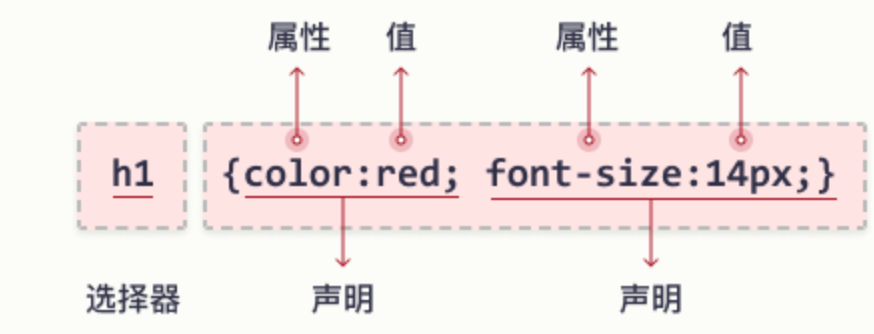
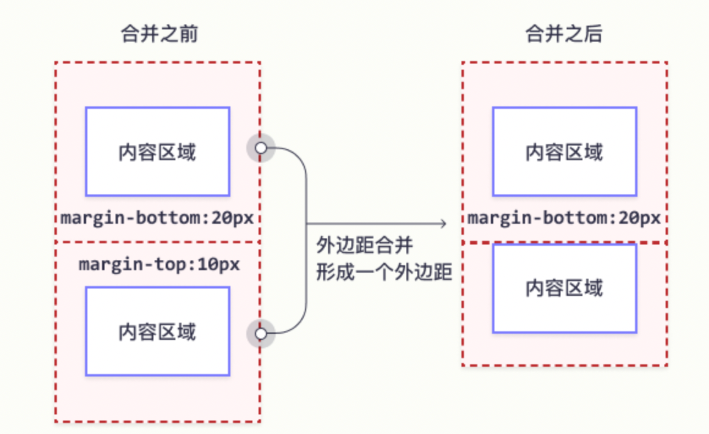
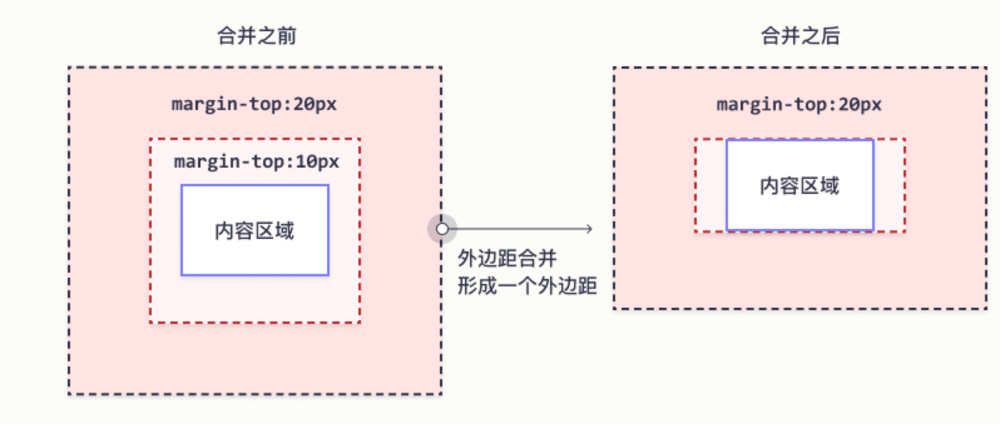
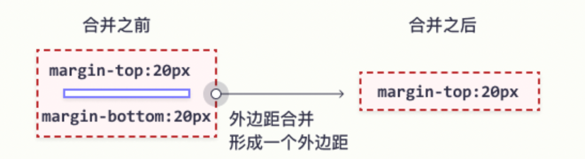
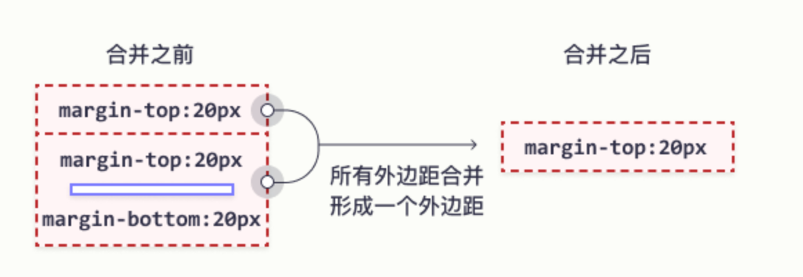
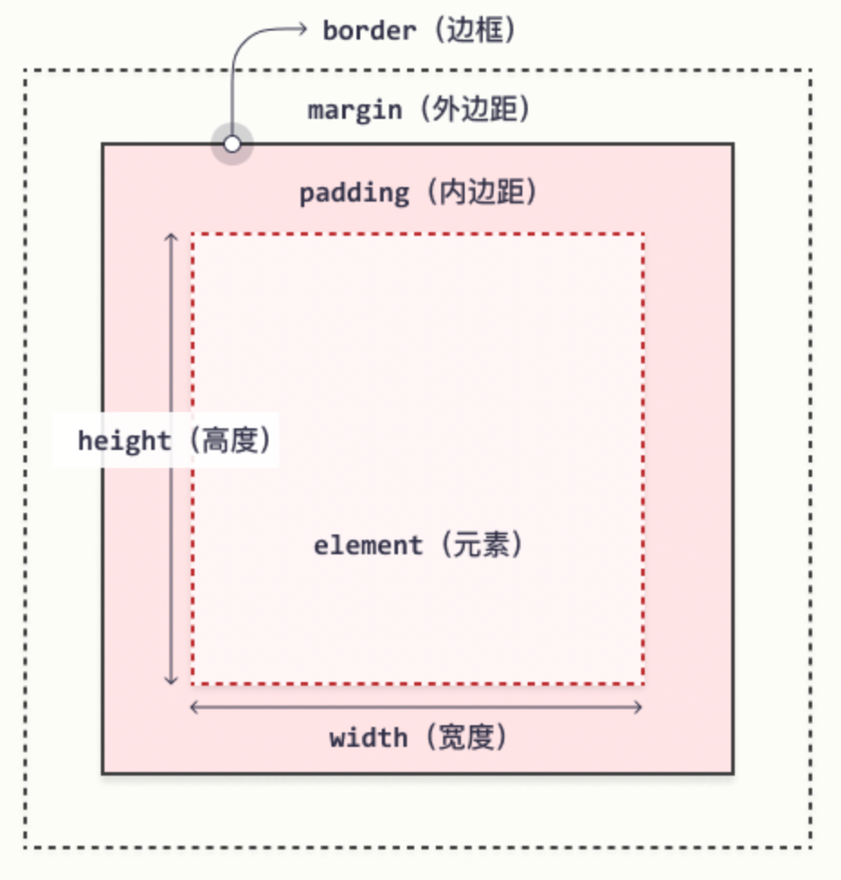
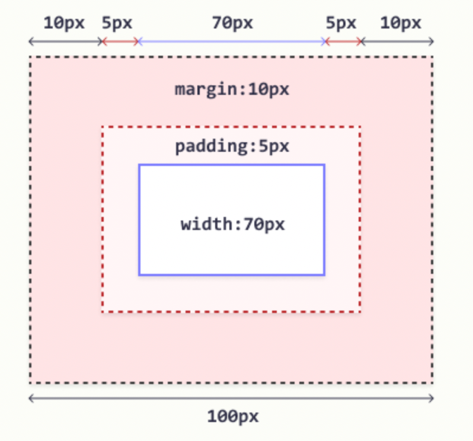

# CSS(层叠样式表 Cascading Style Sheets / 联样式表)

> https://www.w3school.com.cn/css/index.asp

👇目前进度

https://www.w3school.com.cn/css/css_rwd_intro.asp

[toc]

## 概述

- *CSS* 指的是层叠样式表 (Cascading Style Sheets)
- CSS 描述了*如何在屏幕、纸张或其他媒体上显示 HTML 元素*
- CSS *节省了大量工作*。它可以同时控制多张网页的布局
- 外部样式表存储在 CSS 文件中

## 使用css

### 外部css

每张 HTML 页面必须在 head 部分的 `<link>` 元素内包含对外部样式表文件的引用。外部样式表须以 .css 扩展名保存。

```html
<head>
	<link rel="stylesheet" type="text/css" href="mystyle.css">
</head>
```

### 内部css

内部样式在 HTML 页面的` <head>` 部分内的` <style>` 元素中进行定义：

```html
<head>
  <style>
    body {
      background-color: linen;
    }

    h1 {
      color: maroon;
      margin-left: 40px;
    } 
  </style>
</head>
```

### 行内CSS

行内样式在相关元素的 "style" 属性中定义

```
<h1 style="color:blue;text-align:center;">This is a heading</h1>
<p style="color:red;">This is a paragraph.</p>
```

> 行内样式失去了样式表的许多优点（通过将内容与呈现混合在一起）。请谨慎使用此方法。

## 基础语法



* 选择器指向您需要设置样式的 HTML 元素。
* 声明块包含一条或多条用分号分隔的声明。
* 每条声明都包含一个 CSS 属性名称和一个值，以冒号分隔。
* 多条 CSS 声明用分号分隔，声明块用花括号括起来。

**eg:**

```css
body {
  background-color: lightblue;
}

h1 {
  color: white;
  text-align: center;
}

p {
  font-family: verdana;
  font-size: 20px;
}
```

在此例中，所有 <p> 元素都将居中对齐，并带有红色文本颜色：

```
p {
  color: red;
  text-align: center;
}
```

## 选择器

CSS 选择器用于“查找”（或选取）要设置样式的 HTML 元素

* [简单选择器](#元素选择器)（根据名称、id、类来选取元素）

* 组合器选择器（根据它们之间的特定关系来选取元素）

* 伪类选择器（根据特定状态选取元素）

* 伪元素选择器（选取元素的一部分并设置其样式）

* 属性选择器（根据属性或属性值来选取元素）

### 元素选择器

* 元素选择器根据元素名称来选择 HTML 元素

  **eg:**

  在这里，页面上的所有 <p> 元素都将居中对齐，并带有红色文本颜色：

  ```css
  p {
    text-align: center;
    color: red;
  }
  ```

### CSS id 选择器

* id 选择器使用 HTML 元素的 id 属性来选择特定元素。

  元素的 id 在页面中是唯一的，因此 id 选择器用于选择一个唯一的元素！

  要选择具有特定 id 的元素，请写一个井号（＃），后跟该元素的 id。

  **eg:**

  这条 CSS 规则将应用于 id="para1" 的 HTML 元素：

  ```css
  #para1 {
    text-align: center;
    color: red;
  }
  ```

注意：id 名称不能以数字开头。

### CSS 类选择器

类选择器选择有特定 class 属性的 HTML 元素。

* 如需选择拥有特定 class 的元素，请写一个句点（.）字符，后面跟类名。

  **eg:**

  在此例中，所有带有 class="center" 的 HTML 元素将为红色且居中对齐：

  ```
  .center {
    text-align: center;
    color: red;
  }
  ```

* 您还可以指定只有特定的 HTML 元素会受类的影响。

  在这个例子中，只有具有 class="center" 的 <p> 元素会居中对齐：

  ```css
  p.center {
    text-align: center;
    color: red;
  }
  ```
* HTML 元素也可以引用多个类。
  在这个例子中，<p> 元素将根据 class="center" 和 class="large" 进行样式设置：

  ```
  <p class="center large">这个段落引用两个类。</p>
  ```

	> 注意：类名不能以数字开头！

### 分组选择器

* 分组选择器选取所有具有相同样式定义的 HTML 元素。多种元素使用有相同的样式定义

  ```css
  h1 {
    text-align: center;
    color: red;
  }
  
  h2 {
    text-align: center;
    color: red;
  }
  
  p {
    text-align: center;
    color: red;
  }
  ```

  =>

  ```css
  h1, h2, p {
    text-align: center;
    color: red;
  }
  ```

## 组合器

组合器是解释选择器之间关系的某种机制

* 选择器可以包含多个简单选择器

* 在简单选择器之间，我们可以包含一个组合器
  * 后代选择器 (空格)
  * 子选择器 (`>`)
  * 相邻兄弟选择器 (`+`)
  * 通用兄弟选择器 (`~`)

### 后代选择器

后代选择器匹配属于指定元素后代的所有元素。

下面的例子选择 <div> 元素内的所有 <p> 元素：

```css
div p {
  background-color: yellow;
}
```

### 子选择器

子选择器匹配属于指定元素子元素的所有元素。

下面的例子选择属于 <div> 元素子元素的所有 <p> 元素：

```css
div > p {
  background-color: yellow;
}
```

### 相邻兄弟选择器

相邻兄弟选择器匹配所有作为指定元素的相邻同级的元素。

兄弟（同级）元素必须具有相同的父元素，“相邻”的意思是“紧随其后”。

下面的例子选择紧随 <div> 元素之后的所有 <p> 元素：

```css
div + p {
  background-color: yellow;
}
```

通用兄弟选择器匹配属于指定元素的同级元素的所有元素。

下面的例子选择属于 <div> 元素的同级元素的所有 <p> 元素：

## 

通用兄弟选择器匹配属于指定元素的同级元素的所有元素。

下面的例子选择属于 <div> 元素的同级元素的所有 <p> 元素：

```
div ~ p {
  background-color: yellow;
}
```

## 伪类

伪类用于定义元素的特殊状态。伪类可以与 CSS 类结合使用

例如，它可以用于：

- 设置鼠标悬停在元素上时的样式
- 为已访问和未访问链接设置不同的样式
- 设置元素获得焦点时的样式

### 伪类语法

伪类的语法：

```css
selector:pseudo-class {
  property: value;
}
```

### 锚伪类

链接能够以不同的方式显示

```css
/* 未访问的链接 */
a:link {
  color: #FF0000;
}

/* 已访问的链接 */
a:visited {
  color: #00FF00;
}

/* 鼠标悬停链接 */
a:hover {
  color: #FF00FF;
}

/* 已选择的链接 */
a:active {
  color: #0000FF;
}
```

> `a:hover` 必须在 CSS 定义中的 `a:link` 和 `a:visited` 之后，才能生效
>
> `a:active` 必须在 CSS 定义中的 `a:hover` 之后才能生效
>
> 伪类名称对大小写不敏感。

###  :first-child 伪类

`:first-child` 伪类与指定的元素匹配：该元素是另一个元素的第一个子元素。

### :lang 伪类

`:lang` 伪类允许您为不同的语言定义特殊的规则。

在下面的例子中，`:lang` 为属性为 lang="en" 的 <q> 元素定义引号

```css
q:lang(en) {
  quotes: "~" "~";
}
```

### 所有 CSS 伪类

| 选择器                                                       | 例子                  | 例子描述                                                     |
| ------------------------------------------------------------ | --------------------- | ------------------------------------------------------------ |
| :activehttps://www.w3school.com.cn/cssref/selector_active.asp | a:active              | 选择活动的链接。                                             |
| [:checked](https://www.w3school.com.cn/cssref/selector_checked.asp) | input:checked         | 选择每个被选中的 <input> 元素。                              |
| [:disabled](https://www.w3school.com.cn/cssref/selector_disabled.asp) | input:disabled        | 选择每个被禁用的 <input> 元素。                              |
| [:empty](https://www.w3school.com.cn/cssref/selector_empty.asp) | p:empty               | 选择没有子元素的每个 <p> 元素。                              |
| [:enabled](https://www.w3school.com.cn/cssref/selector_enabled.asp) | input:enabled         | 选择每个已启用的 <input> 元素。                              |
| [:first-child](https://www.w3school.com.cn/cssref/selector_first-child.asp) | p:first-child         | 选择作为其父的首个子元素的每个 <p> 元素。                    |
| [:first-of-type](https://www.w3school.com.cn/cssref/selector_first-of-type.asp) | p:first-of-type       | 选择作为其父的首个 <p> 元素的每个 <p> 元素。                 |
| [:focus](https://www.w3school.com.cn/cssref/selector_focus.asp) | input:focus           | 选择获得焦点的 <input> 元素。                                |
| [:hover](https://www.w3school.com.cn/cssref/selector_hover.asp) | a:hover               | 选择鼠标悬停其上的链接。                                     |
| [:in-range](https://www.w3school.com.cn/cssref/selector_in-range.asp) | input:in-range        | 选择具有指定范围内的值的 <input> 元素。                      |
| [:invalid](https://www.w3school.com.cn/cssref/selector_invalid.asp) | input:invalid         | 选择所有具有无效值的 <input> 元素。                          |
| [:lang(*language*)](https://www.w3school.com.cn/cssref/selector_lang.asp) | p:lang(it)            | 选择每个 lang 属性值以 "it" 开头的 <p> 元素。                |
| [:last-child](https://www.w3school.com.cn/cssref/selector_last-child.asp) | p:last-child          | 选择作为其父的最后一个子元素的每个 <p> 元素。                |
| [:last-of-type](https://www.w3school.com.cn/cssref/selector_last-of-type.asp) | p:last-of-type        | 选择作为其父的最后一个 <p> 元素的每个 <p> 元素。             |
| [:link](https://www.w3school.com.cn/cssref/selector_link.asp) | a:link                | 选择所有未被访问的链接。                                     |
| [:not(*selector*)](https://www.w3school.com.cn/cssref/selector_not.asp) | :not(p)               | 选择每个非 <p> 元素的元素。                                  |
| [:nth-child(*n*)](https://www.w3school.com.cn/cssref/selector_nth-child.asp) | p:nth-child(2)        | 选择作为其父的第二个子元素的每个 <p> 元素。                  |
| [:nth-last-child(*n*)](https://www.w3school.com.cn/cssref/selector_nth-last-child.asp) | p:nth-last-child(2)   | 选择作为父的第二个子元素的每个<p>元素，从最后一个子元素计数。 |
| [:nth-last-of-type(*n*)](https://www.w3school.com.cn/cssref/selector_nth-last-of-type.asp) | p:nth-last-of-type(2) | 选择作为父的第二个<p>元素的每个<p>元素，从最后一个子元素计数 |
| [:nth-of-type(*n*)](https://www.w3school.com.cn/cssref/selector_nth-of-type.asp) | p:nth-of-type(2)      | 选择作为其父的第二个 <p> 元素的每个 <p> 元素。               |
| [:only-of-type](https://www.w3school.com.cn/cssref/selector_only-of-type.asp) | p:only-of-type        | 选择作为其父的唯一 <p> 元素的每个 <p> 元素。                 |
| [:only-child](https://www.w3school.com.cn/cssref/selector_only-child.asp) | p:only-child          | 选择作为其父的唯一子元素的 <p> 元素。                        |
| [:optional](https://www.w3school.com.cn/cssref/selector_optional.asp) | input:optional        | 选择不带 "required" 属性的 <input> 元素。                    |
| [:out-of-range](https://www.w3school.com.cn/cssref/selector_out-of-range.asp) | input:out-of-range    | 选择值在指定范围之外的 <input> 元素。                        |
| [:read-only](https://www.w3school.com.cn/cssref/selector_read-only.asp) | input:read-only       | 选择指定了 "readonly" 属性的 <input> 元素。                  |
| [:read-write](https://www.w3school.com.cn/cssref/selector_read-write.asp) | input:read-write      | 选择不带 "readonly" 属性的 <input> 元素。                    |
| [:required](https://www.w3school.com.cn/cssref/selector_required.asp) | input:required        | 选择指定了 "required" 属性的 <input> 元素。                  |
| [:root](https://www.w3school.com.cn/cssref/selector_root.asp) | root                  | 选择元素的根元素。                                           |
| [:target](https://www.w3school.com.cn/cssref/selector_target.asp) | #news:target          | 选择当前活动的 #news 元素（单击包含该锚名称的 URL）。        |
| [:valid](https://www.w3school.com.cn/cssref/selector_valid.asp) | input:valid           | 选择所有具有有效值的 <input> 元素。                          |
| [:visited](https://www.w3school.com.cn/cssref/selector_visited.asp) | a:visited             | 选择所有已访问的链接。                                       |

## 伪元素

CSS 伪元素用于设置元素指定部分的样式。伪元素可以与 CSS 类结合使用

例如，它可用于：

- 设置元素的首字母、首行的样式
- 在元素的内容之前或之后插入内容

### 语法

伪元素的语法：

```css
selector::pseudo-element {
  property: value;
}

p.intro::first-letter {
  color: #ff0000;
  font-size: 200%;
}
```
### 可以组合多个伪元素

```css
p::first-letter {
  color: #ff0000;
  font-size: xx-large;
}

p::first-line {
  color: #0000ff;
  font-variant: small-caps;
}
```

### ::first-line 伪元素

`::first-line` 伪元素用于向文本的首行添加特殊样式。

下面的例子为所有 <p> 元素中的首行添加样式：

```css
p::first-line {
  color: #ff0000;
  font-variant: small-caps;
}
```

> `::first-line` 伪元素只能应用于块级元素。

### ::first-letter 伪元素

`::first-letter` 伪元素用于向文本的首字母添加特殊样式。

> `::first-letter` 伪元素只适用于块级元素。

### ::before/::after 伪元素

`::before`, `::after` 伪元素可用于在元素内容之后插入一些内容

```css
h1::before {
  content: url(smiley.gif);
}
```

### ::selection 伪元素

`::selection` 伪元素匹配用户选择的元素部分。

以下 CSS 属性可以应用于 `::selection`：

- `color`
- `background`
- `cursor`
- `outline`

### 所有 CSS 伪元素

| [::after](https://www.w3school.com.cn/cssref/selector_after.asp) | p::after        | 在每个 <p> 元素之后插入内容。 |
| ------------------------------------------------------------ | --------------- | ----------------------------- |
| [::before](https://www.w3school.com.cn/cssref/selector_before.asp) | p::before       | 在每个 <p> 元素之前插入内容。 |
| [::first-letter](https://www.w3school.com.cn/cssref/selector_first-letter.asp) | p::first-letter | 选择每个 <p> 元素的首字母。   |
| [::first-line](https://www.w3school.com.cn/cssref/selector_first-line.asp) | p::first-line   | 选择每个 <p> 元素的首行。     |
| [::selection](https://www.w3school.com.cn/cssref/selector_selection.asp) | p::selection    | 选择用户选择的元素部分。      |

## 属性选择器

| 选择器                                                       | 例子                | 例子描述                                                |
| ------------------------------------------------------------ | ------------------- | ------------------------------------------------------- |
| [[*attribute*\]](https://www.w3school.com.cn/cssref/selector_attribute.asp) | [target]            | 选择带有 target 属性的所有元素。                        |
| [[*attribute*=*value*\]](https://www.w3school.com.cn/cssref/selector_attribute_value.asp) | [target=_blank]     | 选择带有 target="_blank" 属性的所有元素。               |
| [[*attribute*~=*value*\]](https://www.w3school.com.cn/cssref/selector_attribute_value_contain.asp) | [title~=flower]     | 选择带有包含 "flower" 一词的 title 属性的所有元素。     |
| [[*attribute*\|=*value*\]](https://www.w3school.com.cn/cssref/selector_attribute_value_start.asp) | [lang\|=en]         | 选择带有以 "en" 开头的 lang 属性的所有元素。            |
| [[*attribute*^=*value*\]](https://www.w3school.com.cn/cssref/selector_attr_begin.asp) | a[href^="https"]    | 选择其 href 属性值以 "https" 开头的每个 <a> 元素。      |
| [[*attribute*$=*value*\]](https://www.w3school.com.cn/cssref/selector_attr_end.asp) | a[href$=".pdf"]     | 选择其 href 属性值以 ".pdf" 结尾的每个 <a> 元素。       |
| [[*attribute**=*value*\]](https://www.w3school.com.cn/cssref/selector_attr_contain.asp) | a[href*="w3school"] | 选择其 href 属性值包含子串 "w3school" 的每个 <a> 元素。 |

设置带有特定属性或属性值的 HTML 元素的样式

* 属性选择

  ```css
  /* 带有target 属性的a 元素 */
  a[target] {
    background-color: yellow;
  }
  ```

* 属性-值选择器 (=)

  选取带有指定属性和值的元素

  ```css
  a[target="value"] { 
    background-color: yellow;
  }
  ```

* 属性-包含值选择器 (~/*=)

  ```css
  [title~="value"] {
    border: 5px solid yellow;
  }
  ```

* 属性-开头值选择器 (|=)

  [attribute|="value"] 选择器用于选取指定属性以指定值开头的元素

* 属性-开头/结尾值选择器 (^/$=)
	
	```css
	[class^="top"] {
	  background: yellow;
	}
	
	[class$="top"] {
	  background: yellow;
	}
	```
## 层叠顺序

如果在不同样式表中为同一选择器（元素）定义了一些属性，则将使用最后读取的样式表中的值

当为某个 HTML 元素指定了多个样式时，页面中的所有样式将按照以下规则“层叠”为新的“虚拟”样式表，其中第一优先级最高：

1. 行内样式（在 HTML 元素中）
2. 外部和内部样式表（在 head 部分）
3. 浏览器默认样式

因此，行内样式具有最高优先级，并且将覆盖外部和内部样式以及浏览器默认样式。

## 注释

注释用于解释代码，以后在您编辑源代码时可能会有所帮助

位于 `<style>` 元素内的 CSS 注释，以 `/*` 开始，以 `*/` 结束：

## 变量

var() 函数用于插入 CSS 变量的值。

```css
var(name, value)
```

| 值      | 描述                                 |
| ------- | ------------------------------------ |
| *name*  | 必需。变量名（以两条破折号开头）。   |
| *value* | 可选。回退值（在未找到变量时使用）。 |

e.g

```css
:root {
  --blue: #1e90ff;
  --white: #ffffff;
}

body { background-color: var(--blue); }

h2 { border-bottom: 2px solid var(--blue); }

.container {
  color: var(--blue);
  background-color: var(--white);
  padding: 15px;
}

button {
  background-color: var(--white);
  color: var(--blue);
  border: 1px solid var(--blue);
  padding: 5px;
}
```

### 局部变量

如果只在一个地方使用一个变量，我们也可以声明一个新的局部变量

e.g

```css
:root {
  --blue: #1e90ff;
  --white: #ffffff;
}

button {
  --button-blue: #0000ff;
  background-color: var(--white);
  color: var(--button-blue);
  border: 1px solid var(--button-blue);
  padding: 5px;
}
```

### js中更改变量

```js
// 获取根元素
var r = document.querySelector(':root');

// 创建获取变量值的函数
function myFunction_get() {
  // Get the styles (properties and values) for the root
  var rs = getComputedStyle(r);
  // Alert the value of the --blue variable
  alert("The value of --blue is: " + rs.getPropertyValue('--blue'));
}

// 创建设置变量值的函数
function myFunction_set() {
  // Set the value of variable --blue to another value (in this case "lightblue")
  r.style.setProperty('--blue', 'lightblue');
}
```

### 媒体查询变量

```css
/* 变量声明 */
:root {
  --blue: #1e90ff;
  --white: #ffffff;
}

@media screen and (min-width: 450px) {
  .container {
    --fontsize: 50px;
  }
   :root {
    --blue: lightblue;
  }
}
```


## 计数器

CSS 计数器是由 CSS 保持的“变量”，其值可以通过 CSS 规则递增（以跟踪其使用次数）。

### 带计数器的自动编号

- `counter-reset` - 创建或重置计数器
- `counter-increment` - 递增计数器值
- `content` - 插入生成的内容
- `counter()` 或 `counters()` 函数 - 将计数器的值添加到元素

eg:

```css
body {
  counter-reset: section;
}

h2::before {
  counter-increment: section;
  content: "Section " counter(section) ": ";
}
```

嵌套

```css
body {
  counter-reset: section;
}

h1 {
  counter-reset: subsection;
}

h1::before {
  counter-increment: section;
  content: "Section " counter(section) ". ";
}

h2::before {
  counter-increment: subsection;
  content: counter(section) "." counter(subsection) " ";
}
```

## 长度单位

### 绝对长度

| 单位 | 描述                       |
| ---- | -------------------------- |
| cm   | 厘米                       |
| mm   | 毫米                       |
| in   | 英寸 (1in = 96px = 2.54cm) |
| px * | 像素 (1px = 1/96th of 1in) |
| pt   | 点 (1pt = 1/72 of 1in)     |
| pc   | 派卡 (1pc = 12 pt)         |

>  像素（px）是相对于观看设备的。对于低 dpi 的设备，1px 是显示器的一个设备像素（点）。对于打印机和高分辨率屏幕，1px 表示多个设备像素

### 相对长度

| 单位 | 描述                                                         |
| ---- | ------------------------------------------------------------ |
| em   | 相对于元素的字体大小（font-size）（2em 表示当前字体大小的 2 倍） |
| ex   | 相对于当前字体的 x-height(极少使用)                          |
| ch   | 相对于 "0"（零）的宽度                                       |
| rem  | 相对于根元素的字体大小（font-size）                          |
| vw   | 相对于视口*宽度的 1%                                         |
| vh   | 相对于视口*高度的 1%                                         |
| vmin | 相对于视口*较小尺寸的 1％                                    |
| vmax | 相对于视口*较大尺寸的 1％                                    |
| %    | 相对于父元素                                                 |

## 特异性

如果有两条或两条以上指向同一元素的冲突 CSS 规则，则浏览器将遵循一些原则来确定哪一条是最具体的，并因此胜出。

### 特异性级别

* *行内样式* - 行内（内联）样式直接附加到要设置样式的元素。
  * 实例：\<h1 style="color: #ffffff;">。
* *ID* - ID 是页面元素的唯一标识符
  * 例如 #navbar。
* *类、属性和伪类* - 此类别包括 .classes、[attributes] 和伪类，
  * 例如：:hover、:focus 等。
* *元素和伪元素* - 此类别包括元素名称和伪元素
  * 比如 h1、div、:before 和 :after。

### 特异性值计算

* 为 style 属性添加 1000
* 为每个 ID 添加 100
* 为每个属性、类或伪类添加 10
* 为每个元素名称或伪元素添加 1

### 规则

* 最新的规则很重要
* ID 选择器比属性选择器拥有更高的特异性 
* 上下文选择器比单一元素选择器更具体
* 类选择器会击败任意数量的元素选择器

## 颜色

### 颜色名

CSS/HTML 支持 140 种标准颜色名

### RGB

在 CSS 中，可以使用下面的公式将颜色指定为 RGB 值：

$$
rgb(red, green, blue)
$$

> red, grenn, blue 范围为 0-255

### RGBA

 alpha 通道的 RGB 颜色值的扩展 - 它指定了颜色的不透明度
$$
rgba(red, green, blue, alpha)
$$

> red, grenn, blue 范围为 0-255
>
> alpha 0.0-1.0

### HEX

在 CSS 中，可以使用以下格式的十六进制值指定颜色
$$
\#rrggbb
$$
 rr（红色）、gg（绿色）和 bb（蓝色）是介于 00 和 ff 之间的十六进制值

### HSL

使用色相、饱和度和明度（HSL）来指定颜色，格式如下：
$$
hsla(hue, saturation, lightness)
$$

> hue 0-360
>
> saturation, lightness 0-100%

### HSLA 值

HSLA 颜色值是带有 Alpha 通道的 HSL 颜色值的扩展 - 它指定了颜色的不透明度。
$$
hsla(hue, saturation, lightness, alpha)
$$

> hue 0-360
>
> saturation, lightness 0-100%
>
> alpha 0.0 - 1.0

### opacity 元素的不透明度

属性指定元素的不透明度/透明度

取值范围为 0.0 - 1.0。值越低，越透明：

## 文字

### 颜色

* `color` 属性用于设置文本的颜色
  * 颜色名 - 比如 "red"
  * 十六进制值 - 比如 "#ff0000"
  * RGB 值 - 比如 "rgb(255,0,0)"
* `background-color` 属性设置文本背景的颜色

### 对齐

* `text-align` 属性用于设置文本的水平对齐方式

  * 如果文本方向是从左到右，则默认为左对齐；如果文本方向是从右到左，则默认是右对齐

    ```css
    h1 {
      text-align: center;
    }
    
    h2 {
      text-align: left;
    }
    
    h3 {
      text-align: right;
    }
    ```

  * `text-align` 属性设置为 `justify`后，将拉伸每一行，以使每一行具有相等的宽度，并且左右边距是直的：

* `direction` 和 `unicode-bidi` 属性可用于更改元素的文本方向

* `vertical-align` 属性设置元素的垂直对齐方式。

### 文本格式

* `text-decoration` 属性用于设置或删除文本装饰。

  * `overline` 顶置线
  * `line-through`删除线
  * `underline`下划线
  * `text-decoration: none;` 通常用于从链接上删除下划线

* `text-transform` 属性用于指定文本中的大写和小写字母。

  * `uppercase` 全部大写
  * `lowercase` 全部小写
  * `capitalize`首字母大写

* `text-indent` 属性用于指定文本第一行的缩进：

* `letter-spacing` 属性用于指定文本中字符之间的间距。

* `line-height` 属性用于指定行之间的间距

* `word-spacing` 属性用于指定文本中单词之间的间距

* `white-space` 属性指定元素内部空白的处理方式

  * white-space: nowrap; 禁用文本间换行、

* `text-shadow` 属性为文本添加阴影

  * ```css
    h1 {
      text-shadow: 2px 2px;
    } /*水平阴影（2px）和垂直阴影（2px）*/
    
    h2 {
      text-shadow: 2px 2px red;
    } /* 红色 */
    
    h3 {
      text-shadow: 2px 2px 5px red;
    } /* 模糊 */
    ```

## 字体
### 字体族

* 通用字体族

  - 衬线字体（Serif）- 在每个字母的边缘都有一个小的笔触。它们营造出一种形式感和优雅感。

  - 无衬线字体（Sans-serif）- 字体线条简洁（没有小笔画）。它们营造出现代而简约的外观。

  - 等宽字体（Monospace）- 这里所有字母都有相同的固定宽度。它们创造出机械式的外观。

  - 草书字体（Cursive）- 模仿了人类的笔迹。

  - 幻想字体（Fantasy）- 是装饰性/俏皮的字体。
* `font-family` 属性规定文本的字体。
  * font-family 属性应包含多个字体名称作为“后备”系统，以确保浏览器/操作系统之间的最大兼容性。
  * 请以您需要的字体开始，并以通用系列结束。字体名称应以逗号分隔
  * 如果字体名称不止一个单词，则必须用引号引起来，例如："Times New Roman"。

### 样式

* `font-style` 属性主要用于指定斜体文本。

  * normal - 文字正常显示
  * italic - 文本以斜体显示
  * oblique - 文本为“倾斜”（倾斜与斜体非常相似，但支持较少

* `font-weight` 属性指定字体的粗细：

  * normal 正常
  * bold 加粗

* `font-variant` 属性指定是否以 small-caps 字体（小型大写字母）显示文本

  * normal 

  * small-caps 

    所有小写字母都将转换为大写字母。但是，转换后的大写字母的字体大小小于文本中原始大写字母的字体大小。

* `font-size` 属性设置文本的大小。

  * 绝对尺寸：
    * 将文本设置为指定大小
    * 不允许用户在所有浏览器中更改文本大小（可访问性不佳）
    * 当输出的物理尺寸已知时，绝对尺寸很有用
  * 相对尺寸：
    * 设置相对于周围元素的大小
    * 允许用户在浏览器中更改文本大小
  * px 像素
  * em
    * 为了允许用户调整文本大小，许多开发人员使用 em 而不是像素。
    * 浏览器中的默认文本大小为 16px。因此，默认大小 1em 为 16px
  * `vw` 单位设置文本大小，它的意思是“视口宽度”（"viewport width"）。

* 简写属性

  * `font-style`
  * `font-variant`
  * `font-weight`
  * `font-size/line-height`
  * `font-family`


### 外部字体

* 谷歌字体

  * 如果您不想使用 HTML 中的任何标准字体，则可以使用 Google Fonts API 向页面添加数百种其他字体。

    ```html
    <link rel="stylesheet" href="https://fonts.googleapis.com/css?family=Sofia">
    ```

特殊字体在 CSS `@font-face` 规则中进行定义

在 @font-face 规则中：首先定义字体的名称（例如 myFirstFont），然后指向该字体文件

```css
@font-face {
  font-family: myFirstFont;
  src: url(sansation_light.woff);
  font-weight: bold; /*使用粗体字体*/
}
```

| 描述符        | 值                                                           | 描述                                                         |
| ------------- | ------------------------------------------------------------ | ------------------------------------------------------------ |
| font-family   | *name*                                                       | 必需。定义字体名称。                                         |
| src           | *URL*                                                        | 必需。定义字体文件的 URL。                                   |
| font-stretch  | normal    condensed    ultra-condensed    extra-condensed    semi-condensed    expanded    semi-expanded    extra-expanded    ultra-expanded | 可选。定义应如何拉伸字体。默认值是 "normal"。                |
| font-style    | normal    italic    oblique                                  | 可选。定义字体的样式。默认值是 "normal"。                    |
| font-weight   | normal    bold    100    200    300    400    500    600    700    800    900 | 可选。定义字体的粗细。默认值是 "normal"。                    |
| unicode-range | unicode-range                                                | 可选。定义字体支持的 UNICODE 字符范围。默认值是 "U+0-10FFFF"。 |

## 文本效果

### 文字溢出text-overflow

`text-overflow` 属性规定应如何向用户呈现未显示的溢出内容

* clip 文本剪裁
* ellipsis 呈现为省略号
* visible 直接显示

### 换行 word-wrap

`word-wrap` 属性使长文字能够被折断并换到下一行。如果一个单词太长而无法容纳在一个区域内，它会向外扩展

* break-word 允许单词被打断并换到下一行

###  书写模式writing-mode

`writing-mode` 属性规定文本行是水平放置还是垂直放置。

* vertical-rl 
* horizontal-tb

## 阴影

### 文字阴影 text-shadow 

```css
h1 {
  text-shadow: x-offset y-offset blur color, other_one
}

h1 {
  text-shadow: 0 0 3px #FF0000, 0 0 5px #0000FF;
}
```

### box shadow

```
h1 {
  text-shadow: x-offset y-offset color, other_one
}
```

## 图标

向 HTML 页面添加图标的最简单方法是使用图标库

添加至HTML 元素中，如` <i> `或 `<span>`

### 图标库

* Font Awesome 图标

  * 访问 fontawesome.com，登录并获取代码添加到 HTML 页面的` <head>` 部分

  * ```html
    <script src="https://kit.fontawesome.com/yourcode.js"></script>
    <!--use-->
    <i class="fas fa-cloud"></i>
    ```

* Bootstrap 图标

  ```html
  <link rel="stylesheet" href="https://maxcdn.bootstrapcdn.com/bootstrap/3.3.7/css/bootstrap.min.css">
  
  <!--use-->
  <i class="glyphicon glyphicon-cloud"></i>
  ```

* Google 图标

  ```html
  <link rel="stylesheet" href="https://fonts.googleapis.com/icon?family=Material+Icons">
  
  <!--use-->
  <i class="glyphicon glyphicon-cloud"></i>
  ```


## 背景

| 属性                                                         | 描述                                               |
| ------------------------------------------------------------ | -------------------------------------------------- |
| [background](https://www.w3school.com.cn/cssref/pr_background.asp) | 在一条声明中设置所有背景属性的简写属性。           |
| [background-attachment](https://www.w3school.com.cn/cssref/pr_background-attachment.asp) | 设置背景图像是固定的还是与页面的其余部分一起滚动。 |
| [background-clip](https://www.w3school.com.cn/cssref/pr_background-clip.asp) | 规定背景的绘制区域。                               |
| [background-color](https://www.w3school.com.cn/cssref/pr_background-color.asp) | 设置元素的背景色。                                 |
| [background-image](https://www.w3school.com.cn/cssref/pr_background-image.asp) | 设置元素的背景图像。                               |
| [background-origin](https://www.w3school.com.cn/cssref/pr_background-origin.asp) | 规定在何处放置背景图像。                           |
| [background-position](https://www.w3school.com.cn/cssref/pr_background-position.asp) | 设置背景图像的开始位置。                           |
| [background-repeat](https://www.w3school.com.cn/cssref/pr_background-repeat.asp) | 设置背景图像是否及如何重复。                       |
| [background-size](https://www.w3school.com.cn/cssref/pr_background-size.asp) | 规定背景图像的尺寸。                               |

* background-color

  指定元素的背景色

  ```css
  body {
    background-color: lightblue;
  }
  ```

* background-imag

   元素背景的图像
  
  ```css
  body {
    background-image: url("paper.gif");
  }
  ```

- background-repeat

  * 默认情况下，`background-image` 属性在水平和垂直方向上都重复图像。
  * 仅在水平方向重复 (`background-repeat: repeat-x;`)
  * 垂直重复图像，`background-repeat: repeat-y;`
  * 只显示一次背景图像 `background-repeat: no-repeat`

-  background-position

   属性用于指定背景图像的位置。

  ```css
  body {
    background-image: url("tree.png");
    background-repeat: no-repeat;
    background-position: right top;
  }
  ```

- background-attachment

  属性指定背景图像是应该滚动还是固定的（不会随页面的其余部分一起滚动

  * 指定应该固定背景图像

    ```
    background-attachment: fixed;
    ```

  * 随页面的其余部分一起滚动

    ```
    background-attachment: scroll
    ```

* 简写

  * 顺序为

    - background-color
    - background-image
    - background-repeat
    - background-attachment
    - background-position

  * ```
    body {
      background: #ffffff url("tree.png") no-repeat right top;
    }
    ```

#### Hero Image

您还可以在 <div> 上使用不同的背景属性来创建 Hero Image（带有文本的大图像），并将其放置在您希望的位置上。

```
.hero-image {
  background: url(img_man.jpg) no-repeat center; 
  background-size: cover;
  height: 500px;
  position: relative;
}
```

### 多重背景

* `background-image` 属性为一个元素添加多幅背景图像。

  不同的背景图像用逗号隔开，并且图像会彼此堆叠，其中的第一幅图像最靠近观看者

* `background-size` 属性允许您指定背景图像的大小。可以通过长度、百分比或使用以下两个关键字之一来指定背景图像的大小：`contain` 或 `cover`。

  * `contain` 关键字将背景图像缩放为尽可能大的尺寸（但其宽度和高度都必须适合内容区域）。这样，取决于背景图像和背景定位区域的比例，可能存在一些未被背景图像覆盖的背景区域。
  * `cover` 关键字会缩放背景图像，以使内容区域完全被背景图像覆盖（其宽度和高度均等于或超过内容区域）。这样，背景图像的某些部分可能在背景定位区域中不可见。

* 同时制定多个尺寸

  * ```
    #example1 {
      background: url(tree.png) left top no-repeat, url(flower.gif) right bottom no-repeat, 
      	url(paper.gif) left top repeat;
      background-size: 50px, 130px, auto;
    }
    ```

* 全尺寸背景图像

  我们希望网站上的背景图像始终覆盖整个浏览器窗口

  * 用图像填充整个页面（无空白）

  * 根据需要缩放图像

  * 在页面上居中图像

  * 不引发滚动条

  * ```
    html {
      background: url(img_man.jpg) no-repeat center fixed; 
      background-size: cover;
    }
    ```

### 渐变背景

#### 线性渐变 linear-gradient

```css
background-image: linear-gradient(direction, color-stop1, color-stop2, ...);
```

* 默认 从上到下
* 从左到右` direction = to right`
* 对角线 `to bottom right`
* 自定义角度 `direction = angle deg` => `linear-gradient(-90deg, red, yellow);`

* 重复 线性渐变 repeating-linear-gradient

#### 径向渐变 radial-gradient

向渐变由其中心定义。

*shape* 参数定义形状。它可接受 circle 或 ellipse 值。默认值为 ellipse（椭圆）

## 转换

###  2D 转换

通过使用 CSS `transform` 属性，您可以利用以下 2D 转换方法：

- `translate()`
  - 从其当前位置移动元素（根据为 X 轴和 Y 轴指定的参数）
- `rotate()`
  - `rotate()` 方法根据给定的角度顺时针或逆时针旋转元素。
  - 正值为 顺时针 单位为 `deg`
- `scale()`
  - 增加或减少元素的大小（根据给定的宽度和高度倍数参数）
  - `scaleX()` 为宽度
  - `scaleY()`为高度
- `skew()`
  -  元素沿X, Y 轴倾斜给定角度。类似平行四边形
  - `skewX()`元素沿 X 轴倾斜给定角度
  - `skewY()`元素沿 Y 轴倾斜给定角度。
- `matrix()`
  - 方法把所有 2D 变换方法组合为一个
  - 参数如下：matrix(scaleX(),skewY(),skewX(),scaleY(),translateX(),translateY())

### 3d 转换方法

通过 CSS `transform` 属性，您可以使用以下 3D 转换方法：

| 函数                                                         | 描述                                      |
| ------------------------------------------------------------ | ----------------------------------------- |
| matrix3d(*n*,*n*,*n*,*n*,*n*,*n*, *n*,*n*,*n*,*n*,*n*,*n*,*n*,*n*,*n*,*n*) | 定义 3D 转换，使用 16 个值的 4x4 矩阵。   |
| translate3d(*x*,*y*,*z*)                                     | 定义 3D 转化。                            |
| translateX(*x*)                                              | 定义 3D 转化，仅使用用于 X 轴的值。       |
| translateY(*y*)                                              | 定义 3D 转化，仅使用用于 Y 轴的值。       |
| translateZ(*z*)                                              | 定义 3D 转化，仅使用用于 Z 轴的值。       |
| scale3d(*x*,*y*,*z*)                                         | 定义 3D 缩放转换。                        |
| scaleX(*x*)                                                  | 定义 3D 缩放转换，通过给定一个 X 轴的值。 |
| scaleY(*y*)                                                  | 定义 3D 缩放转换，通过给定一个 Y 轴的值。 |
| scaleZ(*z*)                                                  | 定义 3D 缩放转换，通过给定一个 Z 轴的值。 |
| rotate3d(*x*,*y*,*z*,*angle*)                                | 定义 3D 旋转。                            |
| rotateX(*angle*)                                             | 定义沿 X 轴的 3D 旋转。                   |
| rotateY(*angle*)                                             | 定义沿 Y 轴的 3D 旋转。                   |
| rotateZ(*angle*)                                             | 定义沿 Z 轴的 3D 旋转。                   |
| perspective(*n*)                                             | 定义 3D 转换元素的透视视图。              |

## 过渡 

允许您在给定的时间内通过`transition`平滑地改变属性值

如需创建过渡效果，必须明确两件事：

- 您要添加效果的 CSS 属性
- 效果的持续时间

> 注意：如果未规定持续时间部分，则过渡不会有效果，因为默认值为 0。

eg: 

```css
div {
  transition: width 2s;
}

div {
  transition: width 2s, height 4s;
}
```

当指定的 CSS 属性（width）值发生变化时，将开始过渡效果。

### 过渡属性

* `transition-timing-function` 属性规定过渡效果的速度曲线。

  - `ease` - 规定过渡效果，先缓慢地开始，然后加速，然后缓慢地结束（默认）

  - `linear` - 规定从开始到结束具有相同速度的过渡效果

  - `ease-in` -规定缓慢开始的过渡效果

  - `ease-out` - 规定缓慢结束的过渡效果

  - `ease-in-out` - 规定开始和结束较慢的过渡效果

  - `cubic-bezier(n,n,n,n)` - 允许您在三次贝塞尔函数中定义自己的值

- `transition-delay` 属性规定过渡效果的延迟（以秒计）。

## 动画

动画使元素逐渐从一种样式变为另一种样式。

您可以随意更改任意数量的 CSS 属性。

如需使用 CSS 动画，您必须首先为动画指定一些关键帧。

关键帧包含元素在特定时间所拥有的样式。


eg: 下面的例子将 "example" 动画绑定到 <div> 元素。动画将持续 4 秒钟，同时将 <div> 元素的背景颜色从 "red" 逐渐改为 "yellow"

```css
/* 动画代码 */
@keyframes example {
  from {background-color: red;}
  to {background-color: yellow;}
}

@keyframes example2 {
  0%   {background-color:red; left:0px; top:0px;}
  25%  {background-color:yellow; left:200px; top:0px;}
  50%  {background-color:blue; left:200px; top:200px;}
  75%  {background-color:green; left:0px; top:200px;}
  100% {background-color:red; left:0px; top:0px;}
}

/* 向此元素应用动画效果 */
div {
  width: 100px;
  height: 100px;
  background-color: red;
  animation-name: example;
  animation-duration: 4s;
}
```

* `animation-duration` 属性定义需要多长时间才能完成动画。
  * 如果未指定 `animation-duration` 属性，则动画不会发生，因为默认值是 0s（0秒）。
* `animation-delay` 属性规定动画开始的延迟时间。
* `animation-iteration-count` 属性指定动画应运行的次数。
  * "infinite" 使动画永远持续下去：
* `animation-direction` 属性指定是向前播放、向后播放还是交替播放动画。
  * `normal` - 动画正常播放（向前）。默认值
  * `reverse` - 动画以反方向播放（向后）
  * `alternate` - 动画先向前播放，然后向后
  * `alternate-reverse` - 动画先向后播放，然后向前
* `animation-timing-function` 属性规定动画的速度曲线。
  * `ease` - 指定从慢速开始，然后加快，然后缓慢结束的动画（默认）
  * `linear` - 规定从开始到结束的速度相同的动画
  * `ease-in` - 规定慢速开始的动画
  * `ease-out` - 规定慢速结束的动画
  * `ease-in-out` - 指定开始和结束较慢的动画
  * `cubic-bezier(*n*,*n*,*n*,*n*)` - 运行您在三次贝塞尔函数中定义自己的值
* CSS 动画不会在第一个关键帧播放之前或在最后一个关键帧播放之后影响元素。`animation-fill-mode` 属性能够覆盖这种行为。
  * `none` - 默认值。动画在执行之前或之后不会对元素应用任何样式。
  * `forwards` - 元素将保留由最后一个关键帧设置的样式值（依赖 animation-direction 和 animation-iteration-count）。
  * `backwards` - 元素将获取由第一个关键帧设置的样式值（取决于 animation-direction），并在动画延迟期间保留该值。
  * `both` - 动画会同时遵循向前和向后的规则，从而在两个方向上扩展动画属性。


## 边框

* `border-style` 属性指定要显示的边框类型。

  允许以下值：

  - `dotted` - 定义点线边框
  - `dashed` - 定义虚线边框
  - `solid` - 定义实线边框
  - `double` - 定义双边框
  - `groove` - 定义 3D 坡口边框。效果取决于 border-color 值
  - `ridge` - 定义 3D 脊线边框。效果取决于 border-color 值
  - `inset` - 定义 3D inset 边框。效果取决于 border-color 值
  - `outset` - 定义 3D outset 边框。效果取决于 border-color 值
  - `none` - 定义无边框
  - `hidden` - 定义隐藏边框

  eg:

  ```css
  p.dotted {border-style: dotted;}
  p.dashed {border-style: dashed;}
  p.solid {border-style: solid;}
  p.double {border-style: double;}
  p.groove {border-style: groove;}
  p.ridge {border-style: ridge;}
  p.inset {border-style: inset;}
  p.outset {border-style: outset;}
  p.none {border-style: none;}
  p.hidden {border-style: hidden;}
  p.mix {border-style: dotted dashed solid double;}
  ```

* `border-width` 属性指定四个边框的宽度。

  * 可以将宽度设置为特定大小（以 px、pt、cm、em 计），也可以使用以下三个预定义值之一：thin、medium 或 thick：

  * 属性可以设置一到四个值

  * 用于上边框、右边框、下边框和左边框

    eg:

    ```css
    p.one {
      border-style: solid;
      border-width: 5px 20px; /* 上边框和下边框为 5px，其他边为 20px */
    }
    
    p.two {
      border-style: solid;
      border-width: 20px 5px; /* 上边框和下边框为 20px，其他边为 5px */
    }
    
    p.three {
      border-style: solid;
      border-width: 25px 10px 4px 35px; /* 上边框 25px，右边框 10px，下边框 4px，左边框 35px */
    }
    ```

* `border-color` 属性用于设置四个边框的颜色。

  - name - 指定颜色名，比如 "red"
  - HEX - 指定十六进制值，比如 "#ff0000"
  - RGB - 指定 RGB 值，比如 "rgb(255,0,0)"
  - HSL - 指定 HSL 值，比如 "hsl(0, 100%, 50%)"
  - transparent

  > 注释：如果未设置 `border-color`，则它将继承元素的颜色。

  eg:

  ```css
  p.one {
    border-style: solid;
    border-color: red green blue yellow; /* 上红、右绿、下蓝、左黄 */
  }
  ```

* 单独的边

  ```css
  p {
    border-top-style: dotted;
    border-right-style: solid;
    border-bottom-style: dotted;
    border-left-style: solid;
  }
  ```

  > `border-width` 和 `border-color` 也同样适用

  #### 简写属性

  * 如果 `border-style` 属性设置四个值：

    border-style: dotted solid double dashed;

    - 上边
    - 右边
    - 下边
    - 左边

  * 如果 `border-style` 属性设置三个值：

    border-style: dotted solid double;

    - 上边
    - 右和左
    - 下边

  * 如果 `border-style` 属性设置两个值：

    border-style: dotted solid;

    - 上和下边
    - 右和左边

  * 如果 `border-style` 属性设置一个值：

    border-style: dotted;

    - 四条边

* `border` 属性是以下各个边框属性的简写属性：

  - `border-width`
  - `border-style`（必需）
  - `border-color`

  **eg:**

  ```
  p {
    border: 5px solid red;
  }
  ```

  * 左边框
  ```
  p {
  border-left: 6px solid red;
  background-color: lightgrey;
  }
  ```

* `border-radius` 属性用于向元素添加圆角边框

  ```css
  p {
    border: 2px solid red;
    border-radius: 5px;
  }
  ```

### 圆角  border-radius 属性

 `border-radius` 属性定义元素角的半径。

- `border-radius` 属性可以接受一到四个值。规则如下
  - 四个值 - border-radius: 15px 50px 30px 5px;（依次分别用于：左上角、右上角、右下角、左下角）：
  - 三个值 - border-radius: 15px 50px 30px;（第一个值用于左上角，第二个值用于右上角和左下角，第三个用于右下角）：
  - 两个值 - border-radius: 15px 50px;（第一个值用于左上角和右下角，第二个值用于右上角和左下角）：
  - 一个值 - border-radius: 15px;（该值用于所有四个角，圆角都是一样的）：

* `border-radius` 属性实际上是以下属性的简写属性

  - `border-top-left-radius`

  - `border-top-right-radius`

  - `border-bottom-right-radius`

  - `border-bottom-left-radius`

### 边框图像 border-image 属性

| 属性                                                         | 描述                                         |
| ------------------------------------------------------------ | -------------------------------------------- |
| [border-image](https://www.w3school.com.cn/cssref/pr_border-image.asp) | 用于设置所有 border-image-* 属性的简写属性。 |
| [border-image-source](https://www.w3school.com.cn/cssref/pr_border-image-source.asp) | 规定用作边框的图像的路径。                   |
| [border-image-slice](https://www.w3school.com.cn/cssref/pr_border-image-slice.asp) | 规定如何裁切边框图像。                       |
| [border-image-width](https://www.w3school.com.cn/cssref/pr_border-image-width.asp) | 规定边框图像的宽度。                         |
| [border-image-outset](https://www.w3school.com.cn/cssref/pr_border-image-outset.asp) | 规定边框图像区域超出边框盒的量。             |
| [border-image-repeat](https://www.w3school.com.cn/cssref/pr_border-image-repeat.asp) | 规定边框图像应重复、圆角、还是拉伸。         |

CSS `border-image` 属性允许您指定要使用的图像，而不是包围普通边框。

该属性有三部分：

- 用作边框的图像

- 在哪里裁切图像

- 定义中间部分应重复还是拉伸

  - 重复 round

  - 拉伸 stretch


> 为了使 `border-image` 起作用，该元素还需要设置 `border` 属性！

### 多媒体填充方式 object-fit 属性

`object-fit` 属性用于指定应如何调整 \ 或 \<video> 的大小以适合其容器。 

如“保留长宽比”或者“展开并占用尽可能多的空间”。

`object-fit` 属性可接受如下值：

- `fill` - 默认值。调整替换后的内容大小，以填充元素的内容框。如有必要，将拉伸或挤压物体以适应该对象。
- `contain` - 缩放替换后的内容以保持其纵横比，同时将其放入元素的内容框。
- `cover` - 调整替换内容的大小，以在填充元素的整个内容框时保持其长宽比。该对象将被裁剪以适应。
- `none` - 不对替换的内容调整大小。
- `scale-down` - 调整内容大小就像没有指定内容或包含内容一样（将导致较小的具体对象尺寸）


## 边距

### 外边距

CSS `margin` 属性用于在任何定义的边框之外，为元素周围创建空间。

通过 CSS，您可以完全控制外边距。有一些属性可用于设置元素每侧（上、右、下和左）的外边距。

* CSS 拥有用于为元素的每一侧指定外边距的属性：

  - `margin-top`

  - `margin-right`

  - `margin-bottom`

  - `margin-left`

* 所有外边距属性都可以设置以下值：

  - auto - 浏览器来计算外边距

  - *length* - 以 px、pt、cm 等单位指定外边距

  - % - 指定以包含元素宽度的百分比计的外边距

  - inherit - 指定应从父元素继承外边距

  > 允许负值。

* 简写属性

  `margin` 属性是以下各外边距属性的简写属性，具体配置类似[边框的简写](#简写属性)

* 外边界合并

  * 当两个垂直外边距相遇时，它们将形成一个外边距。合并后的外边距的高度等于两个发生合并的外边距的高度中的较大者。

  

  * 当一个元素包含在另一个元素中时（假设没有内边距或边框把外边距分隔开），它们的上和/或下外边距也会发生合并。请看下图

    

  * 假设有一个空元素，它有外边距，但是没有边框或填充。在这种情况下，上外边距与下外边距就碰到了一起，它们会发生合并

    

  * 边距遇到另一个元素的外边距，它还会发生合并

  * 

> 只有普通文档流中块框的垂直外边距才会发生外边距合并。行内框、浮动框或绝对定位之间的外边距不会合并。

### 内边距

CSS `padding` 属性用于在任何定义的边界内的元素内容周围生成空间。

* CSS 拥有用于为元素的每一侧指定内边距的属性：

  - `padding-top`

  - `padding-right`

  - `padding-bottom`

  - `padding-left`

* 所有内边距属性都可以设置以下值：

  - *length* - 以 px、pt、cm 等单位指定内边距

  - % - 指定以包含元素宽度的百分比计的内边距

  - inherit - 指定应从父元素继承内边距

    >  提示：不允许负值。

* `Padding` 属性是以下各外边距属性的简写属性，具体配置类似[边框的简写](#简写属性)

* 内边距和元素宽度

  CSS `width` 属性指定元素内容区域的宽度。内容区域是元素（盒模型）的内边距、边框和外边距内的部分。

  因此，如果元素拥有指定的宽度，则添加到该元素的内边距会添加到元素的总宽度中。这通常是不希望的结果。

  eg: 

  在这里，<div> 元素的宽度为 300px。但是，<div> 元素的实际宽度将是 350px（300px + 左内边距 25px + 右内边距 25px）：

  ```css
  div {
    width: 300px;
    padding: 25px;
  }
  ```

  若要将宽度保持为 300px，无论填充量如何，那么您可以使用 `box-sizing` 属性。这将导致元素保持其宽度。如果增加内边距，则可用的内容空间会减少

  ```css
  div {
    width: 300px;
    padding: 25px;
    box-sizing: border-box;
  }
  ```

## 高度和宽度

`height` 和 `width` 属性用于设置元素的高度和宽度。

height 和 width 属性不包括内边距、边框或外边距。它设置的是元素内边距、边框以及外边距内的区域的高度或宽度。


`height` 和 `width` 属性可设置如下值：

- `auto` - 默认。浏览器计算高度和宽度。
- `*length*` - 以 px、cm 等定义高度/宽度。
- `%` - 以包含块的百分比定义高度/宽度。
- `initial` - 将高度/宽度设置为默认值。
- `inherit` - 从其父值继承高度/宽度。


`max-width` 属性用于设置元素的最大宽度。`max-width` 属性的值将覆盖 `width`（宽度）。

| 属性                                                         | 描述                 |
| ------------------------------------------------------------ | -------------------- |
| [height](https://www.w3school.com.cn/cssref/pr_dim_height.asp) | 设置元素的高度。     |
| [max-height](https://www.w3school.com.cn/cssref/pr_dim_max-height.asp) | 设置元素的最大高度。 |
| [max-width](https://www.w3school.com.cn/cssref/pr_dim_max-width.asp) | 设置元素的最大宽度。 |
| [min-height](https://www.w3school.com.cn/cssref/pr_dim_min-height.asp) | 设置元素的最小高度。 |
| [min-width](https://www.w3school.com.cn/cssref/pr_dim_min-width.asp) | 设置元素的最小宽度。 |
| [width](https://www.w3school.com.cn/cssref/pr_dim_width.asp) | 设置元素的宽度。     |

## 框模型/盒模型



- 内容 - 框的内容，其中显示文本和图像。
- 内边距 - 清除内容周围的区域。内边距是透明的。
- 边框 - 围绕内边距和内容的边框。
- 外边距 - 清除边界外的区域。外边距是透明的

CSS 中，width 和 height 指的是内容区域的宽度和高度。增加内边距、边框和外边距不会影响内容区域的尺寸，但是会增加元素框的总尺寸。



## 轮廓

轮廓是在元素周围绘制的一条线，在边框之外，以凸显元素。

轮廓与边框不同，不同之处在于：轮廓是在元素边框之外绘制的，并且可能与其他内容重叠。同样，轮廓也不是元素尺寸的一部分；元素的总宽度和高度不受轮廓线宽度的影响。

* CSS 拥有如下轮廓属性：

  - `outline-style`

  - `outline-color`

  - `outline-width`

  - `outline-offset`

  - `outline`

* `outline-style` 属性指定轮廓的样式，并可设置如下值：

  - `dotted` - 定义点状的轮廓。
  - `dashed` - 定义虚线的轮廓。
  - `solid` - 定义实线的轮廓。
  - `double` - 定义双线的轮廓。
  - `groove` - 定义 3D 凹槽轮廓。
  - `ridge` - 定义 3D 凸槽轮廓。
  - `inset` - 定义 3D 凹边轮廓。
  - `outset` - 定义 3D 凸边轮廓。
  - `none` - 定义无轮廓。
  - `hidden` - 定义隐藏的轮廓。

* `outline-width` 属性指定轮廓的宽度，并可设置如下值之一：

  - thin（通常为 1px）
  - medium（通常为 3px）
  - thick （通常为 5px）
  - 特定尺寸（以 px、pt、cm、em 计）

* `outline-color` 属性用于设置轮廓的颜色。

  可以通过以下方式设置颜色：

  - *name* - 指定颜色名，比如 "red"
  - HEX - 指定十六进制值，比如 "#ff0000"
  - RGB - 指定 RGB 值，比如 "rgb(255,0,0)"
  - HSL - 指定 HSL 值，比如 "hsl(0, 100%, 50%)"
  - invert - 执行颜色反转（确保轮廓可见，无论是什么颜色背景）

* `outline` 属性是用于设置以下各个轮廓属性的简写属性：

  - `outline-width`

  - `outline-style`（必需）

  - `outline-color`

* `outline-offset` 属性在元素的轮廓与边框之间添加空间

## 链接

- 链接状态
  - `a:link` - 正常的，未访问的链接
  - `a:visited` - 用户访问过的链接
  - `a:hover` - 用户将鼠标悬停在链接上时
  - `a:active` - 链接被点击时

* eg

  ```css
  a:link, a:visited {
    background-color: #f44336;
    color: white;
    padding: 14px 25px;
    text-align: center; 
    text-decoration: none;
    display: inline-block;
  }
  
  a:hover, a:active {
    background-color: red;
  }
  ```

## 列表

* 列表类型

  * 无序列表（`<ul>`）- 列表项用的是项目符号标记
  * 有序列表（`<ol>`）- 列表项用的是数字或字母标记

* `list-style-type` 属性指定列表项标记的类型
  * list-style-type: circle;

  * list-style-type: square;

  * list-style-type: upper-roman;

  * list-style-type: lower-alpha

  * `list-style-type:none` 删除标记/项目符号

    > 注意，列表还拥有默认的外边距和内边距。要删除此内容，请在 <ul> 或 <ol> 中添加 `margin:0` 和 `padding:0` 

* `list-style-image` 属性将图像指定为列表项标记

  ```css
  list-style-image: url('sqpurple.gif');
  ```

* `list-style-position` 属性指定列表项标记（项目符号）的位置

  * list-style-position: outside;" 表示项目符号点将在列表项之外。列表项每行的开头将垂直对齐
  * `"list-style-position: inside;"` 表示项目符号将在列表项内

* 简写属性
  * `list-style-type`（如果指定了 list-style-image，那么在由于某种原因而无法显示图像时，会显示这个属性的值）
  * `list-style-position`（指定列表项标记应显示在内容流的内部还是外部）
  * `list-style-image`（将图像指定为列表项标记）
* 列表的颜色样式
  * 添加到 `<ol> `或` <ul> `标记的任何样式都会影响整个列表，而添加到 `<li>` 标记的属性将影响各个列表项

## 表格
* 宽度和高度

  * 如果您需要一个可以覆盖整个屏幕（全宽）的表格，请为 `<table>` 元素添加 width: 100%：

### 边框

* `border-collapse` 属性设置是否将表格边框折叠为单一边框
  * border-collapse: collapse;

* 只希望表格周围有边框，则仅需为 <table> 指定 `border` 属性
  * border: 1px solid black;

### 样式

* `text-align` 属性设置 `<th> `或 `<td>` 中内容的水平对齐方式（左、右或居中）。

	> 默认情况下，<th> 元素的内容居中对齐，而 <td> 元素的内容左对齐。

* `vertical-align` 属性设置 <th> 或 <td> 中内容的垂直对齐方式（上、下或居中）。

  > 默认情况下，表中内容的垂直对齐是居中（<th> 和 <td> 元素都是）。

* 如需控制边框和表格内容之间的间距，请在 <td> 和 <th> 元素上使用 `padding` 属性

* 向  <th> 和 <td> 添加 `border-bottom` 属性，以实现水平分隔线

* 在 <tr> 元素上使用 `:hover` 选择器，以突出显示鼠标悬停时的表格行

* 为了实现斑马纹表格效果，请使用 `nth-child()` 选择器，并为所有偶数（或奇数）表行添加 `background-color`：

  ```css
  tr:nth-child(even) {background-color: #f2f2f2;}
  ```

* 表格颜色 对应 元素的背景颜色和文本颜色：

  ```
  th {
    background-color: #4CAF50;
    color: white;
  }
  ```

* 响应式表格
  * <table> 元素周围添加带有 overflow-x:auto 的容器元素（例如 <div>），以实现响应式效果(水平滚动条)

## flexbox 布局模块

https://www.runoob.com/w3cnote/flex-grammar.html

在 Flexbox 布局模块（问世）之前，可用的布局模式有以下四种：

- 块（Block），用于网页中的部分（节）
- 行内（Inline），用于文本
- 表，用于二维表数据
- 定位，用于元素的明确位置

弹性框布局模块，可以更轻松地设计灵活的响应式布局结构，而无需使用浮动或定位。

* `flex-direction` 属性定义容器要在哪个方向上堆叠 flex 项目。
  * column 从上到下
  * row 从左到右
* flex-wrap 是否对flex 换行
  * warp 必要时换行
  * nowarp 不换行(默认)
  * warp-reverse 如果必要 反向顺序换行
* flex-flow  flex-direction 和 flex-wrap 属性的简写属性。
* `justify-content` 属性用于对齐 flex 项目
  * center 中心对齐
  * flex-start 开头对齐
  * flex-end 末端对齐
  * `space-around` 值显示行之前、之间和之后带有空格的 flex 项目
  * `space-between` 值显示行之间有空格的 flex 项目
* `align-items` 属性用于垂直对齐 flex 项目
  * `center` 值将 flex 项目在容器中间对齐
  * `flex-start` 值将 flex 项目在容器顶部对齐
  * `flex-end` 值将弹性项目在容器底部对齐
  * `stretch` 值拉伸 flex 项目以填充容器（默认）
  * `baseline` 值使 flex 项目基线对齐
* `align-content` 属性用于对齐弹性线
  * `space-between` 值显示的弹性线之间有相等的间距
  * `space-around` 值显示弹性线在其之前、之间和之后带有空格
  * `stretch` 值拉伸弹性线以占据剩余空间（默认）
  * `center` 值在容器中间显示弹性线
  * `flex-start` 值在容器开头显示弹性线
  * `flex-end` 值在容器的末尾显示弹性线

### 子元素

flex 容器的直接子元素会自动成为弹性（flex）项目

用于弹性项目的属性有

- `order`
  - `order` 属性可以改变 flex 项目的顺序
- `flex-grow`
  - `flex-grow` 属性规定某个 flex 项目相对于其余 flex 项目将增长多少
- `flex-shrink`
  - `flex-shrink` 属性规定某个 flex 项目相对于其余 flex 项目将收缩多少。
- `flex-basis`
  - `flex-basis` 属性规定 flex 项目的初始长度
- `flex`
  - `flex` 属性是 flex-grow、flex-shrink 和 flex-basis 属性的简写属性
- `align-self`
  - `align-self` 属性规定弹性容器内所选项目的对齐方式

## 媒体查询

CSS2 中引入了 `@media` 规则，它让为不同媒体类型定义不同样式规则成为可能

CSS3 中的媒体查询扩展了 CSS2 媒体类型的概念：它们并不查找设备类型，而是关注设备的能力


媒体查询由一种媒体类型组成，并可包含一个或多个表达式，这些表达式可以解析为 true 或 false。

```css
@media not|only mediatype and (expressions) {
  CSS-Code;
}
```

如果指定的媒体类型与正在显示文档的设备类型匹配，并且媒体查询中的所有表达式均为 true，则查询结果为 true。当媒体查询为 true 时，将应用相应的样式表或样式规则，并遵循正常的级联规则。

除非您使用 not 或 only 运算符，否则媒体类型是可选的，且隐含 `all` 类型。

您还可以针对不同的媒体使用不同的样式表：

```css
<link rel="stylesheet" media="mediatype and|not|only (expressions)" href="print.css">
```

[完整参考如下](https://www.w3school.com.cn/cssref/pr_mediaquery.asp)


## 布局

### display

`display` 属性规定是否/如何显示元素。

每个 HTML 元素都有一个默认的 display 值，具体取决于它的元素类型。大多数元素的默认 display 值为 `block` 或 `inline`。

* 块级元素（block element）

  块级元素总是从新行开始，并占据可用的全部宽度（尽可能向左和向右伸展）。

  - \<div>
  - \<h1> - \<h6>
  - \<p>
  - \<form>
  - \<header>
  - \<footer>
  - \<section>

* 行内元素（inline element)

  * \<span>
  * \<a>
  * \

* `Display: none`

  * 隐藏元素且影响布局

* `visibility:hidden;` 也可以隐藏元素。元素将被隐藏，但仍会影响布局

* `display: inline-block`

  * 与 `display: inline` 相比。
    *  允许在元素上设置宽度和高度
    * 将保留上下外边距/内边距

  *  display: block
    * 在元素之后不添加换行符，因此该元素可以位于其他元素旁边


### width 和 max-width

* `width` 将防止其延伸到其容器的边缘

  > 然后，您可以将外边距设置为 auto，以将元素在其容器中水平居中。元素将占用指定的宽度，剩余空间将在两个外边距之间平均分配

  > 当浏览器窗口小于元素的宽度时，上面这个 `<div>` 会发生问题。浏览器会将水平滚动条添加到页面。

* `max-width` 可以改善浏览器对小窗口的处理。为了使网站在小型设备上可用，这一点很重要

### position

有五个不同的位置值：

- static
- relative
- fixed
- absolute
- sticky

> 元素其实是使用 top、bottom、left 和 right 属性定位的。
>
> 但是，除非首先设置了 position 属性，否则这些属性将不起作用。根据不同的 position 值，它们的工作方式也不同。

#### static

静态定位的元素不受 top、bottom、left 和 right 属性的影响。

position: static; 的元素不会以任何特殊方式定位；它始终根据页面的正常流进行定位

#### relative

`position: relative;` 的元素相对于其正常位置进行定位。

相对定位的元素的 top、right、bottom 和 left 属性将导致其偏离其正常位置进行调整。

#### fixed

`position: fixed;` 的元素是相对于视口定位的，这意味着即使滚动页面，它也始终位于同一位置。 top、right、bottom 和 left 属性用于定位此元素

#### absolute

`position: absolute;` 的元素相对于最近的定位祖先元素进行定位（而不是相对于视口定位，如 fixed）。

然而，如果绝对定位的元素没有祖先，它将使用文档主体（body），并随页面滚动一起移动

#### sticky

`position: sticky;` 的元素根据用户的滚动位置进行定位。

粘性元素根据滚动位置在相对（`relative`）和固定（`fixed`）之间切换。起先它会被相对定位，直到在视口中遇到给定的偏移位置为止 - 然后将其“粘贴”在适当的位置（比如 position:fixed）。

### z-index 重叠元素

`z-index` 属性指定元素的堆栈顺序（哪个元素应放置在其他元素的前面或后面）

### overflow 

属性指定在元素的内容太大而无法放入指定区域时是剪裁内容还是添加滚动条

- `visible` - 默认。溢出没有被剪裁。内容在元素框外渲染
- `hidden` - 溢出被剪裁，其余内容将不可见
- `scroll` - 溢出被剪裁，同时添加滚动条以查看其余内容
- `auto` - 与 `scroll` 类似，但仅在必要时添加滚动条

`overflow-x` 和 `overflow-y` 属性规定是仅水平还是垂直地（或同时）更改内容的溢出

### float 浮动/清除

* `float` 属性规定元素如何浮动。[类似word 中图片的位置]
  
  * left - 元素浮动到其容器的左侧
  * right - 元素浮动在其容器的右侧
  * none - 元素不会浮动（将显示在文本中刚出现的位置）。默认值。
  * inherit - 元素继承其父级的 float 值
  
* `clear` 属性规定哪些元素可以在清除的元素旁边以及在哪一侧浮动。

  * none - 允许两侧都有浮动元素。默认值
  * left - 左侧不允许浮动元素
  * right- 右侧不允许浮动元素
  * both - 左侧或右侧均不允许浮动元素
  * inherit - 元素继承其父级的 clear 值

* clearfix Hack

  如果一个元素比包含它的元素高，并且它是浮动的，它将“溢出”到其容器之外：

  然后我们可以向包含元素添加 overflow: auto;，来解决此问题

### box-sizing 总宽度与高度设置

`box-sizing`属性允许我们在元素的总宽度和高度中包括内边距（填充）和边框

## 多列

* `column-count` 属性规定元素应被划分的列数

* `column-gap` 属性规定列之间的间隔

* `column-rule-style` 属性规定列之间的规则样式：

* `column-rule-width` 属性规定列之间的规则宽度：

* `column-rule-color` 属性规定列之间的规则的颜色

* column-rule 属性是用于设置上面所有 column-rule-* 属性的简写属性。

  * ```css
    column-rule: 1px solid lightblue;
    ```

* `column-span` 属性规定元素应跨越多少列。
* `column-width` 属性为列指定建议的最佳宽度

### resize

| 属性                                                         | 描述                                 |
| ------------------------------------------------------------ | ------------------------------------ |
| [outline-offset](https://www.w3school.com.cn/cssref/pr_outline-offset.asp) | 在轮廓和元素的边框边缘之间添加空间。 |
| [resize](https://www.w3school.com.cn/cssref/pr_resize.asp)   | 规定元素是否可由用户调整大小。       |

## 实例

* [导航栏](https://www.w3school.com.cn/css/css_navbar.asp)

* [下拉菜单](https://www.w3school.com.cn/css/css_dropdowns.asp)

* [图库](https://www.w3school.com.cn/css/css_image_gallery.asp)

* [图像精灵](https://www.w3school.com.cn/css/css_image_sprites.asp)

  图像精灵是单个图像中包含的图像集合。

* [表单](https://www.w3school.com.cn/css/css_form.asp)
* [网页布局](https://www.w3school.com.cn/css/css_website_layout.asp)
* [提示文字](https://www.w3school.com.cn/css/css_tooltip.asp)
* [按钮](https://www.w3school.com.cn/css/css3_buttons.asp)

* [分页](https://www.w3school.com.cn/css/css3_pagination.asp)
