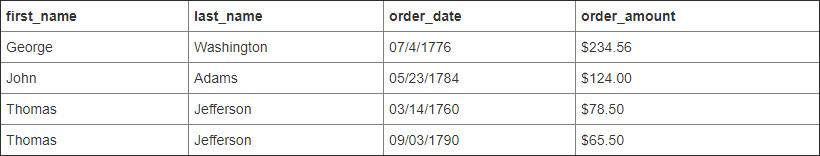

## 图解SQL连接：内连接、左外连接、右外连接、全外连接

# 下文会用到两张表：客户表和订单表。如下图所示：

**客户表**：


**订单表**：


# 内连接（inner join）

满足条件的记录才会出现在结果集中


```
隐式内连接：
select first_name, last_name, order_date, order_amount
from customers, orders 
where customers.customer_id = orders.customer_id

显示内连接：
select first_name, last_name, order_date, order_amount
from customers c
inner join orders o
on c.customer_id = o.customer_id
12345678910
```

**结果集：**


# 左外连接（left outer join，outer可省略）

左表全部出现在结果集中，若右表无对应记录，则相应字段为`NULL`


```
select first_name, last_name, order_date, order_amount
from customers c
left join orders o
on c.customer_id = o.customer_id
1234
```

**结果集：**


# 右外连接（right outer join，outer可省略）

右表全部出现在结果集中，若左表无对应记录，则相应字段为`NULL`


```
select first_name, last_name, order_date, order_amount
from customers c
right join orders o
on c.customer_id = o.customer_id
1234
```

**结果集：**


# 全外连接（full outer join，outer可省略）

全外连接=左外连接+右外连接


```
select first_name, last_name, order_date, order_amount
from customers c
full join orders o
on c.customer_id = o.customer_id
1234
```

**结果集：**
