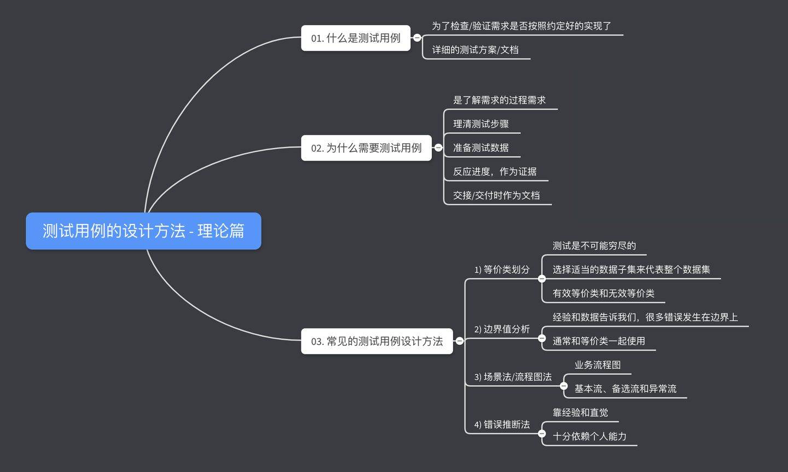

# 测试用例

> 参考自：https://zhuanlan.zhihu.com/p/113911482
>
> http://wiki.baidu.com/pages/viewpage.action?pageId=460869654

为了验证莫哥需求是否实现，是否存在缺陷。通常由测试标题、前置条件、测试数据、测试步骤、预期结果组成

## 测试用例 设计

### 原则

可读性、全面性、可复用性

### 格式和规范

具有清晰名称、前提条件、操作步骤、期望结果的

可被他人理解的

可被他人执行的

## 测试用例功能

1. 体现QA了解需求的过程
2. 理清测试思路和测试过程
3. 规划测试数据的准备
4. 记录测试覆盖的测试内容，反应测试进度
5. 为后续测试提供参考依据
6. 分析缺陷的标准

## 测试用例设计方法

### 等价类划分法

**穷尽测试是不可能的**，使用合适的数据选择方法可以达到穷举法的测试效果。

依据数据的特性，将数据划分为若干的累，每一类代表数据在测试的作用等于这一类的其他值。遵循以下三个标准

* 完备性：划分子集合的并集是整个集合
* 无冗余性：自己互不相交
* 等价性：属于同一等级啊类的测试数据映射到相同的执行路径

### 边界值

大量的错误发生在错误的输入与输出范围的边界上，而不是输入与输出范围的内部。

选取等于，刚刚大于或刚刚小雨边界的值作为测试数据。

除了关注边界值，还要关注，默认值，空白，空值，零，无。还要关注非法值，错误值，不正确值与垃圾数据。所有坑的无效等价类数据。

### 场景法/流程分析法

不同步骤的不同顺序会产生不同的结果，

所以需要画出业务的流程图，包含基本流、备用流、异常流。

**基本流：**业务流程时输入都为正确，达到正常的目标。

**备用流：**业务流程时输入错误（操作错误）导致业务流程存在反复，纠正后能够达到目标。

**异常流：**输入错误（操作错误）长生异常产生流程

### 错误推断法

在测试程序中 依据经验或者直觉推测程序中可能存在的错误，针对性的编写检查错误的测试用例。

## 总结图标

